## 搜索和图论
[TOC]
### 前言
搜索分为深度优先搜索和广度优先搜索。深度优先搜索通常是使用递归的方式枚举路径。广度优先搜索一般是使用队列来迭代美剧。

深度优先搜索中的算法思想时回溯，回溯是在递归之后恢复路径。这里通常会涉及到剪枝。其实递归全部都能够抽象成树，而剪枝就是在递归向下时减去不必要的搜索路径。

这部分内容在代码随想录的二叉树部分和回溯部分会讲的很详细。我主要是记录典型题目的代码模板。

图论的内容通常涉及到最短路径问题。关于求取最短路径有很多算法来实现，当然不同算法一般适用不同类型的图。后面会简单总结以下。


### 1. 深度优先搜索（DFS）
**题目一：全排列问题**
>[全排列问题](https://www.acwing.com/activity/content/problem/content/905/)
>

代码模板：
```c++
#include<bits/stdc++.h>
using namespace std;

int n, use[10];
vector<int> path;
void dfs(int t){
    if(t == n){
        for(int i = 0; i < path.size(); i++)
            cout << path[i] << ' ';
        cout << endl;
        return ;
    }
    for(int i = 1; i <= n; i++){
        if(use[i] == 0){
            use[i] = 1;
            path.push_back(i);
            dfs(t + 1);
            use[i] = 0;
            path.pop_back();
        }
    }
}

int main(){
    cin >> n;
    dfs(0);
    return 0;
}
```


**题目二：n皇后问题**
>[n皇后问题](https://www.acwing.com/problem/content/845/)
>
>

思路：跟刚才的全排列非常相似，我们需要保证每一行每一列、每个正对角线和反对角线不会有同时两个元素。所以遍历顺序是一样的。但是难点是不和标记之前访问过的节点是否满足上面的条件。

这里我们可以将每一列、每一种正对角线、每一条反对角线编号记录下来，通过标记该编号的对角线是否被访问过来判断。例如一个`4X4`的矩阵有4列、`(2*4-1)`条正对角线和`(2*4-1)`条反对角线。

但是如何根据行和列的坐标来推出对角线和反对角线的编号？这里需要利用函数图像的性质来推断。同一个对角线上的坐标，他们的行和列的编号具有定性关系。如下图所示：


代码模板：
```c++
#include<bits/stdc++.h>
using namespace std;

const int N = 10;
int n;
char g[N][N];
bool col[N], dg[2*N], udg[2*N];

void dfs(int u){
    if(u == n){
        for(int i = 0; i < n; i++)  puts(g[i]);
        puts("");
        return;
    }

    for(int i = 0; i < n; i++){
        if(!col[i] && !dg[u - i + n] && !udg[ u + i]){
            g[u][i] = 'Q';
            col[i] = dg[u - i + n] = udg[u + i] = true;
            dfs(u + 1);
            col[i] = dg[u - i + n] = udg[u + i] = false;
            g[u][i] = '.';
        }
    }

}

int main(){
    cin >> n;
    for(int i = 0; i < n; i++)
        for(int j = 0; j < n; j++)
            g[i][j] = '.';

    dfs(0);
    return 0;
}
```


### 2. 广度优先搜索（BFS）

**题目一**
>[走迷宫](https://www.acwing.com/problem/content/846/)
>
>

这里既可以用深度优先搜索，也可以用广度优先搜索。时间复杂度上来说，广度优先搜索时间复杂度低一些。但是在处理队列遍历的时候，由一些注意事项其实和深度优先搜索是一样的。比如遍历节点后需要标记已经访问过了，同时还需要记录从起点到其他节点的路径长度。

需要注意的是需要每次元素入队之后都需要标记该节点已经访问过了。

```c++
#include<bits/stdc++.h>
using namespace std;

typedef pair<int, int> PII;
const int N = 105;
int n, m;
int g[N][N], d[N][N];

int main(){
    cin >> n >> m;
    for(int i = 0; i < n; i++)
        for(int j = 0; j < m; j++) 
            cin >> g[i][j];
        
    queue<PII> que;
    int dx[4] = {0, 1, 0, -1};
    int dy[4] = {1, 0, -1, 0};
    que.push({0, 0});
    g[0][0] = 1;
    while(!que.empty()){
        PII tmp = que.front();
        que.pop();
        int x = tmp.first, y = tmp.second;
        for(int i = 0; i < 4; i++){
            int xx = x + dx[i];
            int yy = y + dy[i];
            if(xx >= 0 && xx < n && yy >= 0 && yy < m && g[xx][yy] == 0){
                d[xx][yy] = d[x][y] + 1;
                g[xx][yy] = 1;
                que.push({xx, yy});
            }
        }
    }

    cout << d[n - 1][m - 1];
    return 0;
}
```

**题目二**
>[八数码](https://www.acwing.com/problem/content/847/)
>
>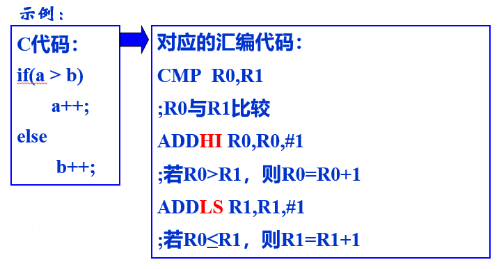

思路：一个很有现实意义的题目——拼图游戏嘛。这里咋一看一点思路都没有。但是要注意：这里相当于**计算求一个状态到另一个状态的最短路径**。很有意思的理解方式：**求最短路径的方式有很多，如果没有路径权重，我们可以直接用搜索实现。一般对于权重为一的图，求最短路径适用广度优先搜索。** 不过也有其他求最短路径的方式，后面都会提到。值得一提的是动态规划也是可以求最短路径的哈哈哈。所谓状态转移嘛，不过难度确实很大。

因此这里我们就需要分析以下几个问题：
1. 怎么表示状态？
>题目给的是一个二维矩阵，如何来表示二维矩阵的状态呢？
>**这里将二维矩阵转化为一维的数据类型。然后通过下标的转换关系实现一维和二维的转换。**


2. 如何表示每个状态是否出现过？（节点是否访问过）
>可以用哈希表来记录字符串是否出现过。

3. 如何记录移动的次数？
>适用哈希表来记录到该状态的次数，类似遍历地图时的记录到每个节点的次数一样。

代码模板：
```c++
#include<bits/stdc++.h>
using namespace std;

int bfs(string start){

    queue<string> que;
    unordered_map<string, int> mp;
    string end = "12345678x";

    if(start == end)    return 0;
    que.push(start);
    mp[start] = 0;

    int dx[4] = {0, 1, 0, -1}, dy[4] = {1, 0, -1, 0};
    while(que.size()){
        string tmp = que.front();
        que.pop();
        int dist = mp[tmp];
        if(tmp == end)  return dist;
        // 一维坐标转换为二维坐标
        int t = tmp.find('x');
        int x = t / 3, y = t % 3;
        // 入队遍历
        for(int i = 0; i < 4; i++){
            int xx = x + dx[i];
            int yy = y + dy[i];
            if(xx >= 0 && xx <3 && yy >= 0 && yy < 3){
                int k = xx * 3 + yy;
                swap(tmp[k], tmp[t]);
                // 如果没有访问过这个节点，入队
                if(mp.find(tmp) == mp.end()){
                    mp[tmp] = dist + 1;
                    que.push(tmp);
                }
                // 复原坐标
                swap(tmp[k], tmp[t]);
            }
        }

    }

    return -1;

}

int main(){

    string start = "", c;
    for(int i = 0; i < 9; i++){
        cin >> c;
        start += c;
    }

    cout << bfs(start);

    return 0;
}
```

### 3. 树和图的深度优先遍历
这里的题目确实不太好理解。其实对于树还好理解一些，但是如果是图，那么情况就比较多了。但是其实树和图的本质是一样的，选择图一个节点当作根节点，然后分叉遍历和他相连的节点。注意的是，需要将记录之前访问过的上面的根节点，这样就不会重复遍历了。

>[图的中心](https://www.acwing.com/problem/content/description/848/)
>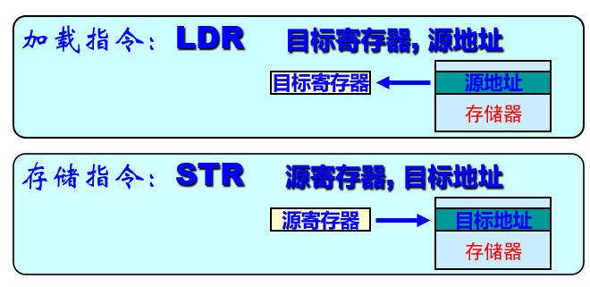
>

思路：这里的难点是计算出遍历每个节点，求出删除每个节点后的连通块和它们内部节点的数量。这里的思考方式是将图想象成树，然后一次遍历每个节点，遍历他们的子树情况。遍历完一个子树相当于找到了一个连通块。最后上面的连通块的节点个数采用总数减去总的子树的节点数即可。这里dfs的作用是求节点的子树的节点数。


代码模板：
```c++
#include<bits/stdc++.h>
using namespace std;

const int N = 100010;
vector<int> e[N];           // 邻接表
bool path[N];               // 标记是否访问过
int n;
int ans = INT_MAX;

int dfs(int u){

    int sum = 1;        // u节点的所有子树的所有结点数量
    int res = 0;        // 删掉u结点的话，剩余各个连通块中点数的最大值
    path[u] = true;

    for(int i = 0; i < e[u].size(); i++){
        int node = e[u][i];
        if(path[node] == false){
            int t = dfs(node);
            sum += t;
            res = max(res, t);
        }
    }

    res = max(res, n - sum);
    ans = min(ans, res);
    // cout << sum << ' ' << res << endl;
    return sum;

}


int main(){

    cin >> n;
    int m = n - 1;
    while(m--){
        int a, b;
        cin >> a >> b;
        e[a].push_back(b);
        e[b].push_back(a);
    }

    dfs(1);

    cout << ans;

    return 0;
}
```


### 4. 树和图的广度优先遍历
这里的广度优先遍历和前面提到的适用方式类似，多用队列来层次遍历图，然后每一个访问过的结点注意标记和更新是否访问过。

**题目**
>[图中点的层次](https://www.acwing.com/problem/content/849/)
>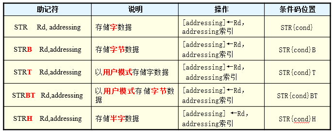
>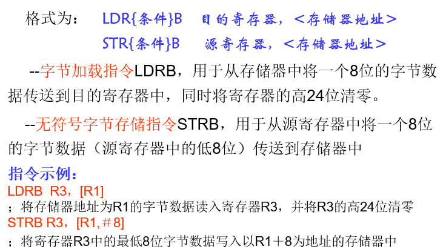

显然这里是适用广度优先遍历的。
代码模板：
```c++
#include<bits/stdc++.h>
using namespace std;

const int N = 100010;
int n, m;
vector<int> e[N];
bool g[N];

int bfs(int start){

    queue<pair<int, int>> que;
    que.push({start, 0});
    g[start] = true;
    while(!que.empty()){
        pair<int, int> tmp = que.front();
        que.pop();
        if(tmp.first == n)  return tmp.second;
        int x = tmp.first, dist = tmp.second;
        for(auto node : e[x]){
            if(g[node] == false){
                que.push({node, dist + 1});
                g[node] = true;
            }
        }

    }

    return -1;
}

int main(){

    cin >> n >> m;
    while(m--){
        int x, y;
        cin >> x >> y;
        e[x].push_back(y);
    }

    cout << bfs(1);

    return 0;
}
```


### 5. 拓扑排序
拓扑排序的定义是：
1. 一个有向图，如果图中有入度为0的点，那么就把这个点删除，同时也删除这个点所连的边。
2. 一只进行上面的处理，如果所有点都能被删除，那么这个图可以进行拓扑排序。

因此对于一个图，我们需要得到它的拓扑排序，首先需要判断该图是不是拓扑结构。根据上面方法判断可以判断。在不断删除的过程中，我们也可以得到结点出入的顺序，这个就是该图的拓扑排序啦。不过拓扑排序可以不唯一。

**题目一**
>[有向图的拓扑排序](https://www.acwing.com/problem/content/850/)
>
>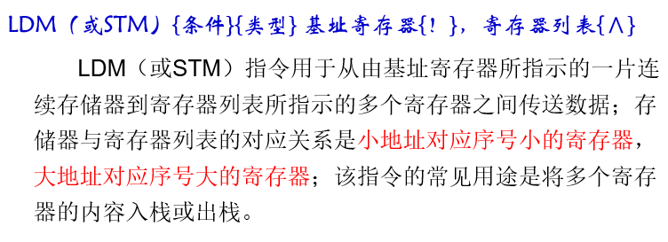

代码模板：
```c++
#include<bits/stdc++.h>
using namespace std;

const int N = 100010;
int n, m;
vector<int> e[N], s;
int d[N];               //记录入度

bool topSort(){
    
    queue<int> que;
    for(int i = 1; i <= n; i++)
        if(d[i] == 0)   que.push(i);

    while(que.size()){
        int tmp = que.front();
        s.push_back(tmp);
        que.pop();
        for(auto t : e[tmp]){
            d[t]--;
            if(d[t] == 0){
                que.push(t);
            }
        }
    }

    // for(auto x : s)
    //     cout << x << ' ';

    if(s.size() == n){
        return true;
    }
    return false;
}

int main(){
    cin >> n >> m;
    while(m--){
        int x, y;
        cin >> x >> y;
        e[x].push_back(y);
        d[y]++;
    }

    if(topSort()){
        for(auto x : s)
            cout << x << ' ';
    }else{
        cout << -1;
    }
    return 0;
}
```


### 6. 最短路径之dijkstra算法

大名鼎鼎的`dijkstra`算法本质是：基于贪心和广度优先搜索的单元最短路径算法。这里很有意思的是：贪心是指每次选取没有访问过的节点中路径最短的点，案后进行**松弛（也就是更新最短路径）**操作；广度优先遍历是有点像将选取结点的邻接点的最短路径更新（也就是松弛操作）。很神奇的一点是这样的操作会进行`n-1`次。

因此这里会用到几个辅助的变量：
1. `d[N]`：每个结点到起点的最短路径，首先会初始化为一个很大的值。
2. `vis[N]`：记录结点是否访问过，访问过的结点下次不能再访问了。
3. `e[N]`：邻接表，存储结点和边的权重。

具体实现方式：
1. 用一个 dist 数组保存源点到其余各个节点的距离，dist[i] 表示源点到节点 i 的距离。初始时，dist 数组的各个元素为无穷大。
用一个状态数组 state 记录是否找到了源点到该节点的最短距离，state[i] 如果为真，则表示找到了源点到节点 i 的最短距离，state[i] 如果为假，则表示源点到节点 i 的最短距离还没有找到。初始时，state 各个元素为假。
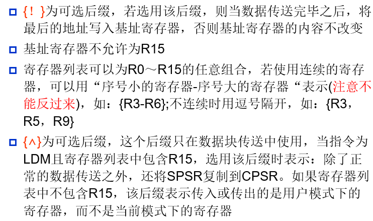

2. **源点到源点的距离为 0。** 即dist[1] = 0。
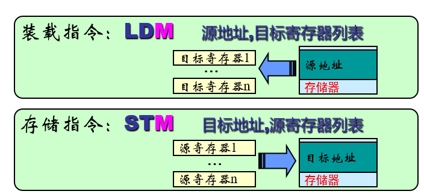

3. **遍历 dist 数组，找到一个节点**，这个节点是：没有确定最短路径的节点中距离源点最近的点。假设该节点编号为 i。此时就找到了源点到该节点的最短距离，state[i] 置为 1。
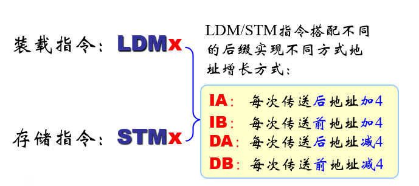

4. 遍历 i 所有可以到达的节点 j，如果 dist[j] 大于 dist[i] 加上 i -> j 的距离，即 dist[j] > dist[i] + w[i][j]（w[i][j] 为 i -> j 的距离） ，则更新 dist[j] = dist[i] + w[i][j]。


5. 重复 3 4 步骤，直到所有节点的状态都被置为 1。
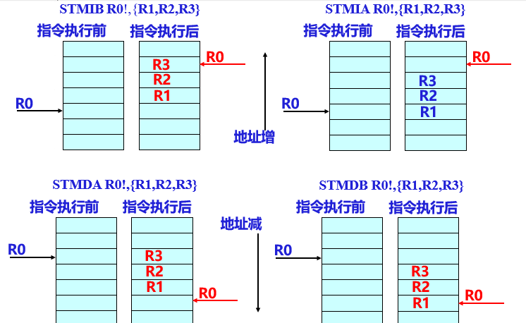

6. 此时 dist 数组中，就保存了源点到其余各个节点的最短距离。


**题目一：朴素的dijkstra算法**
>[Dijkstra求最短路 I](https://www.acwing.com/problem/content/851/)
>
>

代码模板：
```c++
// 由于这个题目中给出的图一个稠密图，所以直接用邻接表实现
// 朴素算法是没有使用堆优化的算法，时间复杂度为O(n^2)
#include<bits/stdc++.h>
using namespace std;

const int N = 510;
int e[N][N];        // 存储有向图
int d[N], vis[N];   // 存储各个结点的最短路径和是否访问过该节点

int n, m;

int dijkstra(int s){

    // 初始化原始距离
    for(int i = 1; i <= n; i++) d[i] = INT_MAX;
    d[s] = 0;

    // 开始 n - 1次遍历
    for(int i = 1; i < n; i++){

        // 找到n个结点中距离最短的点——贪心
        int t = -1;
        for(int j = 1; j <= n; j++){
            // 要求j结点没有呗访问过
            if(vis[j] == 0 && (t == -1 || d[t] > d[j])){
                t = j;
                // vis[j] = true;
            }
        }

        // 标记选择结点应该在遍历出最短那个结点之后
        vis[t] = 1; 

        // 松弛操作，更新选中结点的连接点
        for(int k = 1; k <= n; k++){
            if(e[t][k] != 0){
                d[k] = min(d[k], d[t] + e[t][k]);
            }
        }
    }
    if(d[n] == INT_MAX) return -1;
    return d[n];

}


int main(){
    cin >> n >> m;
    while(m--){
        int a, b, x;
        cin >> a >> b >> x;
        if(e[a][b] == 0 || e[a][b] > x)    e[a][b] = x;
    }
    cout << dijkstra(1) << endl;
    return 0;
}
```


**题目二：基于堆优化的dijkstra算法**
>[Dijkstra求最短路 II](https://www.acwing.com/problem/content/852/)
>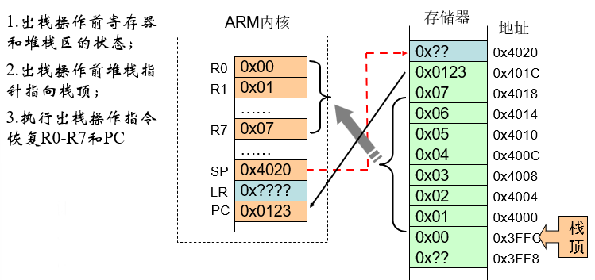

思路：这里算法值得优化的部分其实是在遍历n个结点求出当前距离最短结点的部分。当该图是一个稀疏图的时候，点的结点很多，但是边数很少。那么遍历每一个结点就很耗时，因此我们需要优化找到当前距离最短的点。

这里使用堆优化，在STL中`priority_qeue`是大根堆，每次返回的堆顶是当前入队的最大值，我们这里需要用到的是小根堆，每次返回最小值。这里先简单介绍关于大根堆和小根堆的STL语法：

> 1.Type 就是数据类型，Container 就是容器类型（Container必须是用数组实现的容器，比如vector,deque等等，但不能用 list。STL里面默认用的是vector），Functional 就是比较的方式
> 2.当需要用自定义的数据类型时才需要传入这三个参数，使用基本数据类型时，只需要传入数据类型，默认是大顶堆(优先级高的在前)

`priority_queue<Type, Container, Functional>`

```c++
//greater和less是std实现的两个仿函数
//就是使一个类的使用看上去像一个函数，其实现就是类中实现一个operator()
//这个类就有了类似函数的行为，就是一个仿函数类了

//降序队列(默认大根堆)
priority_queue <int,vector<int>,less<int> >q;
//升序队列(小根堆)
priority_queue <int,vector<int>,greater<int> > q;


//2.基本数据类型-pair-pair类型默认先比较第一个元素，第一个相等比较第二个
    priority_queue<pair<int, int> > a;
    a.push(pair<int,int>{1,2});
    a.push(pair<int,int>{1,3});
    a.push(pair<int,int>{2,5});
    while (a.empty()== false){
        cout<<a.top().first<<" "<< a.top().second<<endl;
        a.pop();
    }
    //输出:
    //2 5
    //1 3
    //1 2
```

代码模板：
```c++
// 由于这个题目中给出的图一个稠密图，所以直接用邻接表实现
// 朴素算法是没有使用堆优化的算法，时间复杂度为O(n^2)
#include<bits/stdc++.h>
using namespace std;

typedef pair<int, int> PII;
const int N = 150010;
vector<PII> e[N];        // 存储有向图,邻接表
int d[N], vis[N];   // 存储各个结点的最短路径和是否访问过该节点

int n, m;

int dijkstra(int s){

    // 初始化原始距离
    for(int i = 1; i <= n; i++) d[i] = INT_MAX;
    d[s] = 0;
    priority_queue<PII, vector<PII>, greater<PII>> que; // 小根堆
    que.push({0, s});

    // 遍历优先队列的数据
    while(que.size()){
        PII tmp = que.top();
        que.pop();
        
        // 标记当前结点的编号
        int t = tmp.second;
        if(vis[t] == 1) continue;      // 当前结点是否访问过
        vis[t] = 1;                 // 标记当前结点

        for(auto x : e[t]){
            int u = x.second, w = x.first;
            if(d[u] > d[t] + w){
                // 更新最短路径
                d[u] = d[t] + w;
                // 最短路径入队
                que.push({d[u], u});
            }
        }
    }

    if(d[n] == INT_MAX) return -1;
    return d[n];

}


int main(){
    cin >> n >> m;
    while(m--){
        int a, b, x;
        cin >> a >> b >> x;
        e[a].push_back({x, b});
    }

    cout << dijkstra(1) << endl;
    return 0;
}
```


### 7. 最短路径之bellman-ford算法

前面提到的`dijkstra`算法不适用于边权为负值的情况。但是边权为负值的情况在现实生活中其实存在，例如飞机航程，如果边权代表乘客的心情，有的路线会使得坏心情buff为负数。最后需要我们求出哪条路径会使得坏心情最少。这里边权为负值也是需要考虑在内的。

但是为什么`dijkstra`算法不适用这个情况？

这里需要提到`dijkstra`算法的流程：
> Dijkstra算法的3个步骤
> 1、找到当前未标识的且离源点最近的点t
> 2、对t号点点进行标识
> 3、用t号点更新其他点的距离
> 
> 结果：
> dijkstra算法在图中走出来的最短路径是1 -> 2 -> 4 -> 5，算出 1 号点到 5 号点的最短距离是2 + 2 + 1 = 5，然而还存在一条路径是1 -> 3 -> 4 -> 5，该路径的长度是5 + (-2) + 1 = 4，因此 dijkstra 算法失效
> 

dijkstra不能解决负权边是因为 dijkstra要求每个点被确定后st[j] = true，dist[j]就是最短距离了，之后就不能再被更新了（一锤子买卖），而如果有负权边的话，那已经确定的点的dist[j]不一定是最短了.
****
**bellman-ford算法是什么？为什么有适用于这种情况？**

 Bellman - ford 算法是求含负权图的单源最短路径的一种算法，效率较低，代码难度较小。**其原理为连续进行松弛，在每次松弛时把每条边都更新一下**，若在 n-1 次松弛后还能更新，则说明图中有负环，因此无法得出结果，否则就完成。
(通俗的来讲就是：假设 1 号点到 n 号点是可达的，每一个点同时向指向的方向出发，更新相邻的点的最短距离，通过循环 n-1 次操作，若图中不存在负环，则 1 号点一定会到达 n 号点，若图中存在负环，则在 n-1 次松弛后一定还会更新)

**因此在出现负权图是，一般会限制最短路径的最大边数，以免出现最短路径为负无穷的情况。**

代码模板：
```c++
int n, m;       // n表示点数，m表示边数
int dist[N];        // dist[x]存储1到x的最短路距离

struct Edge     // 边，a表示出点，b表示入点，w表示边的权重
{
    int a, b, w;
}edges[M];

// 求1到n的最短路距离，如果无法从1走到n，则返回-1。
int bellman_ford()
{
    memset(dist, 0x3f, sizeof dist);
    dist[1] = 0;

    // 如果第n次迭代仍然会松弛三角不等式，就说明存在一条长度是n+1的最短路径，由抽屉原理，路径中至少存在两个相同的点，说明图中存在负权回路。
    for (int i = 0; i < n; i ++ )
    {
        for (int j = 0; j < m; j ++ )
        {
            int a = edges[j].a, b = edges[j].b, w = edges[j].w;
            if (dist[b] > dist[a] + w)
                dist[b] = dist[a] + w;
        }
    }

    if (dist[n] > 0x3f3f3f3f / 2) return -1;
    return dist[n];
}
```

**题目一**
>[有边数限制的最短路](https://www.acwing.com/problem/content/description/855/)
>

思路：`bellman-ford`算法

**小tips：**
>关于memset和0x3f
>```c++
>int a[100];
>memset(a,0x3f,sizeof(a) );
>0x3f=0011 1111=63
>```
>C++中int型变量所占的位数为4个字节，即32位
>0x3f显然不是int型变量中单个字节的最大值，应该是0x7f=0111 1111 B
那为什么要赋值0x3f：
>1. 作为无穷大使用
因为4个字节均为0x3f时，0x3f3f3f3f的十进制是1061109567，也就是10^ 9级别的（和0x7fffffff一个数量级），而一般场合下的数据都是小于10^9的，所以它可以作为无穷大使用而不致出现数据大于无穷大的情形。
可以保证无穷大加无穷大仍然不会超限。
>2. 由于一般的数据都不会大于10^9，所以当我们把无穷大加上一个数据时，它并不会溢出（这就满足了“**无穷大加一个有穷的数依然是无穷大**”），事实上0x3f3f3f3f+0x3f3f3f3f=2122219134，这非常大但却没有超过32-bit int的表示范围，所以0x3f3f3f3f还满足了我们“无穷大加无穷大还是无穷大”的需求。


代码模板：
```c++
#include<bits/stdc++.h>
using namespace std;

const int N = 510, M = 10010;
int n, m, k;
struct Edges{
    int a, b, w;
}e[M];
int d[N], backup[N];           // 记录最短路径的数组

bool bellman_ford(int s){

    // 初始化d[]数组
    memset(d, 0x3f, sizeof d);
    d[s] = 0;

    for(int i = 0; i < k; i++){     // 最多遍历k次
        // 先拷贝上次的d[]数组，以免出现串联的情况
        memcpy(backup, d, sizeof d);
        // 每次遍历所有边
        for(int j = 0; j < m; j++){
            int a = e[j].a, b = e[j].b, w = e[j].w;
            d[b] = min(d[b], backup[a] + w);
            //使用backup:避免给a更新后立马更新b, 这样b一次性最短路径就多了两条边出来
        }

    }

    if(d[n] > 0x3f3f3f3f / 2)   return false;
    return true;
}


int main(){
    cin >> n >> m >> k;
    for(int i = 0; i < m; i++){
        int a, b, w;
        cin >> a >> b >> w;
        e[i] = {a, b, w};
    }

    bool res = bellman_ford(1);
    if(res == false)    cout << "impossible" << endl;
    else            cout << d[n] << endl;

    return 0;
}
```

### 7. 最短路径之spfa算法
上面提到的`bellman-ford`算法时间复杂度较高，但是他适合限定边数的最短路径问题，这个限制即使是`spfa`算法也无法做到。

但是如果仅仅是出现了负权边，没有限制最短路径的边数，那么可以适用`spfa`算法来求**包含负权边的图中的最短路径**和**判断图中是否出现负环**。

`spfa`算法其实是`bellman-ford`算法的优化版本，当`bellman-ford`算法需要遍历全部的边来判断是否松弛（更新最短路径），我们可以考虑用队列来存储更新之后的结点，因为只有更新之后的结点才能对它的邻边进行更新。

这里来看，其实`spfa`算法和`dijkstra`算法就很像了。但是`dijkstra`算法是基于贪心思想的遍历选取，如果出现负权边是会破坏它的贪心的根基，在上面也有提到具体例子。但是`spfa`并不会一锤定音，而是只要是更新过的最短路径，都会出现进入队列，便于下次更新。

同时该算法多用于解决判断图中是否出现负环，只需要在遍历时用一个数组记录每一个结点的路径，每次更新最短路径时判断路径数量是否大于等`n`。

> 具体图解案例可以参考:[博客](https://www.acwing.com/solution/content/105508/)

****
**题目一：求最短路径**
> [spfa求最短路径](https://www.acwing.com/problem/content/853/)
> 

代码模板：
```c++
#include<bits/stdc++.h>
using namespace std;

typedef pair<int, int> PII;
const int N = 100010;
int n, m;
vector<PII> e[N];
int d[N];

void spfa(){
    memset(d, 0x3f, sizeof d);
    d[1] = 0;

    queue<PII> que;
    que.push({1, 0});

    while(que.size()){
        PII tmp = que.front();
        que.pop();

        int u = tmp.first, w = tmp.second;
        for(auto x : e[u]){
            int xx = x.first, ww = x.second;
            if(d[xx] > d[u] + ww){
                d[xx] = d[u] + ww;
                que.push({xx, d[xx]});
            }
        }
    }
}

int main(){

    cin >> n >> m;
    for(int i = 0; i < m; i++){
        int a, b, x;
        cin >> a >> b >> x;
        e[a].push_back({b, x});
    }

    spfa();
    
    if(d[n] == 0x3f3f3f3f)  cout << "impossible" << endl;
    else cout << d[n] << endl;
    return 0;
}
```


**题目二：判断是否出现负环**
>[spfa判断负环](https://www.acwing.com/problem/content/854/)
>

思路：**什么是负环？** 这一点很重要，负环是**一个环的权重之和小于零**，这样经历一个负环之后达到该点的最短路径会一直减少，此时就会陷入死循环。那么怎么发现这个是一个死循环？我们可以记录到达这个点的边数，如果边数大于总边数，那么肯定进入了死循环了。就可以判断途中包含负环。

因此思路依然是：使用`spfa`算法，首先在队列中加入所有结点，因为这个图可能不是一个连通图，所以需要在队列中加入所有结点。

代码模板：
```c++
#include<bits/stdc++.h>
using namespace std;

typedef pair<int, int> PII;
const int N = 2010;
vector<PII> e[N];
int n, m;
int d[N], cnt[N];   // 记录最短路径和边长次数
bool vis[N];        // 记录结点是否入队

bool spfa(){

    queue<PII> que;
    for(int i = 1; i <= n; i++){    // 将所有结点全部加入队列
        que.push({i, 0});
        vis[i] = true;              // 同时标记已经入队
    }
        
    while(que.size()){              // 队列不为空时
        PII tmp = que.front();
        que.pop();
        vis[tmp.first] = false;     // 出队和标记

        int u = tmp.first;
        for(auto x : e[u]){         // 访问该节点的临界点，
            int t = x.first, w = x.second;
            if(d[t] > d[u] + w){    // 发现负权边胡总和负环，就会更新
                d[t] = d[u] + w;
                cnt[t] = cnt[u] + 1;    // 那么该节点的边数就是之前结点边数+1

                if(cnt[t] > n)  return true;    // 出现死循环，直接返回
                
                if(vis[t] == false){        // 如果没有入过队，那就入队
                    que.push({t, d[t]});
                    vis[t] = true;
                }
            }

        }
    }

    return false;


}

int main(){

    cin >> n >> m;
    for(int i = 0; i < m; i++){
        int a, b, x;
        cin >> a >> b >> x;
        e[a].push_back({b, x});
    }

    if(spfa())  cout << "Yes" << endl;
    else        cout << "No" << endl;
    return 0;
}
```

### 8. 最短路径之Floyd算法

Floyd算法是多源最短路径算法，即可以求出每个点到其他任意结点的路径。这个算法的思想是根据三维动态规划。，还是留到动态规划的时候再来理解把。

****
**题目**
>[Floyd求最短路](https://www.acwing.com/problem/content/856/)
>
>

```c++
#include<bits/stdc++.h>
using namespace std;

const int N = 210, INF = 1e9;
int n, m, k;
int e[N][N];

void floyd(){
    for(int k = 1; k <= n; k++)
        for(int i = 1; i <= n; i++)
            for(int j = 1; j <= n; j++)
                e[i][j] = min(e[i][j], e[i][k] + e[k][j]);
}

int main(){

    cin >> n >> m >> k;
    for(int i = 1; i <= n; i++){
        for(int j = 1; j <= n; j++){
            if(i == j)  e[i][j] = 0;
            else        e[i][j] = INF;
        }
    }

    while(m--){
        int a, b, x;
        cin >> a >> b >> x;
        e[a][b] = min(e[a][b], x);
    }

    floyd();

    while(k--){
        int x, y;
        cin >> x >> y;
        if(e[x][y] > INF / 2)   cout << "impossible" << endl;
        else                    cout << e[x][y] << endl;
    }
    
    return 0;
}
```

### 9. Prim算法求最小生成树

如何根据一个连通图求出最小生成树的最小权值之和？这里的算法思想很简单，有些类似`dijkstra`算法，依然是利用贪心的思想来实现，但是就是需要更新的内容是未进入集合的结点到进入集合的结点的最小值。但是这里如何枚举找到和现有集合相连的最小边？

**首先需要选出一个进入集合的结点，然后更新每个结点到集合的最短距离。** 其实这里最神奇的地方就是每次新加入一个结点，就会更新它邻接点的到该集合的最短距离（如果确实是最短的话），但是也会更新已经在集合里面的结点到该集合的最短距离啊？这里由于我们是基于贪心的算法，每次加入集合的结点就会使曾经的最佳选择，即使更新了，也不会再加入到最小权值的计算了。

这里的算法也适用于有负权边的图。

> 图解参考博客：[图解链接](https://www.acwing.com/solution/content/38312/)

****
**题目一**
> [prim求最小生成树](https://www.acwing.com/problem/content/860/)
> 
> 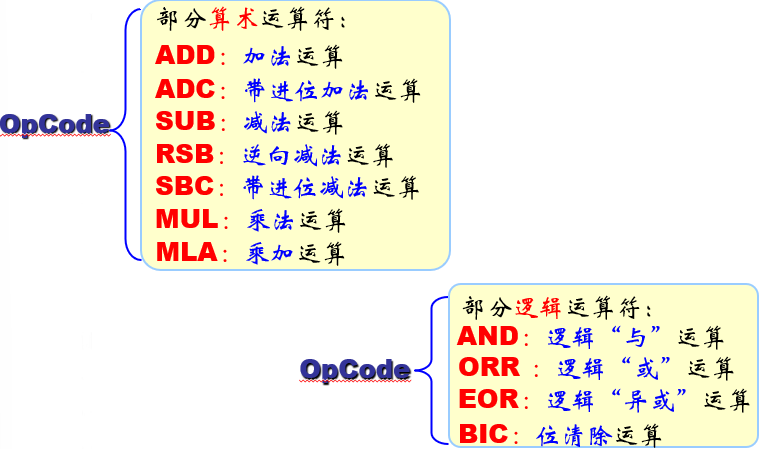

代码模板（朴素Prim算法）：
```c++
#include<bits/stdc++.h>
using namespace std;

const int N = 510, INF = 0x3f3f3f3f;
int n, m;
int e[N][N];    // 邻接矩阵
int d[N];       // 当前结点到集合的最短距离
bool vis[N];    // 判断该节点是否被访问过

int prim(int s){
    // 初始化
    memset(d, 0x3f, sizeof d);
    d[s] = 0;

    // 记录生成树的权值之和
    int res = 0;

    // 遍历n次
    for(int i = 0; i < n; i++){
        // 寻找需要加入集合的结点
        int t = -1;
        for(int j = 1; j <= n; j++){
            if(!vis[j] && (t == -1 || d[j] < d[t])){
                t = j;
            }
        }
        // 此时就会选出一个结点t
        // 标记该节点
        vis[t] = true;

        // 判断当前结点是否是孤立的，孤立的结点 d[t] = INF
        if(d[t] == INF)  return d[t];
        // 加上当前边
        res += d[t];

        // 根据当前t结点更新周围其他结点
        // 这里的更新和dijkstra算法不一样，它只需要比较当前结点可以遍历到的边的长度即可
        for(int j = 1; j <= n; j++){
            if(!vis[j] && d[j] > e[t][j]){
                d[j] = e[t][j];                 // 区别
            }
        }
    }

    return res;
}

int main(){
    
    cin >> n >> m;
    memset(e, 0x3f, sizeof e);
    
    while(m--){
        int a, b, x;
        cin >> a >> b >> x;
        e[a][b] = e[b][a] = min(e[a][b], x);
    }

    int t = prim(1);
    if(t >= INF)  cout << "impossible" << endl;
    else                cout << t << endl;
    return 0;
}
```


### 10. 


