# 基础算法
[TOC]

## 1. 快速排序
快速排序是分治算法的一种应用，他和归并排序的区别是：快速排序是在**分的过程**中完成子任务，归并排序是在**分完之后合的过程**中完成子任务。

>[快速排序例题链接](https://www.acwing.com/problem/content/787/)
>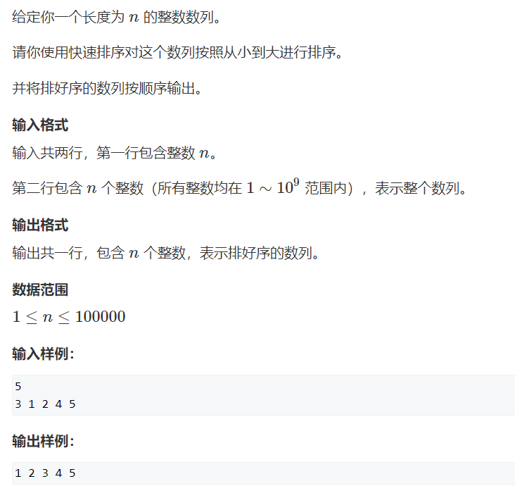

代码模板：
```c++
#include<bits/stdc++.h>

using namespace std;
const int N = 100005;
int n;
int a[N];

void quickSort(int l, int r){
    // 递归结束条件
    if(l >= r)  return;

    // 分治的分界点
    int tmp = a[ l + r >> 1];
    // 双指针
    int i = l - 1, j = r + 1;
   
    // 核心代码,楷书排序中分开前的处理
    while(i < j){
        do{ i++; } while (a[i] < tmp);
        do{ j--; } while (a[j] > tmp);
        if(i < j){
            swap(a[i], a[j]);
        }
    }

    // 递归处理分开的两段
    quickSort(l, j);
    quickSort(j + 1, r);

}

int main(){
    cin >> n;
    for(int i = 0; i < n; i++)
        cin >> a[i];

    quickSort(0, n - 1);
    
    for(int i = 0; i < n; i++){
        cout << a[i] <<' ';
    }
    return 0;
}

```

快速排序代码思路总结:
>[优秀博客讲解](https://www.acwing.com/solution/content/16777/)
>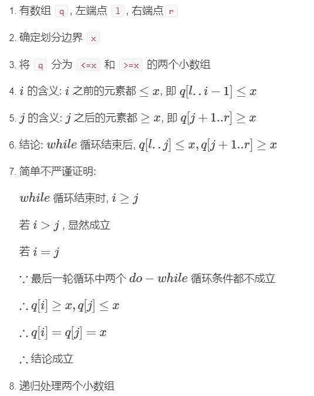


## 2. 归并排序
前文提到了快速排序和归并排序的区别,即在处理子任务的什么时间对数据进行处理。其实也就是二叉树的前序遍历和后序遍历的区别。

>[归并排序例题](https://www.acwing.com/problem/content/789/)
>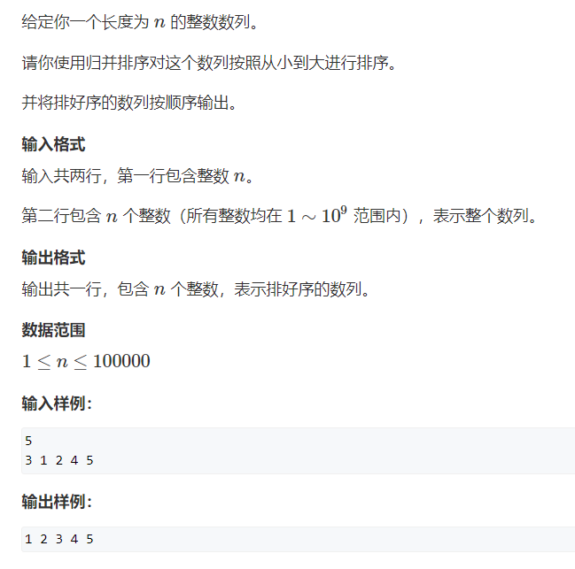

代码模板:
```c++
#include<bits/stdc++.h>

using namespace std;
int n;
const int N = 100005;
int a[N], tmp[N];

void merge_sort(int l, int r){
    // 递归边界
    if(l >= r)  return;

    // 子任务分界点
    int mid = l + r >> 1;
    // 先处理子任务
    merge_sort(l, mid);
    merge_sort(mid + 1, r);
    // 处理完子任务对现阶段子任务进行处理
    int i = l, j = mid + 1, k = 0;
    while(i <= mid && j <= r){
        if(a[i] < a[j])
            tmp[k++] = a[i++];
        else    
            tmp[k++] = a[j++];
    }
    while(i <= mid){
        tmp[k++] = a[i++];
    }
    while(j <= r){
        tmp[k++] = a[j++];
    }
    // 注意放回到原数组
    for(int x = 0; x < k; x++){
        a[l++] = tmp[x];
    }

}


int main(){
    cin >> n;
    for(int i = 0; i < n; i++){
        cin >> a[i];
    }

    merge_sort(0, n - 1);
    for(int i = 0; i < n; i++){
        cout << a[i] << ' ';
    }
    
    return 0;
}
```

## 3. 二分查找
二分查找虽然逻辑很好理解,但是在实际的代码编写中很容易写出死循环的代码.我们需要理解为什么会出现死循环。

二分中出现的中点是 `mid = l + r >> 1`，循环条件是`l < r`，那么死循环时就是一直满足`l < r`。这说明在用中点`mid`更新`l`和`r`的时候出现了问题。

**重点：在`mid = l + r >> 1`中，即mid取中点时会向下取整。也就是`l`和`r`相邻时，`mid`会取`l`的值。** 如果针对这种情况不进行处理，就会出现死循环。

然后对于二分的本质是什么？我想应该是区间性质分明吧。**二分查找的本质是双指针。** 我们需要用左右指针来查找目标区间的分解点。这里就可以用左右指针来不同查找。设`l`和`r`指针分别为左右指针。

如果`[0, l]`是目标区间，`mid`满足条件时`l = mid`,`r`是不满足目标的位置，他需要不停跑在mid前面即`r = mid - 1`。分析此时是否会出现死循环：**当`l`和`r`相邻时，`mid`等于`l`，`l = mid`，最后`l`和`r`没有更新，陷入死循环。** 想要摆脱困境，只能在mid更新的时候向上取整，即`mid = l + r + 1 >> 1`,当`l`和`r`相邻的时候，mid就可以取到`r`的位置，`r`也会相对`mid`向前一步，突破死循环。

如果`[r, n]`是目标区间，`mid`满足条件时是`r = mid`，`l`是不满足目标的位置，他就会走在mid前面，即`l = mid + 1`。分析是否会陷入死循环：**当`l`和`r`相邻时，`mid`等于`l`，`l = mid + 1`，最后`l`实现更新，不会陷入死循环。** 此时可以直接使用`mid`的更新条件`mid = l + r >> 1`。

综上所述：二分查找的思路：
1. 确定目标区间是`[0, l]`还是`[r, n - 1]`。
2. 确定目标区间之后确定`l`和`r`的更新方式。
3. 根据`l`和`r`相邻时是否陷入死循环来判断mid的更新方式。
4. 返回下标。

**也可以直接记忆：`[0, l]`为目标区间时，`l = mid`，`mid`必须变成向上取整；`[r, n - 1]`为目标区间时，r = mid，`mid`还是向下取整。**

>[二分查找例题](https://www.acwing.com/problem/content/791/)
>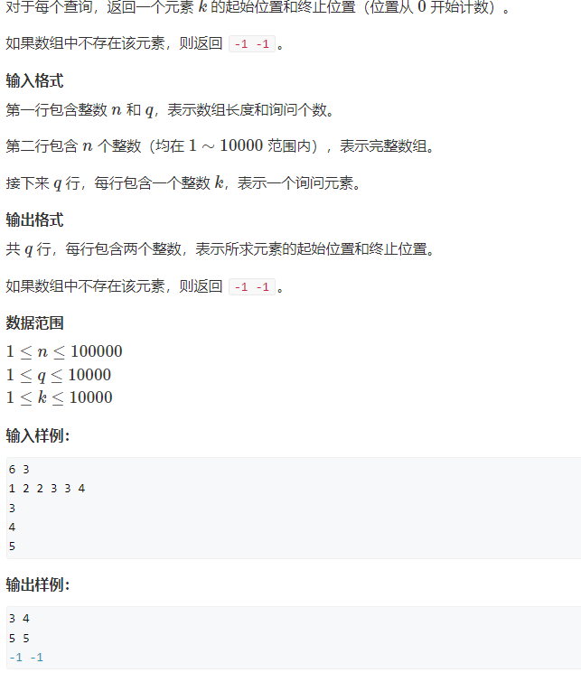


代码模板：
```c++
#include<bits/stdc++.h>
using namespace std;
int n, k;
const int N = 100005;
int a[N];

int binarySearch_first(int t){
    int l = 0, r = n - 1;
    while(l < r){
        int mid = l + r >> 1;
        if(a[mid] >= t) r = mid;
        else            l = mid + 1;
    }

    if(a[r] == t)   return r;
    else            return -1;
}

int binarySearch_last(int t){
    int l = 0, r = n - 1;
    while(l < r){
        int mid = l + r + 1 >> 1;
        if(a[mid] <= t) l = mid;
        else            r = mid - 1;
    }
    if(a[r] == t)   return r;
    else            return -1;
}


int main(){
    cin >> n >> k;
    for(int i = 0; i < n; i++){
        cin >> a[i];
    }

    while(k--){
        int t;
        cin >> t;
        int t_first = binarySearch_first(t);
        if(t == -1){
            cout << -1 << ' ' << -1 << endl;
        }else{
            int t_last = binarySearch_last(t);
            cout<< t_first << ' ' << t_last << endl;
        }
    }
    return 0;
}
```


## 4. 高精度计算模拟
这里可以简单总结一下c++中基础数据类型的范围和大小。
>**基本数据类型**
>布尔型：bool
字符型：char
整型：int
浮点型：float
双浮点型：double

>**类型修饰符**
>有符号：signed
无符号：unsigned
短整型：short
长整型：long

>int 是基本的整数类型，默认是有符号的（signed ），**unsigned 表示无符号，无符号值可以避免误存负数，同时扩大了正数的表示范围**。

>short 和 long 是在 int 的基础上进行的扩展，**使用 short int 可以节省内存，long int 则可以表示更大的值**。

> sizeof() 是一个判断数据类型或者表达式长度的运算符，**以字节为单位**。


```
1byte = 8bit
即：1字节 = 8位
```
**基本数据类型范围**
| 数据类型 |  估计范围 |字节数 | 最小值 | 最大值 |
|:-----:| :-----:|:-----:|:----:|:-----:|
| bool | ~ | 1 | 0 | 1  | 
| char | ~ | 1 | ~ | ~  | 
| int | -10^9 ~ 10^9 | 4 | -2147483648 | 2147483647  | 
| unsigned int | 0 ~ 10^9 | 4 | 0 | 4294967295  | 
| short int | -10^4 ~ 10^4 | 2 | -32768 | 32767  | 
| long int |  -10^18 ~ 10^18 | 8 | -9.223e18 | 9.223e18  |
| long long |  -10^18 ~ 10^18 | 8 | -9.223e18 | 9.223e18  |
| float |  -10^38 ~ 10^38 | 4 | -1.17e38 | 3.40e38  | 
| double |  -10^308 ~ 10^308 | 8 | -2.225e308 | 1.797e308  |

`注意:在不同编译器中long 和long long的大小是不一样的,一些编译器默认long的大小是int的大小.`

### 高精度加法
对于数值远超过基本数据类型的数,可以先用string类型存储.未来便于计算,将两个数反转之后逐位相加,也就是模拟两数相加的计算.

>[高精度加法例题](https://www.acwing.com/problem/content/description/793/)
>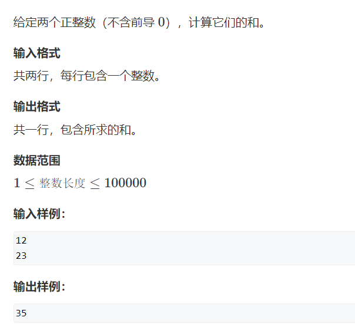

代码模板:
```c++
#include<bits/stdc++.h>
using namespace std;

string a, b;
int main(){
    cin >> a >> b;
    reverse(a.begin(), a.end());
    reverse(b.begin(), b.end());

    if(a.size() < b.size())
        swap(a, b);
    
    int cnt = 0, i = 0;
    for(i = 0; i < b.size(); i++){
        int tmp = a[i] - '0' + b[i] - '0' + cnt;
        cnt = tmp / 10;
        a[i] = tmp % 10 + '0';
    }

    while(cnt && i < a.size()){
        int tmp = a[i] - '0' + cnt;
        cnt = tmp / 10;
        a[i++] = tmp % 10 + '0';
    }

    if(cnt && i == a.size()){
        a.push_back(cnt + '0');
    }

    reverse(a.begin(), a.end());
    cout << a << endl;

    return 0;
}
```


### 高精度减法
这个题目中需要考虑到相减为负数的情况,以及需要注意借位的问题.

>[高精度减法例题](https://www.acwing.com/problem/content/794/)
>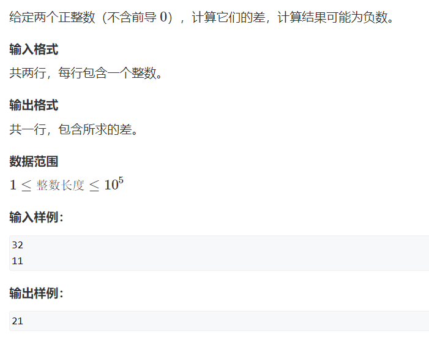

```c++
#include<bits/stdc++.h>
using namespace std;

string a, b;
int main(){
    cin >> a >> b;
    int pre = 1;
    if(a.size() < b.size()){
        pre *= -1;
        swap(a, b);
    }
    else if(a.size() == b.size()){
        int i = 0;
        for(i = 0; i < a.size() && a[i] == b[i]; i++);
        if(i == a.size()){
            pre = 0;
        }else if(a[i] < b[i]){
            pre *= -1;
            swap(a, b);
        }
    }

    if(pre == 0){
        cout << 0 << endl;
        return 0;
    }
    reverse(a.begin(), a.end());
    reverse(b.begin(), b.end());
    
    int cnt = 0, i = 0;
    for(i = 0; i < b.size(); i++){
       int x = a[i] - '0' + cnt;
       int y = b[i] - '0';
       if(x < y){
            cnt = -1;
            x += 10;
       }else{
            cnt = 0;
       }
       a[i] = x - y + '0';
    }

    while(cnt && i < a.size()){
        int x = a[i] - '0' + cnt;
        if(x < 0){
            a[i] = x + 10 + '0';
            cnt = -1;
        }else{
            a[i] = x + '0';
            cnt = 0;
        }
        i++;
    }

    for(int i = a.size() - 1; i >= 0; i--){
        if(a[i] != '0')
            break;
        else
            a.pop_back();
    }

    reverse(a.begin(), a.end());
    if(pre == -1)
        cout<< '-';
    cout << a << endl;

    return 0;
}

```


### 高精度乘法
高精度乘法中的模拟和之前的模拟不太一样.

> **高精度 X 低精度**
> 遍历高精度的每一位,直接乘以低精度数值,然后进位累加计算下一位.

> **高精度 X 高精度**
> 分别遍历两个高精度位数,将位数相同的部分相加,之后再进位相加得到最终结果.
>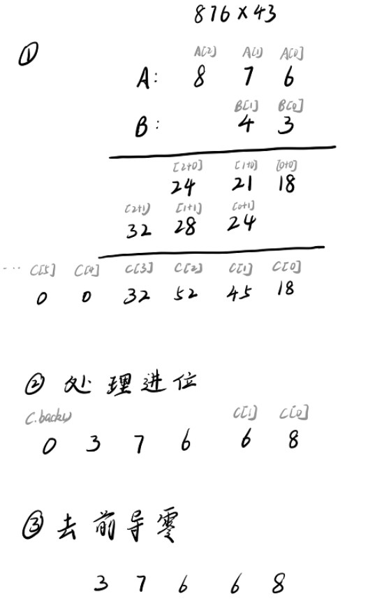

**`高精度 X  低精度`代码模板:**
```c++
// 高精度 X  低精度
#include<bits/stdc++.h>
using namespace std;
int main(){
    string a;
    int b;
    cin >> a >> b;
    vector<int> A;
    if(b == 0){
        cout << 0 << endl;
        return 0;
    }
    for(int i = a.size() - 1; i >= 0; i--){
        A.push_back(a[i] - '0');
    }

    vector<int> ans;
    int cnt = 0;
    for(int i = 0; i < A.size(); i++){
        int tmp = A[i] * b + cnt;
        ans.push_back(tmp % 10);
        cnt = tmp / 10;
    }

    while(cnt){
        ans.push_back(cnt % 10);
        cnt /= 10;
    }

    for(int i = ans.size() - 1; i >= 0; i--){
        cout << ans[i];
    }
    
    return 0;
}

```


**`高精度 X 高精度`代码模板：**
```c++
// 高精度 X 高精度
# include<bits/stdc++.h>

using namespace std;
string a, b;
vector<int> A, B;

vector<int> Mul(vector<int> A, vector<int> B){
    vector<int> ans(A.size() + B.size(), 0);
    for(int i = 0; i < A.size(); i++){
        for(int j = 0; j < B.size(); j++){
            ans[i + j] += A[i] * B[j];
        }
    }

    int pre = 0;
    for(int i = 0; i < ans.size(); i++){
        int tmp = ans[i] + pre;
        ans[i] = tmp % 10;
        pre = tmp / 10;
    }

    int i = ans.size() - 1;
    while(i >= 0 && ans[i] == 0){
        ans.pop_back();
        i--;
    }

    return ans;
}

int main(){
    
    cin >> a >> b;
    if(a == "0" || b == "0"){
        cout << 0;
        return 0;
    }
    for(int i = a.size() - 1; i >= 0; i--)
        A.push_back(a[i] - '0');
    for(int i = b.size() - 1; i >= 0; i--)
        B.push_back(b[i] - '0');

    vector<int> ans = Mul(A, B);
    for(int i = ans.size() - 1; i >= 0; i--)
        cout << ans[i];

    return 0;
}

```


### 高精度除法
高精度除法中需要除数是低精度的数值。解决问题只需要模拟平时的除法运算的过程即可。

>[高精度除法例题](https://www.acwing.com/problem/content/796/)
>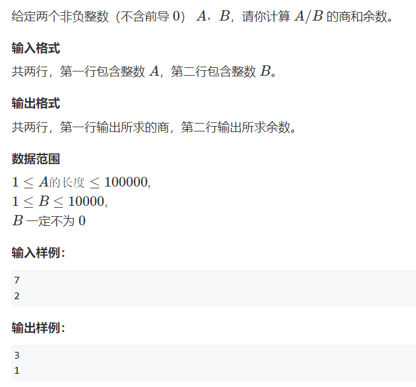

代码模板：
```c++
#include<bits/stdc++.h>
using namespace std;
int tmp;
vector<int> Divide(vector<int> A, int b){
    vector<int> ans(A.size(), 0);
    for(int i = A.size() - 1; i >= 0; i--){
        tmp = tmp * 10 + A[i];
        int res = tmp / b;
        ans[i] = res;
        tmp %= b;
    }

    int i = ans.size() - 1;
    while(i >= 0 && ans[i--] == 0){
        ans.pop_back();
    }
    return ans;
}

int main(){
    string a;
    int b;
    vector<int> A;
    cin >> a >> b;
    for(int i = a.size() - 1; i >= 0; i--){
        A.push_back(a[i] - '0');
    }

    vector<int> ans = Divide(A, b);
    for(int i = ans.size() - 1; i >= 0; i--){
        cout << ans[i];
    }
    if(ans.size() == 0)
        cout << 0;
    cout << endl;
    cout << tmp;

    return 0;
}
```


## 5. 前缀和
附上一篇较为详细的博客：
[对前缀和和差分的讲解](https://blog.csdn.net/m0_74215326/article/details/129620912?spm=1001.2014.3001.5502)

### 一维前缀和
一维数组的前缀和，相当于求取一组数列的前n项和。

什么时候适合使用前缀和？当需要频繁使用一组数列某个区间的数列和时，可以用该数列的前n项和来快速求取。

**一维前缀和核心代码**
```c++
const int N = 1e5+10;
int sum[N], a[N]; //sum[i] = a[1] + a[2] + a[3] ..... a[i];
for(int i = 1; i <= n;i++)
{ 
    sum[i] = sum[i - 1] + a[i];   
}

```
**查询操作:**
`sum[r] = a[1] + a[2] + a[3] + a[l-1] + a[l] + a[l+1] ...... a[r]`;
`sum[l - 1] = a[1] + a[2] + a[3] + a[l - 1]`;
`sum[r] - sum[l - 1] = a[l] + a[l + 1]+......+ a[r]`.


**图解**
>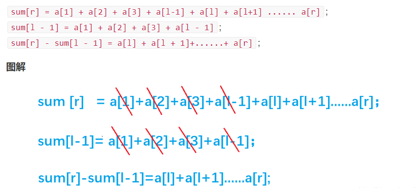

>[一维前缀和例题](https://www.acwing.com/problem/content/797/)
>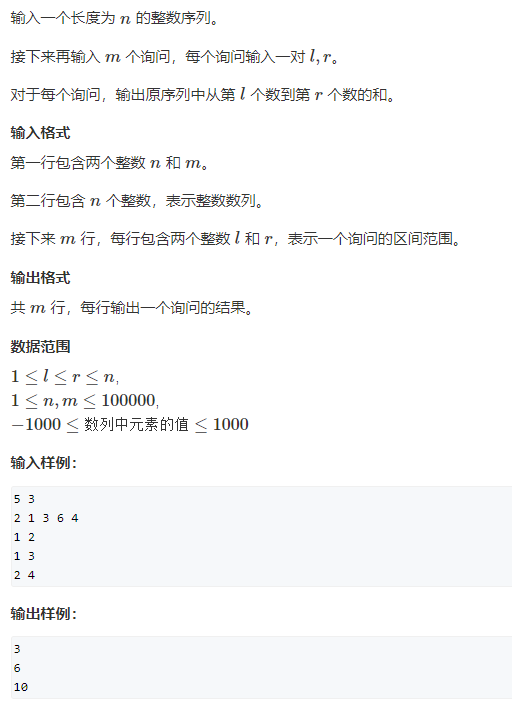


代码模板：
```c++
#include<bits/stdc++.h>
using namespace std;
const int N = 100005;
int n, m;
int a[N], sum[N];
int l, r;

int main(){

    cin >> n >> m;
    for(int i = 1; i <= n; i++){
        cin >> a[i];
        sum[i] = sum[i - 1] + a[i];
    }

    while(m--){
        cin >> l >> r;
        cout << sum[r] - sum[l - 1] << endl;
    }

    return 0;
}
```

### 二维前缀和
给一个二维矩阵，可以以O(1)的时间求出子矩阵的总数和。原理和一维前缀和类似，都是需要预先求出总的前缀和，然后根据坐标的加减来求出子矩阵的前缀和。

**二维前缀和初始化：**
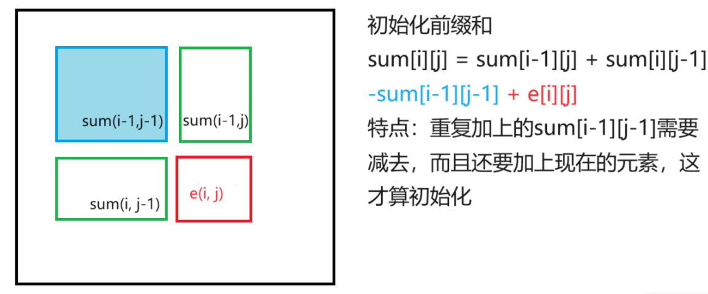

**二维前缀和求区间**
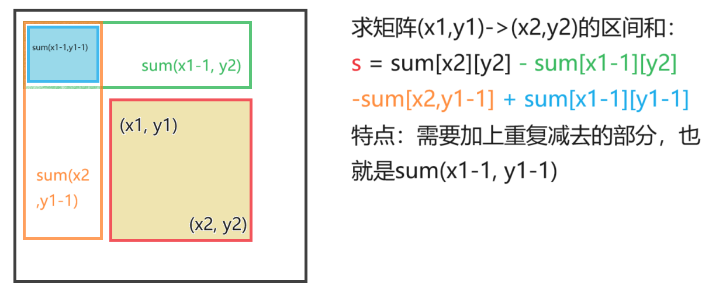

```
S[i, j] = 第i行j列格子左上部分所有元素的和
以(x1, y1)为左上角，(x2, y2)为右下角的子矩阵的和为：
S[x2, y2] - S[x1 - 1, y2] - S[x2, y1 - 1] + S[x1 - 1, y1 - 1]
```

>[二维前缀和例题](https://www.acwing.com/problem/content/798/)
>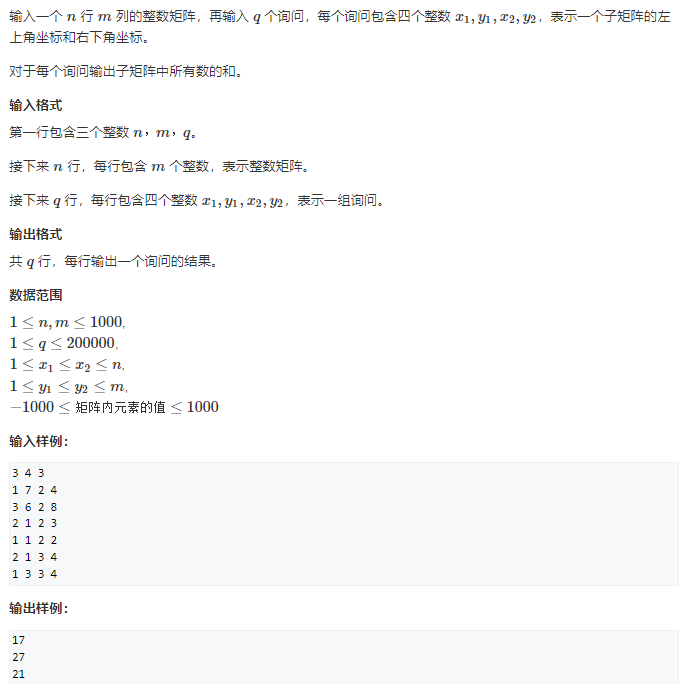

代码模板：
```c++
#include<bits/stdc++.h>
using namespace std;

const int N = 1005;
int n, m, q;
int a[N][N], s[N][N];
int main(){
    cin >> n >> m >> q;
    for(int i = 1; i <= n; i++){
        for(int j = 1; j <= m; j++){
            cin >> a[i][j];
            s[i][j] = s[i - 1][j] + s[i][j - 1] - s[i - 1][j - 1] + a[i][j];
        }
    }

    while(q--){
        int x1, y1, x2, y2;
        cin >> x1 >> y1 >> x2 >> y2;
        int sum = s[x2][y2] - s[x1 - 1][y2] - s[x2][y1 - 1] + s[x1 - 1][y1 -1];
        cout << sum << endl;
    }
    return 0;
}
```

## 6. 差分
### 一维差分
差分是前缀和的逆运算。
>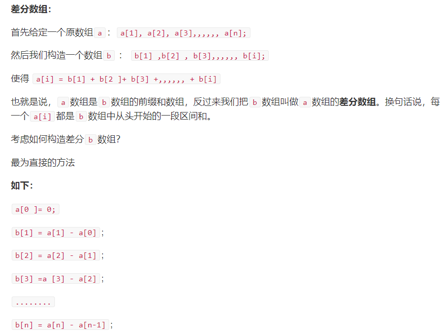
>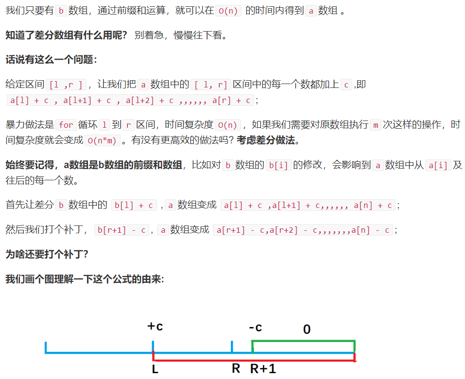
>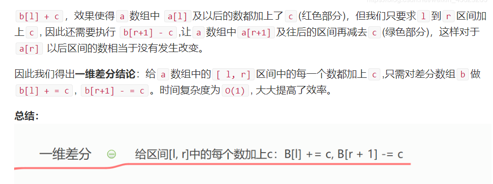
>转载自 [林小鹿博客](https://www.acwing.com/solution/content/26588/)

综上所述：差分是前缀和的逆运算，通过操作差分数组可以用O(1)的时间改变原序列中一段子序列的值。

> [一维差分例题](https://www.acwing.com/problem/content/799/)
> 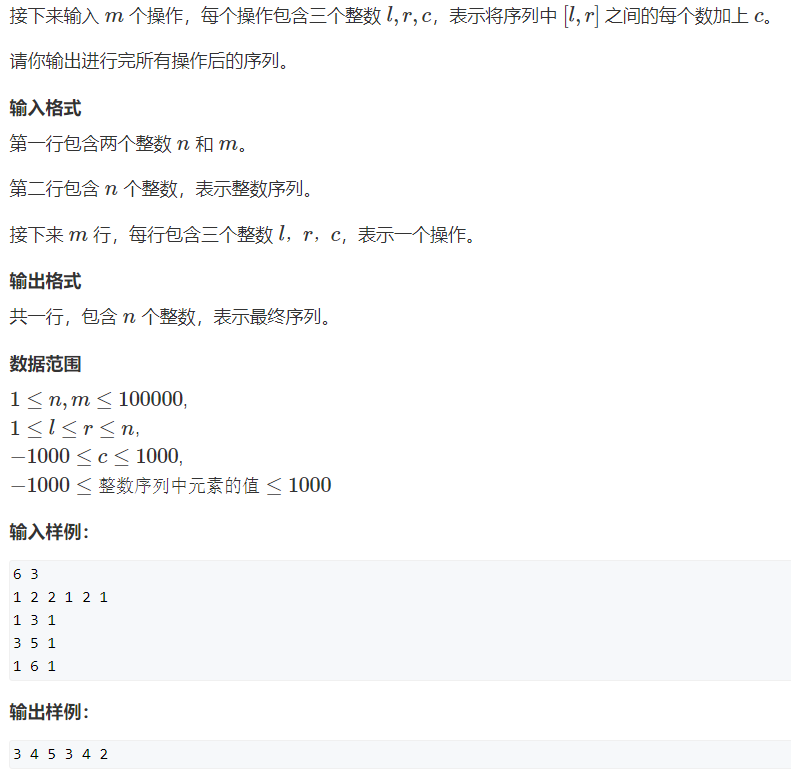

代码模板：
```c++
#include<bits/stdc++.h>
using namespace std;

const int N = 100005;
int n, m;
int a[N], b[N];
int main(){
    cin >> n >> m;
    for(int i = 1; i <= n; i++){
        cin >> a[i];
        b[i] = a[i] - a[i - 1];
    }

    while(m--){
        int l, r, c;
        cin >> l >> r >> c;
        b[l] += c;
        b[r + 1] -= c;
    }

    for(int i = 1; i <= n; i++){
        a[i] = a[i - 1] + b[i];
        cout << a[i] << ' ';
    }
    return 0;
}
```

### 二维差分
差分是前缀和的逆运算。
> [二维差分讲解博客](https://www.acwing.com/solution/content/27325/)
> 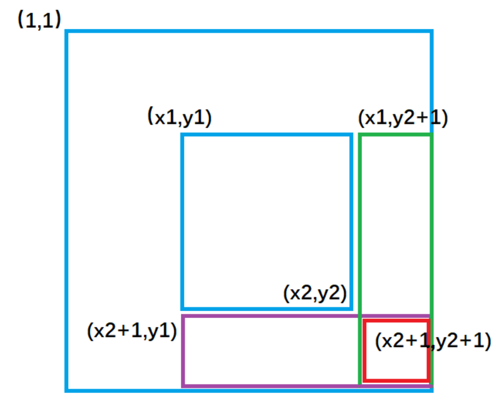
> 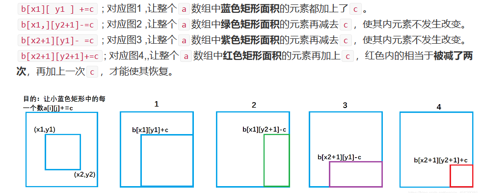

> [二维差分例题](https://www.acwing.com/problem/content/800/)
> 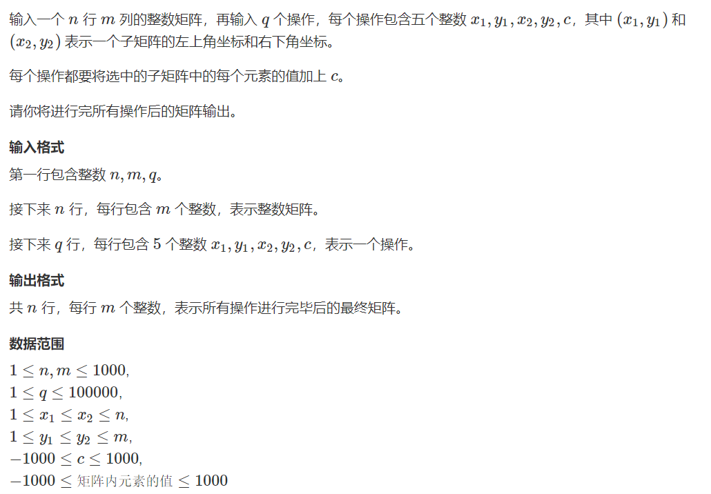
> 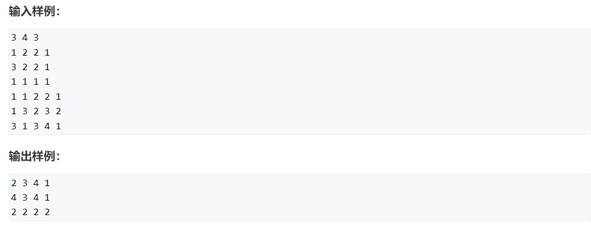

代码模板：
```c++
#include<bits/stdc++.h>
using namespace std;

const int N = 1005;
int n, m, q;
int a[N][N], b[N][N];

void track(int x1, int y1, int x2, int y2, int c){
    b[x1][y1] += c;
    b[x1][y2 + 1] -= c;
    b[x2 + 1][y1] -= c;
    b[x2 + 1][y2 + 1] += c;
}

int main(){
    cin >> n >> m >> q;
    for(int i = 1; i <= n; i++){
        for(int j = 1; j <= m; j++){
            cin >> a[i][j];
            track(i, j, i, j, a[i][j]);
        }
    }

    while(q--){
        int x1, y1, x2, y2, c;
        cin >> x1 >> y1 >> x2 >> y2 >> c;
        track(x1, y1, x2, y2, c);
    }

    for(int i = 1; i <= n; i++){
        for(int j = 1; j <= m; j++){
            a[i][j] = a[i - 1][j] + a[i][j - 1] - a[i - 1][j - 1] + b[i][j];
            cout << a[i][j] <<' ';
        }
        cout << endl;

    }
    return 0;
}
```

## 7. 双指针
双指针算法通常是用前后两个指针动态变化维护某个区间。类型大致分为两指针同向移动和相向移动。例如前面提到的快速排序和归并排序等就用到了双指针。

**双指针模板**
```c++
for (int i = 0, j = 0; i < n; i ++ )
{
    while (j < i && check(i, j)) j ++ ;

    // 具体问题的逻辑
}
常见问题分类：
    (1) 对于一个序列，用两个指针维护一段区间
    (2) 对于两个序列，维护某种次序，比如归并排序中合并两个有序序列的操作
```

**题目一**
>[最长连续不重复子序列](https://www.acwing.com/problem/content/801/)
>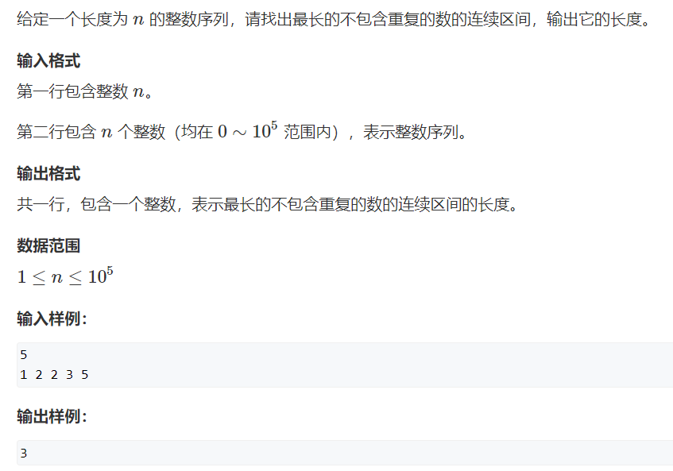

代码模板：
```c++
#include<bits/stdc++.h>
using namespace std;

const int N = 100005;
int n, a[N], b[N];

int main(){
    cin >> n;
    for(int i = 0; i < n; i++)  cin >> a[i];
    
    int cnt = 0;
    for(int i = 0, j = 0; j < n; j++){
        b[a[j]]++;
        while(b[a[j]] > 1){
            b[a[i]]--;
            i++;
        }
        
        cnt = max(cnt, j - i + 1);
    }
    
    cout << cnt << endl;
    return 0;
}
```

**题目二**
>[数组元素的目标和](https://www.acwing.com/problem/content/description/802/)
>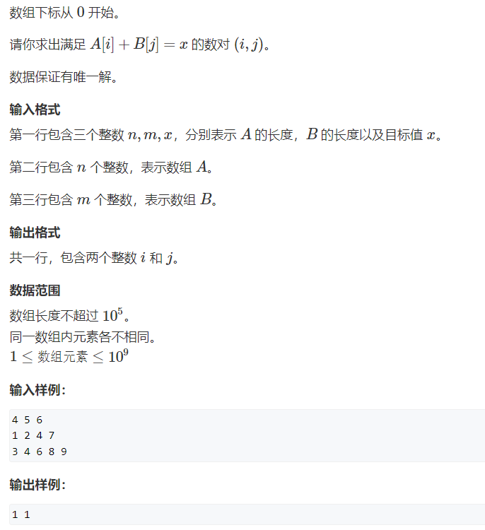

思路很多。两层循环暴力求解也是可以的。如果这里两个数组不是有序序列，使用hash表也很方便。考虑到是双指针，可以考虑对一个数组用二分查找目标数，时间复杂度应该是O(n*logm)。

但是考虑到单调性，我们发现如果一个序列的首指针和另一个序列的尾指针相向而行，可以保证两数之和具有一定性质：`a[i] + b[j] > target`。通过移动双指针来维护这个性质。直到找到`a[i] + b[j] == target`返回答案。

代码模板：
```c++
#include<bits/stdc++.h>

using namespace std;

const int N = 100010;
int n, m, x;
int a[N], b[N];

int main(){
    cin >> n >> m >> x;
    for(int i = 0; i < n; i++)  cin >> a[i];
    for(int i = 0; i < m; i++)  cin >> b[i];
    
    for(int i = 0, j = m - 1; i < n; i++){
        while(j >= 0 && a[i] + b[j] > x){
            j--;
        }
        if(a[i] + b[j] == x){
            cout << i << ' ' << j << endl;
            break;
        }
    }
    
    return 0;
}
```

**题目三**
>[判断子序列](https://www.acwing.com/problem/content/2818/)
>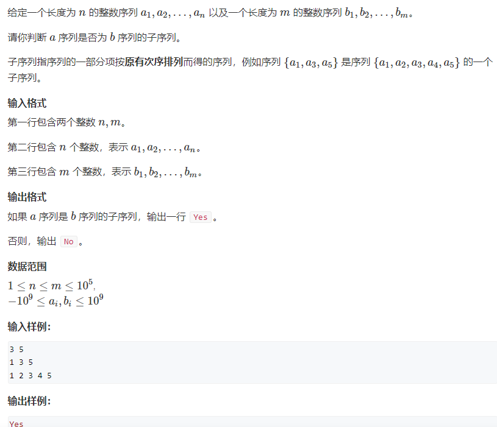

代码模板：
```c++
#include<bits/stdc++.h>
using namespace std;

const int N = 100010;
int n, m;
int a[N], b[N];

int main(){
    cin >> n >> m;
    for(int i = 0; i < n; i++)  cin >> a[i];
    for(int i = 0; i < m; i++)  cin >> b[i];

    int i, j;
    for(i = 0, j = 0; i < n; i++, j++){
        while(j < m && a[i] != b[j]){
            j++;
        }
        if(j == m){
            cout << "No" <<endl;
            break;
        }
    }
    if(i == n)  cout << "Yes" << endl;

    return 0;
}
```

## 8. 位运算
几个常见位运算。

**右移：** `x >> 1`,右移一位，相当于除以2：右移几位相当于高位补零，低位抛弃；

**左移：** `x << 1`,左移一位，相当于乘以2：左移几位相当于高位舍弃，低位补零；

**求n的第k位数字：** `n >> k & 1`,这里是将n右移k位，然后剩余位数取零。（ps：k是从0开始）

**返回n的最后一位1:** `lowbit(n) = n & -n`。在计算机内部，一个数的负数是取它的补码。补码是将其取反加一。这里lowbit(n)是将n的最后一位1对应的数字大小返回。
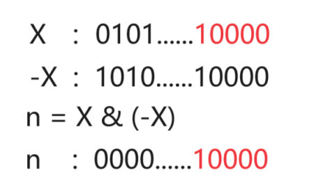

>[位运算例题](https://www.acwing.com/problem/content/description/803/)
>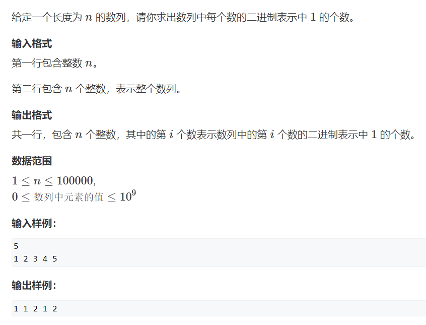

思路：通过位运算，以O(1)的速度求出n二进制的最后一位1对应的数值，然后再一个循环内减去该数，求出一共进行的次数，即可求出数字一个数的二进制中有多少个1.

代码模板：
```c++
#include<bits/stdc++.h>
using namespace std;

const int N = 100010;
int n, a[N];
int lowbit(int n){
    return n & (-n);
}
int main(){

    cin >> n;
    for(int i = 0; i < n; i++){
        cin >> a[i];
    }

    for(int i = 0; i < n; i++){
        int cnt = 0;
        while(a[i]){
            a[i] -= lowbit(a[i]);
            cnt++;
        }
        cout << cnt << ' ';
    }
    return 0;
}
```

## 9. 离散化
什么是离散化？为什么要离散化？

一组数据的值域比较大，个数比较少【一般l和 r较小的话,比如<=10^5,用前缀和】。我们需要求出这组数据的某个区间的和。所以为了处理值域和数据个数的冲突，必须要进行离散化——**类似hash的思想将数据的数值和数组下标对应起来。**

接下来直接通过一个例题来理解离散化。
>[离散化例题](https://www.acwing.com/problem/content/description/804/)
>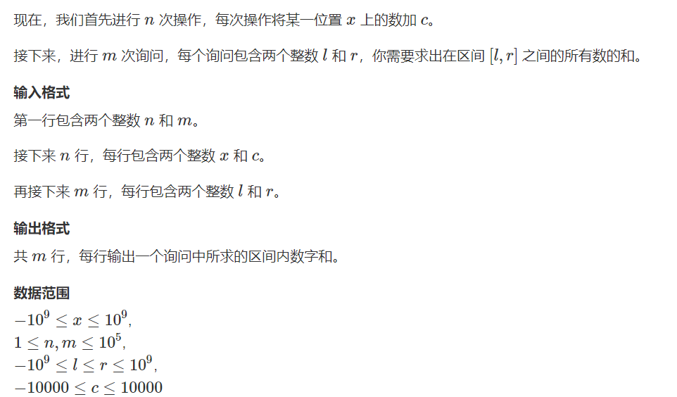
>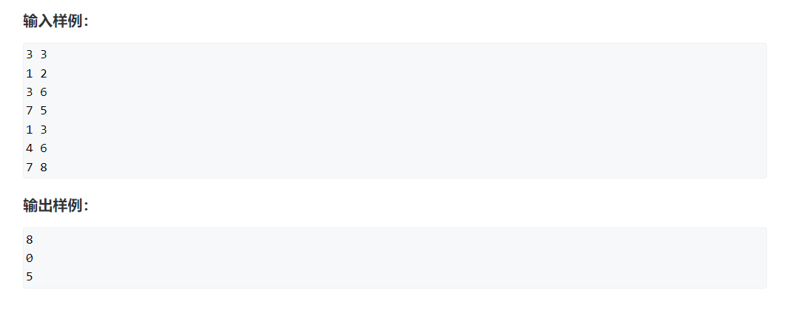

利益注意到这里的`x`对应的数值范围很大，要求出某段关于`x`的区间的和，很难用数组下标连续表示出来。同时`x`的个数并不多，可以用数组放下。所以我们根据hash的思想，将数组下标和`x`的数值对应，之后求关于`x`的每一段区间和，首先将`x`转换为数组下标，然后再求取这一段下标对应的区间和（前缀和实现）。
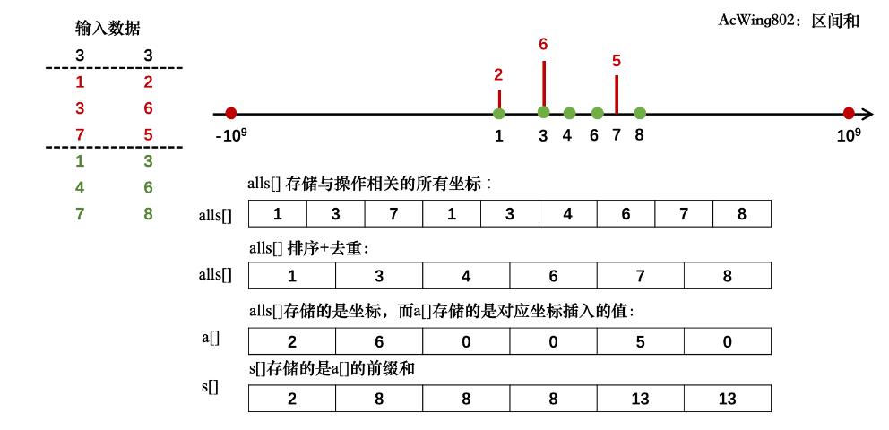

代码模板:
```c++
#include<bits/stdc++.h>
using namespace std;

typedef pair<int, int> PII;
const int N = 300010;
int n, m;
int sum[N]; //sum表示i对应的x坐标的前缀和
int a[N];   // a[i]表示i下标对应的x坐标对应的值
vector<int> alls;   // 存放排序好的x坐标
vector<PII > add, query;    // 存放对应x插入的数值和查询的区间范围

int main(){

    // 先输入数据
    cin >> n >> m;
    for(int i = 0; i < n; i++){
        int x, c;
        cin >> x >> c;
        alls.push_back(x);
        add.push_back({x, c});
    }

    for(int i = 0; i < m; i++){
        int l, r;
        cin >> l >> r;
        query.push_back({l, r});
        alls.push_back(l);
        alls.push_back(r);
    }

    // 在alls数组中进行排列和去重
    sort(alls.begin(), alls.end());
    alls.erase(unique(alls.begin(), alls.end()), alls.end());
    // unique函数的原理：使得只出现一次的数在一个区域，
    //剩余的有重复的接在第一个end(最后未重复出现的位置的下标)的后面，
    //再把其与第二个end之间(数组末尾)的值erase

    // 获得x数值和数组下标的映射
    unordered_map<int, int> mp;
    for(int i = 0; i < alls.size(); i++){
        mp[alls[i]] = i + 1;
    }

    // 开始对x坐标进行插值处理
    for(int i = 0; i < add.size(); i++){
        int index = mp[add[i].first];
        a[index] += add[i].second;
    }

    // 计算前缀和
    for(int i = 1; i <= alls.size(); i++){
        sum[i] = sum[i - 1] + a[i];
    }

    // 给出每段查询区间的值
    for(int i = 0; i < m; i++){
        int l = mp[query[i].first];
        int r = mp[query[i].second];
        int s = sum[r] - sum[l - 1];

        cout << s << endl;
    }

    return 0;
}
```

## 10. 区间合并
区间合并，典型的贪心问题，思维难度不大，但是模拟的过程如何用代码实现才是一个比较难的问题。计算合并之后的区间个数，我们需要用一个容器存储合并的区间，同时也需要一个两个指针来维护合并时的区间。在算法处理的时候，首先需要对区间进行排序，然后将判断每个区间的左右端点进行合并。当上一个区间的右端点小于下一个区间的左端点时，将记录上一个区间，然后更新维护区间的指针。当上一个区间的右端点和和下一个区间有交集，更新右端点。

>[区间合并例题](https://www.acwing.com/problem/content/805/)
>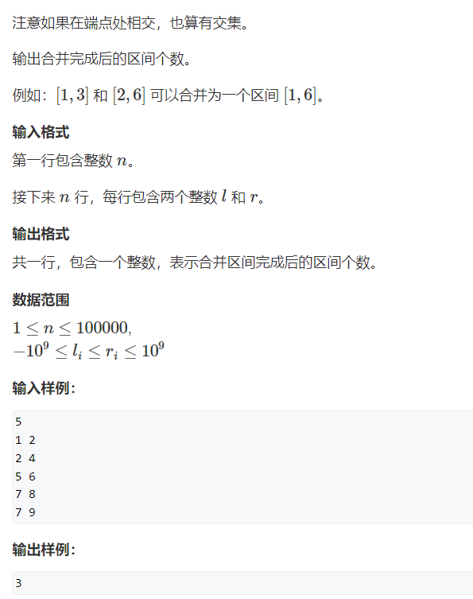

```c++
#include<bits/stdc++.h>
using namespace std;

typedef pair<int, int> PII;
vector<PII > segs, res;

void merge(){
    int st = INT_MIN, ed = INT_MIN;
    for(int i = 0; i < segs.size(); i++){
        // 上一个区间的右端点小于下一个区间的左端点
        if(ed < segs[i].first){
            if(st != INT_MIN)
                res.push_back({st, ed});
            // 更新维护区间的左右端点
            st = segs[i].first;
            ed = segs[i].second;
        }else{
            // 更新左端点
            ed = max(ed, segs[i].second);
        }
    }

    // 注意加入最后一个区间
    res.push_back({st, ed});
}

int main(){
    int n;
    cin >> n;
    for(int i = 0; i < n; i++){
        int l, r;
        cin >> l >> r;
        segs.push_back({l, r});
    }

    sort(segs.begin(), segs.end());

    merge();
    cout << res.size();
    return 0;
}
```


