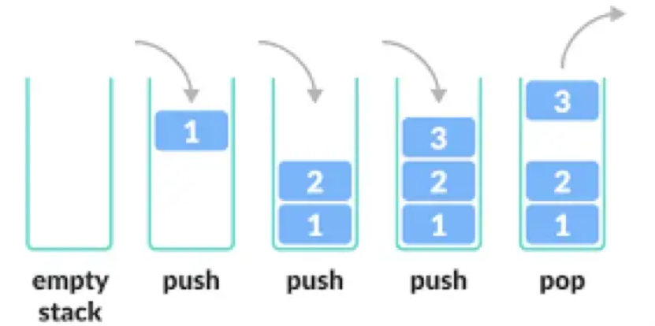
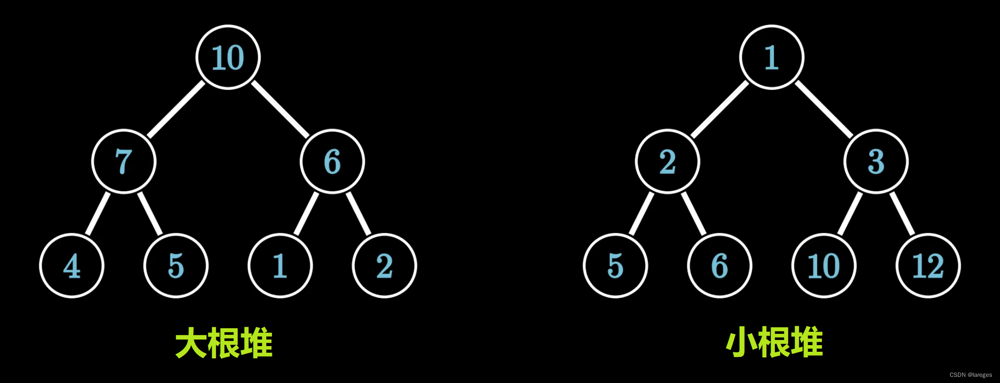

# 数据结构
[TOC]

## 前言
本文涉及到的数据结构，均是为了算法题和算法竞赛准备的。**为了减少时间复杂度，本文使用了数组模拟常见的数据结构，例如链表、栈和队列等。** 通常情况下实现这些数据结构都会使用结构体，还有动态分配内存等内容。但是这样会导致时间复杂度较高，不利于算法题目的实现。

事实上，利用数组模拟可以提高程序运行速度，但是在空间的消耗上会变大。但是由于算法题目中数据的大小不会太大，用数组模拟也不会超过限制范围。

## 1. 链表

用数组实现链表的数据结构称为静态链表。**实现方式一般是一个数组（`e[N]`）存放节点，一个数组（`ne[N]`）存放当前结点的下一个结点的位置（下标）。** 事实上静态链表的结点之间逻辑位置相邻，但是物理位置不一定相邻。因为新增的结点会在数组后面直接赋值，而删除结点只是通过`ne`数组（也就是存放当前结点的下一个结点的位置（下标）的数组）改变下一个结点下标实现，并没有实际删除结点的物理空间。

单独拎出来解释`head`头节点。**它相当于一个指针，指向链表的第一个元素。** 这里head是放置数组中代表头节点的数组下标。

### 单链表

>[单链表例题](https://www.acwing.com/problem/content/828/)
>
>

提示：三个功能：（1）.在表头插入结点；（2）.删除第k个插入的数后面的结点；（3）.在第k个插入的数后面插入一个数。这里的第k的插入的数不是很好理解。**这里我们使用`idx`表示插入的第`idx + 1`个数，因为方便在数组中放置结点。**

代码模板：
```c++
#include<bits/stdc++.h>
using namespace std;

const int N = 100010;
int head, idx;      // 头指针和当前可以存放结点下标的位置
int e[N], ne[N];    // 存放结点的数组和存放下一个指针的数组
void init(){
    head = -1;      // 当前头指针没有指向任何结点
    idx = 0;        //idx下标为0
}

void addToHead(int x){  // 在链表头部插入结点
    e[idx] = x;         // 1.创建和存放当前结点
    ne[idx] = head;     // 2.当前结点的下一个结点设置为头指针，头指针存放的是上一任头指针的下标
    head = idx;         // 3.更新头指针，存放新的头节点的下标
    idx++;              // 4.idx右移
}


void add(int k, int x){ // 在k下标后面加入新节点
    e[idx] = x;         // 1.创建和存放当前结点    
    ne[idx] = ne[k];    // 2.新节点的下一个结点位置为k结点下一个结点的位置
    ne[k] = idx;        // 3.更新k结点的下一个结点的位置
    idx++;              // 4.更新idx
}

void remove(int k){
    if(ne[k] == -1) return;
    ne[k] = ne[ne[k]];
}

int main(){
    init();
    int m;
    cin >> m;
    while(m--){
        char c;
        cin >> c;
        if(c == 'H'){
            int x;
            cin >> x;
            addToHead(x);
        }else if(c == 'D'){
            int k;
            cin >> k;
            if(k == 0)  head = ne[head];
            else        remove(k - 1);
        }else if(c == 'I'){
            int k, x;
            cin >> k >> x;
            add(k - 1, x);
        }
    }

    for(int i = head; i != -1; i = ne[i]){  // 遍历链表
        cout << e[i] << ' ';
    }

    return 0;
}
```


### 双链表
双链表需要两个额外数组记录前后结点的位置。同时还需要两个哑结点来标记头节点和尾结点。其余原理和单链表类似。

>[双链表例题](https://www.acwing.com/problem/content/description/829/)
>
>

代码模板：
```c++
#include<bits/stdc++.h>
using namespace std;

const int N = 100010;
int e[N], l[N], r[N];       // 链表
int idx;                    // 存放结点的数组下标

void init(){
    r[0] = 1, l[1] = 0;     // 初始化头节点和尾结点
    idx = 2;                // 已经有两个结点了
}

void add(int k, int x){     // 在下标为k的结点后面插入新节点x
    e[idx] = x;
    r[idx] = r[k];
    l[idx] = k;
    l[r[k]] = idx;
    r[k] = idx;
    idx++;
}

void remove(int k){
    l[r[k]] = l[k];
    r[l[k]] = r[k];
}


int main(){

    int n;
    cin >> n;
    init();
    while(n--){
        string op;
        cin >> op;
        if(op == "L"){
            int x;
            cin >> x;
            add(0, x);
        }else if(op == "R"){
            int x;
            cin >> x;
            add(l[1], x);
        }else if(op == "D"){
            int k;
            cin >> k;
            remove(k + 1);
        }else if(op == "IL"){
            int k, x;
            cin >> k >> x;
            add(l[k + 1], x);
        }else if(op == "IR"){
            int k, x;
            cin >> k >> x;
            add(k + 1, x);
        }
    }

    for(int i = r[0]; i != 1; i = r[i]){
        cout << e[i] << ' ';
    }
    return 0;
}
```

## 2. 模拟栈
使用数组模拟数据结构——栈。

栈相当于一个有底的瓶子，向瓶子存和取物品时，规则是后进先出。


**题目一**
> [数组模拟栈](https://www.acwing.com/problem/content/description/830/)
> 
> 

思路：设置一个下标表示栈顶位置，为了便于返回栈顶元素，**通常初始化栈顶位置`top = -1`**。

代码模板：
```c++
#include<bits/stdc++.h>
using namespace std;

const int N = 100010;
int st[N];      // 模拟栈的数组
int top;

void init(){
    top = -1;
}

void push(int x){
    st[++top] = x;
}

void pop(){
    top--;
}

bool empty(){
    return top == -1;
}

int query(){
    return st[top];
}

int main(){

    int n;
    cin >> n;
    init();
    while(n--){
        string op;
        cin >> op;
        if(op == "push"){
            int x;
            cin >> x;
            push(x);
        }else if(op == "pop"){
            pop();
        }else if(op == "empty"){
            if(empty())     cout << "YES" << endl;
            else            cout << "NO" << endl;
        }else if(op == "query"){
            cout << query() << endl;
        }
    }
    return 0;
}
```


**题目二**
>[求表达式](https://www.acwing.com/problem/content/description/3305/)
>

思路：设置两个栈分别存储操作符和操作数。这里类似运用逆波兰式求解表达式的结果。直接给一份详细题解吧。[优秀博客讲解](https://www.acwing.com/solution/content/40978/)

事实上在`leetcode`上有相关的题目练习，难度由简单到难，可以自行练习。

```c++
#include<bits/stdc++.h>
using namespace std;

const int N = 100010;
int nums[N];
char op[N];
int opTop, numsTop;     // 建立两个栈，分别存放操作数和运算符
string s;               // 表达式
unordered_map<char, int> mp = {     //运算符优先级
    {'(', 0},
    {'+', 1},
    {'-', 1},
    {'*', 2},
    {'/', 2},
    {')', 3}
};

void init(){            // 栈初始化
    opTop = -1, numsTop = -1;
}

bool isNum(char c){     // 判断是否是数字
    int x = c - '0';
    return x >= 0 && x <= 9;
}

int toNum(int i, int j){    // 将字符串转化为数字
    int tmp = 0;
    while(i <= j){
        tmp = tmp * 10 + s[i] - '0';
        i++;
    }
    return tmp;
}

void compute(){             // 计算一个运算符对应的表达式的结果
    char c = op[opTop];
    opTop--;
    int b = nums[numsTop];
    numsTop--;
    int a = nums[numsTop];
    numsTop--;

    int res = 0;
    if(c == '+')    res = a + b;
    else if(c == '-')   res = a - b;
    else if(c == '*')   res = a * b;
    else if(c == '/')   res = a / b;
    nums[++numsTop] = res;
}

int main(){

    init();     //初始化
    cin >> s;   //输入表达式
    
    for(int i = 0; i < s.size(); i++){
        if(isNum(s[i])){        // 将连续的数字压入栈
            int j = i;
            while(isNum(s[j]) && j < s.size())  j++;
            int tmp = toNum(i, j - 1);
            i = j - 1;          // 这里i要少一位，因为末尾i++
            nums[++numsTop] = tmp;
        }else if(s[i] == '('){  // '('直接压入栈，等待遇到了')'返回
            op[++opTop] = '(';
        }else if(s[i] == ')'){  // 遇到')'，将()内部的式子都计算了
            while(op[opTop] != '('){
                compute();      // 计算()内部的式子
            }
            opTop--;            // 将最后的'('弹出
        }else{                  //对于运算符的情况
            while(mp[s[i]] <= mp[op[opTop]]){
                compute();
            }
            op[++opTop] = s[i];
        }
    }

    // 将栈里面的最后结果计算出来
    while(opTop != -1){
        compute();
    }

    int ans = nums[numsTop];
    cout << ans << endl;
    
    return 0;
}
```

## 3. 模拟队列
队列的机制相当于一截水管，两端分别进出。原理图如下：


这里我们使用数组模拟队列。思路如下：**重点：队头和队尾的设置不一样，队头`hh`初始化为`0`,队尾`tt`初始化为-1.当`hh < tt`时队列为空。**


>[模拟队列](https://www.acwing.com/problem/content/831/)
>
>

代码模板：
```c++
#include<bits/stdc++.h>
using namespace std;

const int N = 100010;
int q[N];       //队列
int hh, tt;

void init(){
    hh = 0;
    tt = -1;
}

void push(int x){
    q[++tt] = x;
}

void pop(){
    hh++;
}

bool empty(){
    return hh > tt;
}

int query(){
    return q[hh];
}

int main(){
    int n;
    cin >> n;
    init();
    while(n--){
        string s;
        cin >> s;
        if(s == "push"){
            int x;
            cin >> x;
            push(x);
        }else if(s == "pop"){
            pop();
        }else if(s == "empty"){
            if(empty()){
                cout << "YES" << endl;;
            }else{
                cout << "NO" << endl;;
            }
        }else if(s == "query"){
            cout << query() << endl;
        }
    }
    return 0;
}

```


## 4. 单调栈
单调栈和单调队列其实还蛮像的。不过单调队列主要用于滑动窗口中最大值或者最小值，单调栈主要用于在`O(n)`的时间复杂度求一个数左边或者右边中小于或者大于它的数。下面主要讲解单调栈。

研究了半天，发现我们需要维护一个栈，栈中的元素具有单调性。但是这个栈代表什么含义？我觉得这一点很重要——**当遍历到数组中`i`位置时，此时从栈底到栈顶是代表从数组中`0`位置到`i - 1`位置中满足某种单调性的序列。** 例如，**如果我们需要求出数组中`i`位置左边序列中最近的小于它的数，那么可以维护栈的序列时单调递增的。那么此时对于数组中的`e[i]`,栈中元素都是小于它的，那么栈顶元素就是离他最近的小于它的数。** 

如何维护单调栈？接着上面说到的：比较数组`e[i]`和栈顶的数的大小，如果栈顶的数小于`e[i]`，那么此时栈顶的数就是数组`e[i]`左边序列中最近的小于`e[i]`的数（满足条件的数），记录下来。如果栈顶的数大于等于`e[i]`，那么将栈顶的元素弹出，直到栈顶的元素小于`e[i]`。


简言之：单调栈时维护数组`e[i]`的左边序列中满足某种单调性的序列，栈顶元素是左边序列中离当前`e[i]`最近的满足某种条件的数。

上面只是提到了如何维护左边序列，那么如何求取数组中每一位的右边序列中离他最近的小于它的数？毕竟单调栈的序列都是当前位置的左边序列。

其实此时需要逆向思考了。我们将还没有进栈的元素当作右边序列的数，在进栈时判断它是否满足单调栈中的某种单调性。如果不满足该单调性，那么这个元素就是单调栈中部分元素的满足条件的最近元素。

**单调栈模板伪代码**
```c++
for(int i = 0; i < n; i++){   // 遍历数组
    // 处理答案
    while(!st.empty() && st.top() <= e[i]){    //对于当前数组位置，维护单调栈
        st.pop();
    }

    // 处理元素
    // 压入元素
    st.push(e[i]);
}
```

>[单调栈例题](https://www.acwing.com/problem/content/description/832/)
>

代码：
```c++
#include<bits/stdc++.h>
using namespace std;

const int N = 100010;
int e[N], ans[N], n;
stack<int> st;

int main(){
    cin >> n;
    for(int i = 0; i < n; i++){
        cin >> e[i];
    }

    for(int i = 0; i < n; i++){
        while(!st.empty() && st.top() >= e[i]){
            st.pop();
        }

        if(st.empty())  ans[i] = -1;
        else            ans[i] = st.top();

        st.push(e[i]);
    }

    for(int i = 0; i < n; i++){
        cout << ans[i] << ' ';
    }
    return 0;
}
```


## 5. 单调队列
单调队列通常用于解决滑动窗口中最大只能或者最小值问题。因此我们需要维护这个滑动窗口的元素。如果此时选择暴力算法，那么就是使用队列不断弹进和弹出元素，每次找队列的最值时遍历队列即可。但是时间复杂度比较高。因此选择使用单调队列这个概念——我们每次将窗口向右移时，都去维护队列，**保证队列的元素具有单调性**。这样可以每次以O(1)的时间复杂度找到窗口的最值——要么在队头要么在队尾。

在实现方式上，我们确定队列的单调性，然后不断维护单调队列。每次移动都可以输出或者记录当前窗口的最值。

如何维护单调队列？

假设单调队列中元素是单调递增的，那么每次到达一个新的窗口时，比较即将进入队列的元素`e[i]`和队尾元素`q.back()`的大小。如果`e[i] > q.back()`，满足队列的单调性，将`e[i]`加入队列；如果`e[i] < q.back()`，那么不停的将队尾元素弹出，直到满足条件或者队列为空时停止，在将`e[i]`加入队列。

**但是注意这里的队尾元素的出队条件是不带等号的。** 因为如果出现一个序列中元素全部相等，那么就会出现问题，导致弹出多余元素。

但是需要注意的是：需要保证队列中不在滑动窗口的元素会被弹出。那么可以在新元素进入队列之前就判断一下，队头元素是否和之前滑动窗口的第一个元素相等。

> [滑动窗口例题](https://www.acwing.com/problem/content/156/)
> 
> 

代码模板：注意，这里使用了c++的双向队列`deque`，它可以再队头和队尾都是先入队和出队的操作。

```c++
#include<bits/stdc++.h>
using namespace std;

const int N = 1000010;
int n, k;
int a[N];

int main(){
    cin >> n >> k;
    for(int i = 0; i < n; i++)  cin >> a[i];

    deque<int> que;     // 单调队列

    // 求滑动窗口最小值，单调队列的数值是非严格单调递增的
    for(int i = 0; i < n; i++){
        // 确保队列中队头的元素已经不是之前滑动窗口中队头的元素
        if(i - k >= 0 && !que.empty() && a[i - k] == que.front()){
            que.pop_front();
        }
        // 维护单调队列
        // 这里的弹出条件必须不带等号
        while(!que.empty() && que.back() > a[i]){
            que.pop_back();
        }
        // 加入队列
        que.push_back(a[i]);
        if(i - k + 1 >= 0){     //滑动窗口已满
            cout << que.front() << ' ';
        }
    }
    cout << endl;

    // 求滑动窗口的最大值
    que.clear();
    for(int i = 0; i < n; i++){
        // 判断队首元素
        if(i - k >= 0 && !que.empty() && que.front() == a[i - k]){
            que.pop_front();
        }

        // 维护队列
        while(!que.empty() && que.back() < a[i]){
            que.pop_back();
        }

        //将当前元素加入队尾
        que.push_back(a[i]);

        // 输出答案
        if(i - k + 1 >= 0){
            cout << que.front() << ' ';
        }
    }

    return 0;
}
```

## 6. KMP算法
KMP算法常用于字符串匹配，即在字符串`s`中匹配模式串`p`是否出现在`s`串中。

对于字符串匹配问题，如果采用暴力方式，那么算法复杂度很大，为`O(n*m)`。使用KMP算法，时间复杂度为`O(m+n)`。

KMP算法的本质是，根据模式串`p`的（某种）对称性构建`next`数组，然后在不移动字符串`s`的指针`i`的情况下，根据`next`数组来移动模式串`p`。以此降低时间复杂度。

> 具体思路和讲解请看博客：[代码随想录讲解KMP](https://programmercarl.com/0028.%E5%AE%9E%E7%8E%B0strStr.html#%E6%80%9D%E8%B7%AF)
> 我认为的关键是：设置`j`为当前最长的下标，然后不断比较`j + 1`处的字符和`i`处的字符，不匹配就会退，匹配了就停止，直到最后更新数组。

关键代码：**求模式串`p`的`next`数组**
记忆模板：**初始化-1，回退，++，赋值**
```c++
void getNext(int *ne, string s){
    int j = -1;     //j相当于记录前面字符串最长公共前后缀的位置
    ne[0] = j;
    for(int i = 1; i < s.size(); i++){      //遍历字符串
        while(j >= 0 && s[j + 1] != s[i]){  //j的下一个位置不匹配，j不断回退
            j = ne[j];
        }
        // 回退到合适的前缀位置后，继续判断j后面一个位置是否和i位置的字符匹配
        if(s[i] == s[j + 1]){
            j++;            //匹配，j就前进
        }
        // 最后更新next数组
        ne[i] = j;
    }
}
```

>[KMP例题](https://www.acwing.com/problem/content/833/)
>
>

代码模板:
```c++
#include<bits/stdc++.h>
using namespace std;

const int N = 100010;
int main(){
    int n, m;
    string s, p;
    cin >> n;
    cin >> p;
    cin >> m;
    cin >> s;
    // 求next数组
    int ne[N], j = -1;
    ne[0] = j;
    for(int i = 1; i < n; i++){
        while(j >= 0 && p[j + 1] != p[i]){
            j = ne[j];
        }
        if(p[i] == p[j + 1]){
            j++;
        }
        ne[i] = j;
    }

    // for(int i = 0; i < n; i++)
    //     cout << ne[i] << ' ';

    // 开始匹配
    for(int i = 0, j = -1; i < m; i++){
        // 这里依然是匹配的模板
        while(j >= 0 && s[i] != p[j + 1]){
            j = ne[j];
        }
        if(s[i] == p[j + 1])    j++;
        // 这里是什么时候输出的模板
        if(j == n - 1){
            cout << i - j << ' ';
            j = ne[j];
        }
        
    }

    return 0;
}
```


## 7. Trie树（字典树）
一种树形数据结构—— Trie树，也叫字典树。

**Trie树的介绍**
Trie树，又叫**字典树、前缀树、单词查找树或者键树**，是一种多叉树树的结构，如下图：


Trie能够快速插入和查询字符串。每个结点的编号各不相同，**其中根节点的编号为0，其他结点用来表示路径和单词的插入次数，边（路径）表示字符。**


**Trie功能**
根据Trie的概念，可知它的本质是将很多字符串拆分成单个字符的形式，以树的形式存储起来，这里的查询方式就很想字典。应用如下：

1. **字符串检索：** 检索和查询是其最原始功能，**思路就是从根节点开始一个一个字符的比较。**

2. **词频统计：** Trie树常被用于文本词频统计。以上两个功能都可以用hash表实现。

3. **字符串排序：** Trie树结构可以将大量的字符串按照字典序进行排序。思路就是一次性遍历所有字符串，将他们全部插到Trie树中。然后按照先序遍历Trie树的所有关键字即可。

4. **前缀匹配：** 找出一个字符串集合中所有以'ab'开头的字符串。对此问题我们只需要构建Trie树之后输出以'ab'路径开头的关键字即可。

5. **后缀树、AC自动机的辅助内容**。


**Trie树的实现**
Trie维护字符串的集合，支持两种操作：
1. 在集合中插入一个字符串，`void insert(string s)`;
2. 在集合中查询一个字符串，`int query(string s)`;

>1. 儿子数组`son[p][j]`：**存储从结点`p`沿着`j`这条边走到的子节点。**
>   边为26个小写字符(a-z)对应着映射至0-25；
>   每个结点最多可以有26和分叉。
>2. 计数数组`cnt[p]`，存储以结点`p`结尾的单词插入的次数。
>3. 节点编号`idx`,用来给节点编号。（其实编号也没什么特殊含义，就是标记数组里面的值不为空而已。）


**题目一**
>[Trie树字符串统计](https://www.acwing.com/problem/content/837/)
>
>

代码模板：
```c++
#include<bits/stdc++.h>
using namespace std;

const int N = 100020;
int son[N][26], cnt[N];
int idx;

void insert(string s){
    int p = 0;          // 表示从头节点开始
    for(int i = 0; i < s.size(); i++){
        int u = s[i] - 'a';             // 字符映射为数字
        if(son[p][u] == 0)  son[p][u] = ++idx;      // 如果没有节点，就创建节点
        p = son[p][u];          //指向该节点的下一个位置，idx表示当前是第几个节点
    }
    //访问到最后一个字符之后，标记是第几次插入
    //因为idx是节点编号，每一个单词的最后一个字符都对应着一个编号
    //编号最多也是只有所有字符串加起来的长度而已。
    cnt[p]++;
}

int query(string s){
    int p = 0;
    for(int i = 0; i < s.size(); i++){
        int u = s[i] - 'a';
        if(son[p][u] == 0)  return 0;
        p = son[p][u];
    }
    return cnt[p];
}

int main(){
    int n;
    cin >> n;
    while(n--){
        char op;
        string s;
        cin >> op >> s;
        if(op == 'I')   insert(s);
        else if(op == 'Q'){
            int num = query(s);
            cout << num << endl;
        }
    }

    return 0;
}
```


**题目二**
>[最大异或对例题](https://www.acwing.com/problem/content/145/)
>

思路：参考博客[Trie总结](https://blog.csdn.net/raelum/article/details/128885107)

```c++
#include<bits/stdc++.h>
using namespace std;

const int N = 100020, M = N * 31;
int a[N];
int son[M][2], idx;


void insert(int x){
    int p = 0;
    for(int i = 30; i >= 0; i--){
        int t = x >> i & 1;
        if(!son[p][t])    son[p][t] = ++idx;
        p = son[p][t];
    }
}

int query(int x){
    int p = 0, res = 0;
    for(int i = 30; i >= 0; i--){
        int t = x >> i & 1;
        if(son[p][!t]){
            p = son[p][!t];
            res = res * 2 + !t;
        }else{
            p = son[p][t];
            res = res * 2 + t;
        }
    }

    return res;
}

int main(){
    int n;
    cin >> n;
    for(int i = 0; i < n; i++)  cin >> a[i];

    int res = 0;
    for(int i = 0; i < n; i++){
        insert(a[i]);           // 插入Trie树
        res = max(query(a[i]) ^ a[i], res);            // 查询a[i]对应的异或值最大的结果
    }

    cout << res << endl;
    return 0;
}
```


## 8. 并查集
并查集通常适用于：快速判断一个元素是否在一个集合中，快速合并两个集合。

那么如何实现呢？这里使用并查集主要是利用树结构——直接设置数组来存放所有元素所在集合的根节点元素。利用这个数组来快速找到元素的集合，从而解决以上两个问题。

1. 判断一个元素是否在某个集合中：**判断他们的根节点是否一致**
但是在合并元素到一个集合时，元素的父节点层层递进，不利于查询，因此需要不停的向上查询，使得时间复杂度变高。因此我们需要进行 **路径压缩**，使得出现如下情况：

这里我们可以通过在`find`函数中，每一次查询时，改变每个节点的父节点为根节点。

代码模板:
```c++
// 找到x元素的根节点
int find(int x){
    if(x == fa[x])  return fa[x];
    else            fa[x] = find(fa[x]);    // 进行路径压缩
    return fa[x];
}
``
简化版
```c++
// 找到x元素的根节点
int find(int x){
    if(x != fa[x])  fa[x] = find(fa[x]);    // 进行路径压缩
    return fa[x];
}
``

2. 合并两个集合，如图：


代码模板：
```c++
// 合并两个元素所在的集合
void union(int i, int j){
    int x = find(i);
    int y = find(j); //分别找到i和j的祖先节点
    fa[x] = y;    //让其中一个元素的祖先节点指向另一个元素的祖先节点
}

```

**题目一**
>[合并集合](https://www.acwing.com/problem/content/838/)
>
>

代码模板：
```c++
#include<bits/stdc++.h>
using namespace std;

const int N = 100020;
int n, m;
int a[N], fa[N];

// 初始化并查集
void init(){
    for(int i = 1; i <= n; i++)
        fa[i] = i;
}

// 返回元素的祖先节点
int find(int x){
    if(x != fa[x])  fa[x] = find(fa[x]);
    return fa[x];
}

// 合并两个元素或者集合
void merge(int i, int j){
    int x = find(i);
    int y = find(j);
    fa[x] = y;
}

int main(){
    
    cin >> n >> m;
    init();
    while(m--){
        string op;
        int x, y;
        cin >> op;
        if(op == "M"){
            cin >> x >> y;
            merge(x, y);
        }else if(op == "Q"){
            cin >> x >> y;
            if(find(x) == find(y))  cout << "Yes" << endl;
            else                    cout << "No" << endl;
        }
    }
    return 0;
}
```


**题目二**
>[连通块中点的个数](https://www.acwing.com/problem/content/description/839/)
>
>

思路：和前面模板不同的是，需要能够快速得到集合的元素个数。这里我们可以初始化每一个节点的元素个数为1，当需要合并两个不同元素的时候，再更新祖先节点对应集合元素的个数。**注意，这里只能通过根节点求出集合的元素。**

代码模板：
```c++
#include<bits/stdc++.h>
using namespace std;

const int N = 100020;
int n, m;
int a[N], fa[N], cnt[N];

void init(){
    for(int i = 1; i <= n; i++){
        fa[i] = i;
        cnt[i] = 1;
    }
}

int find(int x){
    if(x != fa[x])  fa[x] = find(fa[x]);
    return fa[x];
}

void merge(int i, int j){
    int x = find(i);
    int y = find(j);
    if(x != y){
        fa[x] = y;
        cnt[y] += cnt[x];
    }
}


int main(){
    cin >> n >> m;
    init();
    while(m--){
        string op;
        int x, y;
        cin >> op;
        if(op == "C"){
            cin >> x >> y;
            merge(x, y);
        }else if(op == "Q1"){
            cin >> x >> y;
            if(find(x) == find(y))  cout << "Yes" << endl;
            else                    cout << "No" << endl;
        }else if(op == "Q2"){
            cin >> x;
            cout << cnt[find(x)] << endl;
        }
    }
    return 0;
}
```

**题目三**
此题很难理解，确实是能力之外的题目。所以只能先留着了。
>[食物链](https://www.acwing.com/problem/content/242/)
>
>

代码模板：
```c++
#include<bits/stdc++.h>
using namespace std;

const int N = 50020;
int n, k;               // 动物编号、询问次数
int fa[N], d[N];      // 祖先节点、举例祖先节点的路径（带权）

int find(int x){    // 寻找父节点
    if(x != fa[x]){
        int u = find(fa[x]);
        d[x] += d[fa[x]];
        fa[x] = u;
    }
    return fa[x];
}

int main(){
    
    cin >> n >> k;
    for(int i = 1; i <= n; i++) fa[i] = i;
    int res = 0;                    
    while(k--){
        int c, x, y;
        cin >> c >> x >> y;
        if(x > n || y > n)  res++;
        else{
            int fx = find(x), fy = find(y);
            if(c == 1){
                if(fx == fy && (d[x] - d[y]) % 3 != 0)  res++;
                else if(fx != fy){
                    fa[fx] = fy;
                    d[fx] = d[y] - d[x];
                }
            }else{
                if(fx == fy && (d[x] - d[y] - 1) % 3 != 0) res++;
                else if(fx != fy){
                    fa[fx] = fy;
                    d[fx] = d[y] - d[x] + 1;
                }
            }
        }

    }

    cout << res;
    
    return 0;
}
```


## 9. 堆

### 什么是堆？
堆（heap）是一种特殊的完全二叉树，满足性质：除了叶节点外每个节点的值都**大于等于**（或者**小于等于**）其孩子节点的值（该性质又称为**堆序性**）。

堆有两种类型：
1. **大根堆**（又称为**最大堆**）：堆的每个节点值都大于等于其孩子节点的值。所以大根堆的特点是**堆顶元素（根节点）是堆中最大值**。
2. **小根堆**（又称为**最小堆**）：队中每个节点的值都小于等于其孩子节点的值。所以小根堆的特点是**堆顶元素（根节点）是堆中最大值**。



### 堆的实现
堆通常用**数组**来实现。具体而言，我们**从1开始，按照层序遍历的顺序给每个节点进行编号。** 每个节点的编号就是该节点在数组的下标。

按照这个编号方式，我们可以发现以下性质：
1. 根节点的编号一定是1；
2. 若一个节点的编号为`x`，那么它的左右节点的编号分别为`2x`和`2x+1`；
3. 若一个节点的编号为`x`，那么他的父节点（如果存在）编号为`x/2`.

同时根据完全二叉树的性质可知：
1. 若堆中含有`n`个元素，那么堆的高度为⌊logn⌋+1；
2. 若一个节点的编号为`x`，且满足`x>n/2`(整除)，那么该节点一定是叶子节点，否则一定是分支节点。


#### part1: 上滤和下滤
上滤又称为向上调整，下滤又称为向下调整，这是堆的两种基本操作。

上滤是指将不符合堆序性的某个元素向上调整至合适的位置，下滤是指将不符合堆序性的某个元素向下调整至合适的位置。

下面以小根堆为例，说明下滤和上滤的操作。

对于下滤操作，编号为`x`的非叶子节点，如果：
1. 编号为`2x`的左节点存在，但是编号为`2x+1`的右节点不存在：对于小根堆，如果比较发现`h[x] > h[2x]`，那么交换`h[x]`和`h[2x]`即可。
2. 编号为`2x`的左节点存和编号为`2x+1`的右节点都存在：对于小根堆，取`y = arg min{h[2x], h[2x+1]}`,若`h[x] > h[y]`，交换两个节点即可。

下滤操作的代码模板如下：
```c++
void down(int u){//注意u是数组下标
    int t = u;      // t记录最小点的编号

    // 有左节点，并且左节点比t小，更新t
    if(2*u <= r && a[t] > a[2*u])   t = 2*u;
    // 有右节点，并且右节点比他、
    节点的值小，更新t
    if(2*u + 1 <= r && a[t] > a[2*u + 1])   t = 2*u + 1;

    // 如果带调整的点不满足最小堆的性质，就需要交换，并且继续向下遍历
    if(u != t){
        swap(h[u], h[t]);
        down(t);
    }

}
```

对于上滤操作，只需要比较档期那节点和父节点的大小即可。对于小根堆来说，如果`h[x] < h[x/2]`，就不断交换两个节点，直到`h[x] >= h[x/2]`即可。

上滤代码模板：
```c++
void up(int u){
    while(u / 2 && h[u] < h[u / 2]){
        swap(u, u / 2);
        u /= 2;
    }
}
```

**上滤和下滤的操作时间复杂度为O(logn)**


#### part2：堆的常用操作
| 操作 | 时间复杂度 |
|:----:|:---------:|
|获取堆顶元素的值| O(1)|
|向堆中插入一个元素| O(logn)|
|删除堆顶元素|O(logn)|
|删除堆中任意元素|O(logn)|
|修改堆中任意元素|O(logn)|

这里插入和修改元素的时间复杂度取决于上滤和下滤的时间复杂度。

这里说明以下变量，`h`表示实现堆结构的数组，`r`表示当前堆中有多少个元素。

**操作一：获取堆顶元素**
```c++
int top(){
    return h[1];
}
```

**操作二：向堆中插入一个元素**
```c++
void push(int x){
    h[++r] = x, up(x);
}
```

**操作三：删除栈顶元素**
做法是将栈中最后一个元素（即编号最大的元素覆盖栈顶元素），然后删除最后一个元素，同时下滤堆顶元素。
```c++
void pop_head(){
    h[1] = h[r], r--, down(1);
}
```

**操作四：删除任意元素**
不妨设要删除的元素编号为`k`，同样需要用最后一个元素覆盖这个元素。此时对于编号为`k`的节点来说，要么执行上滤，要么执行下滤，要么什么都不执行。**因此，我们可以直接执行`down(k), up(k)`**，因为这里至多只有一个操作会被执行。
```c++
void pop_index(int k){
    h[k] = h[r], r--;
    down(k), up(k);
}
```

**操作五：修改堆中任一元素**
类似删除任一元素。
```c++
void modify(int k, int x){
    h[k] = x;
    down(k), up(k);
}
```

#### part3：堆排序
对于一个乱序数组，如何根据它来建堆？

如果对于每一个`a[i]`,一次调用`push()`方法，总时间复杂度为`O(nlogn)`。

更好的方式：将数值直接传送到`h`数组中（一般其实是直接输入到`h`中），此时`h`不一定满足堆序性。那么对该树的每个分支节点进行下滤，即可得到堆：
```c++
void build(){
    for(int i = r / 2; i; i--)  down(i);
}
```

**该方式的时间复杂度为`O(n)`**.


### 堆排序
堆排序实际上是现根据乱序序列建堆，然后 输出根节点，然后将根节点和编号最大的节点进行交换，数组数量降低，同时下滤根节点。接下来依次输出和进行。

**这样的时间复杂度是O(n)**.

这里需要有一个很有意思的地方：
如果是自己模拟堆排序，每次输出根节点之后再重新调整堆结构，那么：
**小根堆输出的序列就是从小到大排序的序列，大根堆同理。**

但是如果不是每次输出根节点再调整堆结构，而是等到全部调整完之后再一次性输出数组，那么：
**利用小根堆进行堆排序得到的数组是从大到小的序列，大根堆同理。**

> 具体操作图解可以参考[博客](https://www.acwing.com/solution/content/120483/)

****
**题目一**
>[堆排序](https://www.acwing.com/problem/content/840/)
>

代码模板：
```c++
#include<bits/stdc++.h>
using namespace std;

const int N = 100010;
int n, m;
int h[N], r;

// 下滤
void down(int u){
    int t = u;
    if(2*u <= r && h[t] > h[2*u])   t = 2*u;
    if(2*u + 1 <= r && h[t] > h[2*u + 1])   t = 2*u + 1;
    if(u != t){
        swap(h[u], h[t]);
        down(t);
    }
}

// 上滤
void up(int u){
    if(u/2  && h[u] < h[u/2]){
        swap(h[u], h[u/2]);
        up(u/2);
    }
}

int main(){
    cin >> n >> m;
    for(int i = 1; i <= n; i++) cin >> h[i];
    r = n;

    // 建堆
    for(int i = r / 2; i; i--)  down(i);
    // 输出有序元素
    while(m--){
        cout << h[1] << ' ';
        swap(h[1], h[r]), r--, down(1);
    }

    return 0;
}
```

### 优先队列
优先队列是指定队列中元素的**优先级**，优先级越大的越优先出队，而普通队列则是按照进队的先后顺序出队，可以看作越早越优先。

在`STL`中的优先队列实际是**大根堆**，元素越大越优先出队。这里主要讲解`STL`中优先队列的用法。

****
**包含的头文件**
```c++
#include<queue>
```

**创建优先队列（大根堆）**
```c++
priority_queue<int> q;
```

**常用操作**
|操作|描述|
|:---:|:---:|
|q.top()|返回队头元素|
|q.pop()|弹出队头元素|
|q.push(x)|向队列中插入元素|
|q.empty()|判断队列是否为空|
|q.size()|返回队列的大小|


