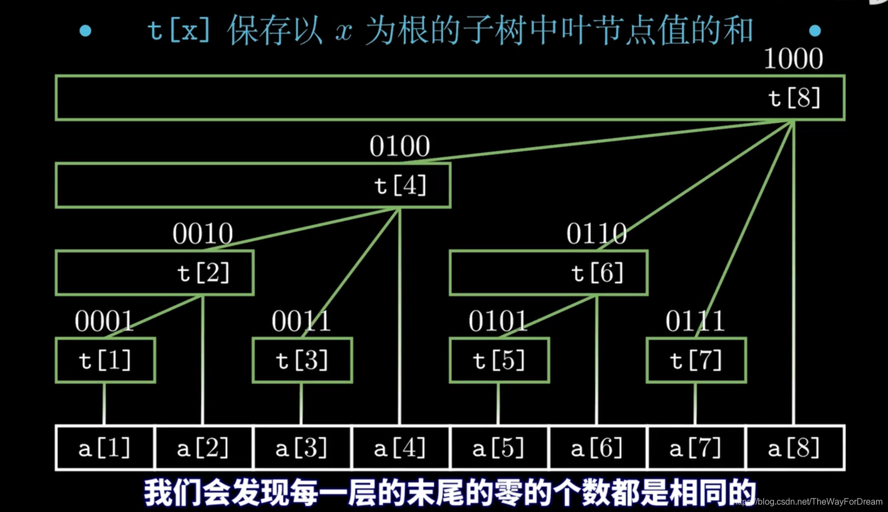
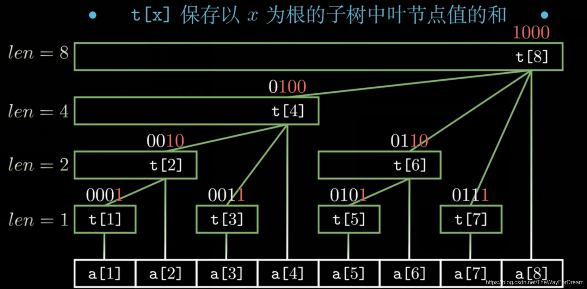
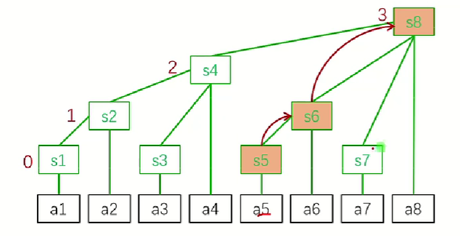
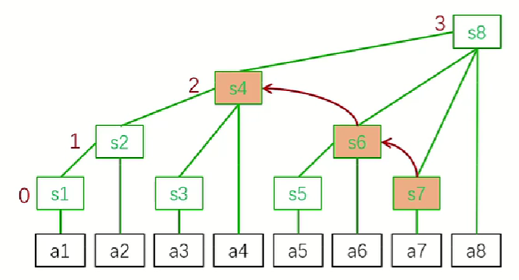
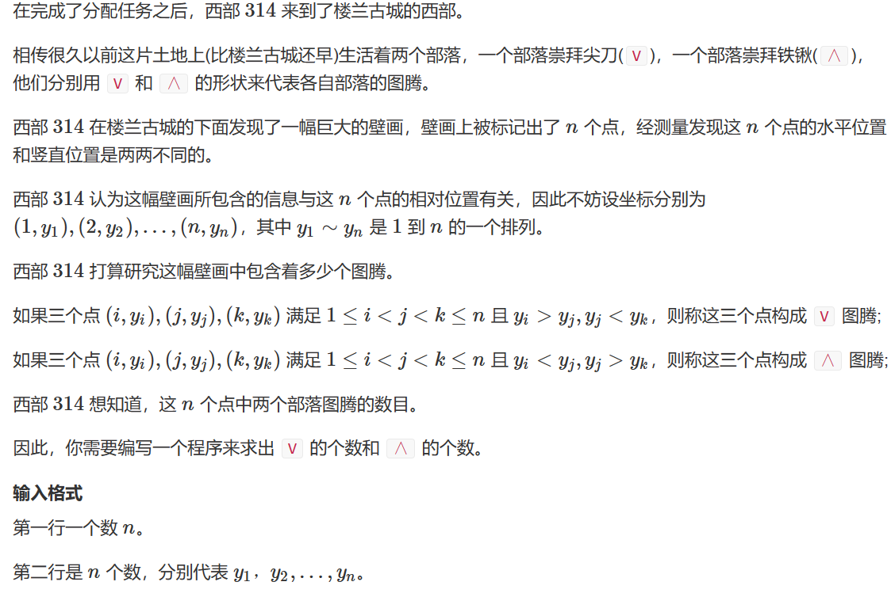
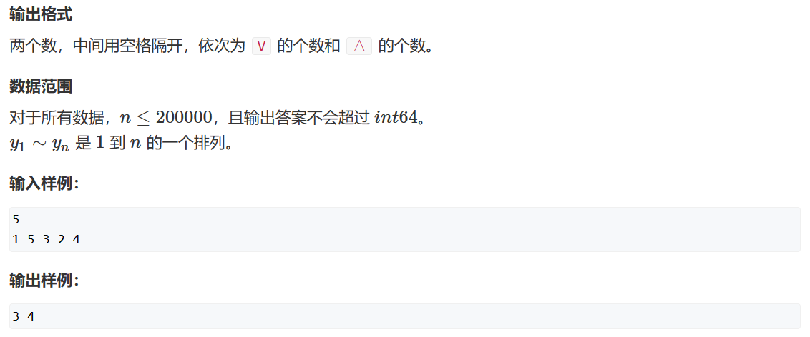
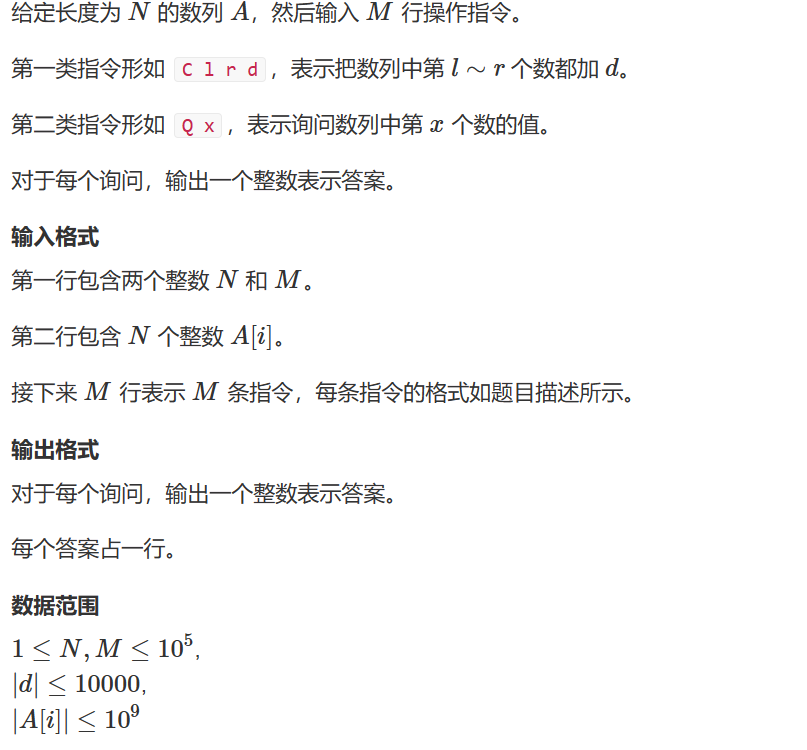
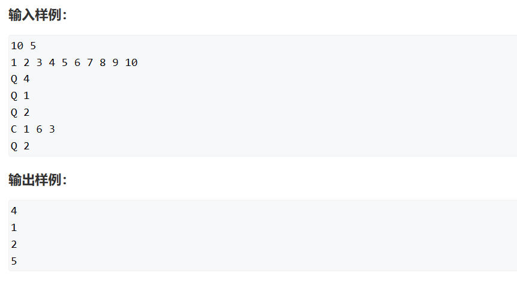
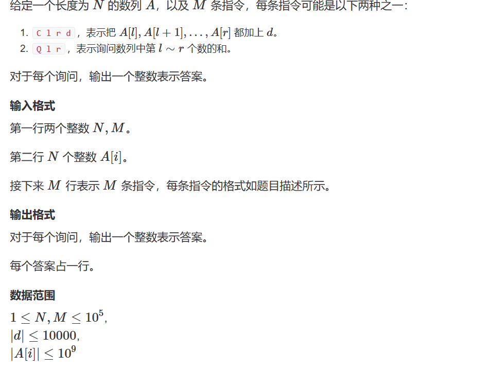
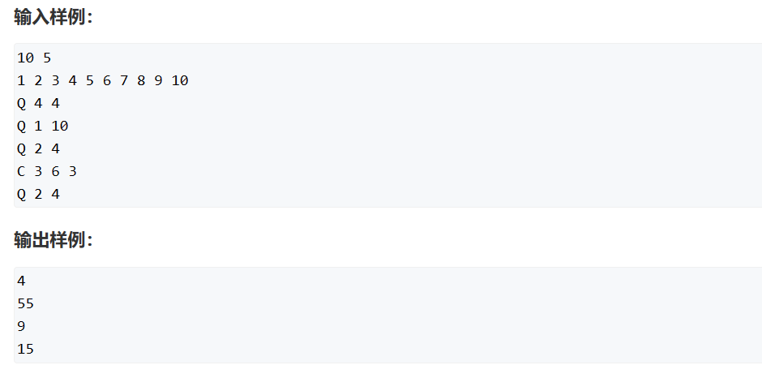

# 树状数组
[TOC]

## 2. 算法综述
树状数组确实是一个不好理解的概念和数据结构。所以多结合图来理解，然后还要将模板记住。

### 2.1 什么是树状数组
树状数组：就是一个结构为树形结构的数组，他和二叉树不一样，他在二叉树的基础上删除了一些中间节点——这个其实和树状数组的lowbit性质有关，我们接着往下看。

### 2.2 树状数组解决什么问题

解决大部分区间上面修改和查询的问题。这里我们可以想到前缀和和差分来实现`O(1)`的时间复杂度修改和查询数组和区间和。到那时他们每次要求出区间和或者原数组都是`O(n)`的时间复杂度，如果进行m次查询，那么总的时间复杂度就是`O(m*n)`。我们需要考虑如何将一个某个线性的部分优化为`O(logn)`的形式。

这里就会用到树状数组了——他的本质是用`O(logn)`的时间复杂度来优化区间查询和修改。

所以树状数组适合一下类型问题：
1. 单点修改，区间查询；
1. 区间修改，单点查询；
2. 区间修改，区间查询。

### 2.3 树状数组讲解

1. lowbit(x)运算

如何计算一个非负整数n在二进制下的最低为1及其后面的0构成的数？

我们可以利用计算机二进制原码和反码的性质：
```c++
int lowbit(int x){
    return x & -x;
}
```

2. 树状数组的原理

树状数组`tr[N]`标识i下标存储一部分的区间和。利用lowbit性质来实现`O(logn)`下计算出区间和。






3. 单点修改，区间查询

我们在修改原序列的某个元素时，也需要即使更新树状数组，也就是`tr[i]`和他的父节点的值。我们依然根据树状数组的lowbit性质来实现——每个节点的父节点下标就是原来位置下标加上其lowbit位。



代码：
```c++
// 单点修改，更新tr数组
// 在x位置加上k值
void add(int x, int k){
    for(int i = x; i <= n; i += lowbit(i))  tr[i] += k; 
}
```

如何求出前缀和：


代码：
```c++
int query(int x){
    int res = 0;
    for(int i = x; i > 0; i -= lowbit(i)){
        res += tr[i];
    }
}
```


4. 区间修改，单点查询

对一个区间整体加减某值，然后得到数组序列的情况。我们可以想到差分算法。对于这类操作，我们可以构造出原数组的差分数组b，然后使用树状数组维护差分数组即可。

这里我们相当于可以用树状数组求出差分数组的前缀和，也就是求出修改之后的原数组。本质是一样的。

代码：
```c++
int l, r;
// 修改单点
void add(int x, int k){
    for(int i = x; i <= n; i += lowbit(i))  tr[i] += k;
}
// 相当于对差分数组进行操作
add(l, k), add(r + 1, -k);

// 查询每一个位置的元素
int query(int pos){
    int res = 0;
    for(int i = pos; i > 0; i -= lowbit(i)) res += tr[i];
}

```


## 3. 例题讲解
### 3.1 AcWing 241. 楼兰图腾
> [AcWing 241. 楼兰图腾](https://www.acwing.com/problem/content/description/243/)
> 
> 

思路：很神奇的一道题目。这里需要我们统计一个序列中有多少个`v`和`^`形状的图腾。如果使用暴力枚举，时间复杂度是`O(n^2)`，显然会超时。如果优化为`O(nlogn)`以内是个问题。我们可以考虑求出每一个元素左边和右边比他大的的元素个数，然后相乘就可以得到以该元素位底部的`v`形状的图腾的个数。这里有意思的是题目说明`a[i]`是一个关于n的全排列，也就是这里的元素值域是`[1, n]`的，而且每个元素只会出现一次。那么这里就可以考虑树状数组了。

确实这一步的转弯有难度——为什么考虑树状数组？因为我们可以从左到右遍历数组，用`tr`数组存放`i`下标对应元素`1~a[i]`出现的个数。那么`tr`数组也就是一个前缀和了，能够实现`O(logn)`情况之下求出区间和。然后我们在这个顺序中，每一次更新`tr`之后，就求一下该下标前面的元素中小于他的元素和大于他的元素了。

```c++
// a[i]前面小于他的元素个数
int lessL = query(a[i]);
// a[i]前面大于他的元素个数
int bigL = i - lessL - 1;
// 更新tr数组
add(a[i], 1);
```

在从左到右遍历的过程中也可以求出该位置右边序列中比他小的元素个数了，也就是用总的小于该元素的个数减去目前左边序列小于他的元素个数即可。右边序列中大于他的元素个数也是同理可求。

```c++
// a[i]前面小于他的元素个数
int lessL = query(a[i]);
int lessR = a[i] - 1 - lessL;
// a[i]前面大于他的元素个数
int bigL = i - lessL - 1;
int bigR = n - a[i] - bigL;
// 更新tr数组
add(a[i], 1);
```

那么最后再一相乘即可求出每个位置符合条件的图腾个数了。


代码：
```c++
#include<iostream>
#include<algorithm>

using namespace std;
typedef long long LL;
const int N = 200005;
int n, q[N], tr[N];
LL resV, resA;

int lowbit(int x){
    return x & -x;
}

void add(int x, int k){
    for(int i = x; i <= n; i += lowbit(i)) tr[i] += k;
}

int query(int x){
    int res = 0;
    for(int i = x; i > 0; i -= lowbit(i))   res += tr[i];
    return res;
}


int main(){

    cin >> n;
    for(int i = 1; i <= n; i++) cin >> q[i];

    for(int i = 1; i <= n; i++){
        int lowL = query(q[i]);
        resA += (LL) lowL * (q[i] - lowL - 1);
        int bigL = i - lowL - 1;
        resV += (LL) bigL * (n - q[i] - bigL);

        // 更新tr数组
        add(q[i], 1);
    }
 
    cout << resV << " " << resA << endl;
    return 0;
}
```


### 3.2 AcWing 242. 一个简单的整数问题
> [AcWing 242. 一个简单的整数问题](https://www.acwing.com/problem/content/248/)
> 
> 

思路：这里就是直接用`tr`数组来存储原数组的差分数组的前缀和即可，这样就可以实现区间修改和快速求回原数组。

```c++
#include<iostream>
#include<algorithm>

using namespace std;
typedef long long LL;
const int N = 100005;
int n, m;
int a[N];
LL tr[N];

int lowbit(int x){
    return x & -x;
}

void add(int x, int k){
    for(int i = x; i <= n; i += lowbit(i))  tr[i] += k;
}

LL sum(int x){
    LL res = 0;
    for(int i = x; i > 0; i -= lowbit(i))   res += tr[i];
    return res;
}

int main(){

    cin >> n >> m;
    for(int i = 1; i <= n; i++) cin >> a[i];
    for(int i = 1; i <= n; i++) add(i, a[i] - a[i  - 1]);

    while(m--){
        string op;
        cin >> op;
        if(op == "Q"){
            int t;
            cin >> t;
            cout << sum(t) << endl;
        }else{
            int x, y, z;
            cin >> x >> y >> z;
            add(x, z), add(y + 1, -z);
        }
    }
    
    return 0;
}
```

### 3.3 AcWing 243. 一个简单的整数问题2
> [AcWing 243. 一个简单的整数问题2](https://www.acwing.com/problem/content/244/)
> 
> 


