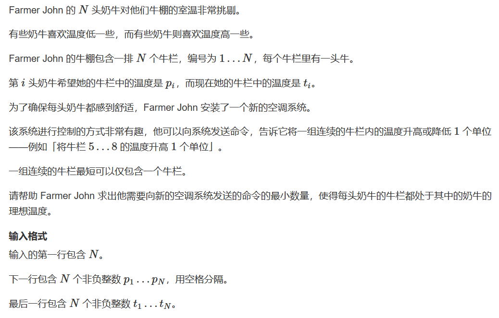
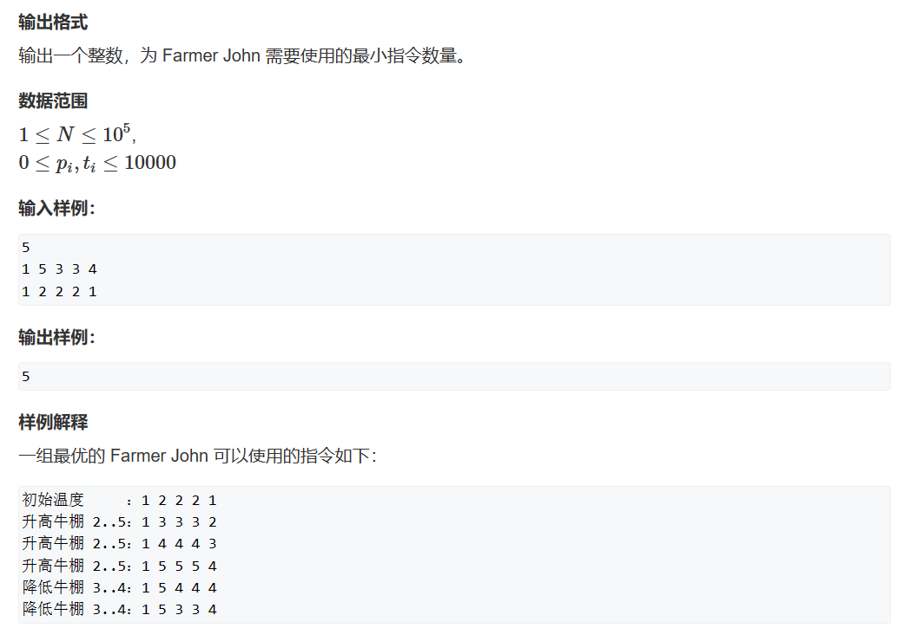

# 差分
[TOC]

## 1. 算法综述
差分算法是前缀和的逆运算。

差分算法可以实现在`O(1)`的时间复杂度下将一个序列的区间同时加减一个常数。如果差分数组全是0，那么原数组也全部都是0。二维差分数组就是先假设原数组都是0，然后根据差分算法的性质不断插入元素。

> [二维差分讲解博客](https://www.acwing.com/solution/content/27325/)
> 
> 


**一维差分模板：**
```c++
int e[N], b[N];
// 初始化
for(int i = 1; i <= n; i++){
    b[i] = e[i] - e[i - 1];
}
// 将区间[l, r] 加上 c
b[l] += c, b[r + 1] -= c;
// 求出改变后的序列
for(int i = 1; i <= n; i++){
    e[i] = e[i - 1] + b[i];
}
```

**二维差分模板：**
```c++
int e[N][N], b[N][N];
// 让矩阵(x1, y1)->(x2, y2) 都加上c
void add(int x1, int y1, int x2, int y2, int c){
    b[x1][y1] += c;
    b[x1][y2 + 1] -= c;
    b[x2 + 1][y1] -= c;
    b[x2 + 1][y2 + 1] += c;
}
// 初始化差分数组
for(int i = 1; i <= n; i++){
    for(int j = 1; j <= m; j++){
        cin >> c;
        add(i, j, i, j, x);
    }
}
// 让矩阵(x1, y1)->(x2, y2) 都加上c
add(x1, y1, x2, y2, c);
// 求出改变后的矩阵
for(int i = 1; i <= n; i++){
    for(int j = 1; j <= m; j++){
        // 相当于二维前缀和
        e[i][j] = e[i - 1][j] + e[i][j - 1] - e[i - 1][j - 1] + b[i][j];
    }
}
```

***
## 2. 题目练习
### 2.1 题目一：AcWing 4262. 空调
>[AcWing 4262. 空调](https://www.acwing.com/activity/content/problem/content/9710/)
>
>

思路：
就是将原序列的连续一段全部增加或者减少1，求出变成目标序列的最小操作数。

**题目要求同时将一段子数组全部加上1或者减去1, 考虑采用差分数组的思想**, 将原数组每一项的原始温度减去目标温度, 得到每一项需要改变的数值, 然后求出该数组的差分数组, **目标是使得差分数组的每一项变成0**, 我们的操作方式有2种:
1. 选择任意两项, 一项加1, 另一项减1；
2. 选择任意一项 加1 或者 减1，这里的选择一项也可以当作选择两项，将下标`n+1`位置当作处理的另一项。因为处理`n+1`项对原序列没有影响。

**这里使用差分数组，可以将对一段区间的处理变成每次取两位数的处理。** 我们需要求出如何使用最少次操作，使得差分数组元素全部为0。这里的原理是：**差分数组中负数和与正数和的绝对值的最大值**就是最小操作次数。原理自行模拟。

代码：
```c++
#include<iostream>
using namespace std;

const int N = 100010;
int p[N], b[N], w[N];   // w[N]是差分数组
int n;

int main(){
    cin >> n;
    for(int i = 1; i <= n; i++) cin >>p[i];
    for(int i = 1; i <= n; i++){
        int t;
        cin >> t;
        b[i] = t - p[i];
        w[i] = b[i] - b[i - 1];
    }

    // 求出正数和和负数和
    int pos = 0, neg = 0;
    for(int i = 1; i <= n; i++){
        if(w[i] > 0)    pos += w[i];
        else            neg += w[i]; 
    }

    cout << max(pos, abs(neg)) << endl;
    return 0;
}
```


