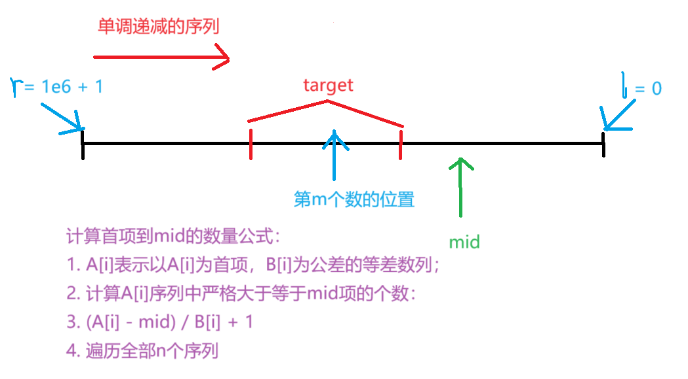
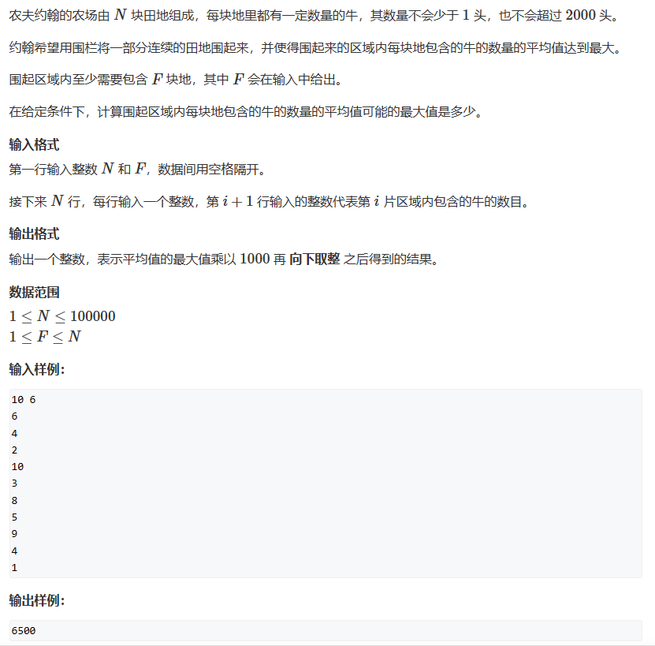

# 二分
[TOC]

## 1. 算法综述

二分查找虽然逻辑很好理解,但是在实际的代码编写中很容易写出死循环的代码.我们需要理解为什么会出现死循环。

二分中出现的中点是 `mid = l + r >> 1`，循环条件是`l < r`，那么死循环时就是一直满足`l < r`。这说明在用中点`mid`更新`l`和`r`的时候出现了问题。

**重点：在`mid = l + r >> 1`中，即mid取中点时会向下取整。也就是`l`和`r`相邻时，`mid`会取`l`的值。** 如果针对这种情况不进行处理，就会出现死循环。

然后对于二分的本质是什么？我想应该是区间性质分明吧。**二分查找的本质是双指针。** 我们需要用左右指针来查找目标区间的分解点。这里就可以用左右指针来不同查找。设`l`和`r`指针分别为左右指针。

1. 如果`[0, l]`是目标区间，`mid`满足条件时`l = mid`,`r`是不满足目标的位置，他需要不停跑在mid前面即`r = mid - 1`。分析此时是否会出现死循环：**当`l`和`r`相邻时，`mid`等于`l`，`l = mid`，最后`l`和`r`没有更新，陷入死循环。** 想要摆脱困境，只能在mid更新的时候向上取整，即`mid = l + r + 1 >> 1`,当`l`和`r`相邻的时候，mid就可以取到`r`的位置，`r`也会相对`mid`向前一步，突破死循环。

2. 如果`[r, n]`是目标区间，`mid`满足条件时是`r = mid`，`l`是不满足目标的位置，他就会走在mid前面，即`l = mid + 1`。分析是否会陷入死循环：**当`l`和`r`相邻时，`mid`等于`l`，`l = mid + 1`，最后`l`实现更新，不会陷入死循环。** 此时可以直接使用`mid`的更新条件`mid = l + r >> 1`。

综上所述：二分查找的思路：
1. 确定目标区间是`[0, l]`还是`[r, n - 1]`。
2. 确定目标区间之后确定`l`和`r`的更新方式。
3. 根据`l`和`r`相邻时是否陷入死循环来判断mid的更新方式。
4. 返回下标。

**也可以直接记忆：`[0, l]`为目标区间时，`l = mid`，`mid`必须变成向上取整；`[r, n - 1]`为目标区间时，r = mid，`mid`还是向下取整。**

***
 ## 2. 题目练习
 ### 2.1 AcWing 503. 借教室
 > [AcWing 503. 借教室](https://www.acwing.com/problem/content/505/)
 > 
 > 

思路：很难想到是二分的思想。但是这里会用到差分是显而易见的。首先说明以下这里的题意：

给出`n`天的空教室数量，然后给出`m`个订单的详细信息。请你判断最早从哪一个订单开始就出现空教室供不应求了。订单是说出从那个区间开始连续占用多少个教室。

这里优化多不同区间多次加减的算法是**差分模型**。但是如果只是使用差分模型，如何求出最早出现问题的订单？暴力做法是什么？

到这一步我的思维就出现问题了。我看你把题意理解成了求出最早出现问题是哪一天？那如果是这样，就直接使用全部订单对区间进行操作，遭到第一个不满足要求的日期即可对吧。

但是求出最早出现问题的订单就不一样了。因为不同订单选择的日期不一样，减少的天数不一样。要计算直到第`i`个订单是是否出现问题，就需要将前面所有`i`个区间的操作都处理，然后遍历所有天数。如果遍历所有天数发现都没问题，那么这`i`天都没问题。

这里就体现出来二分的某种性质的连续性。我们需要找到不同性质区间的分界点，自然是可以使用二分算法的。只需要写好判断函数就可以了。

如果使用暴力的做法，那么就必须从前到后遍历每个订单，每一次更新一个订单的操作，都需要遍历所有天数，那么即使差分可以让整体区间的加减复杂度到达`O(n)`，遍历全部订单之后，总复杂度还是`O(m*n)`。`m`和`n`的数量级都达到了`10^6`，这样的时间复杂度一定会超时，必须进行优化。

如果使用二分的算法进行遍历，就能将时间复杂度优化到`O(nlogm)`，能够实现。

难点还是理解题意。

代码：
```c++
#include<iostream>
using namespace std;

typedef long long ll;
const int N = 1000010;
int n, m;
int  a[N], d[N], s[N], t[N];
ll b[N];

// 检查前mid个订单是否出现问题
bool check(int mid){
    // 进行当前mid个订单操作
    // 每次要对差分数组更新
    // 求差分数组
    for(int i = 1; i <= n; i++) b[i] = a[i] - a[i - 1];
    for(int i = 1; i <= mid; i++){
        b[s[i]] -= d[i];
        b[t[i] + 1] += d[i];
    }

    // 检查n天中是否出现有问题的时间
    for(int i = 1; i <= n; i++){
        b[i] += b[i - 1];
        if(b[i] < 0)   return true;
    }

    return false;
}

int main(){
    
    cin >> n >> m;
    for(int i = 1; i <= n; i++) cin >> a[i];
    for(int i = 1; i <= m; i++) cin >> d[i] >> s[i] >> t[i];

    // 二分求订单号
    int l = 1,  r = m;
    while(l < r){
        int mid = (l + r) >> 1;
        if(check(mid)){
            r = mid;
        }else{
            l = mid + 1;
        }   
    }

    if(check(l)){
        cout << -1 <<endl;
        cout << l << endl;
    }else{
        cout << 0 << endl;
    }

    return 0;
}
```


### 2.2 AcWing 1227. 分巧克力
> [AcWing 1227. 分巧克力](https://www.acwing.com/problem/content/1229/)
> 
> 

思路:这里需要根据某种区间的性质找出分界点,就是二分的特点.我们可以发现,当分的巧克力边长越大,那么数量就会越少.因此我们可以找到某种边界,当满足边长最大的时候,也满足数量关系,但是边长再变大一点,数量关系就不满足了,这就是可以用二分来实现.当然也可以分析暴力的做法:从`1`枚举边长,判断边长最大为多少时刚好不满足条件对吧.这里时间复杂度就到达了`O(n*t)`,但是使用二分时间复杂度可以优化为`O(n*logt)`,其中`t`是巧克力的最小边.

代码:
```c++
#include<iostream>
using namespace std;

typedef long long ll;
const int N = 100010;
int n, m;
int a[N], b[N];
int r = 0;

bool check(int mid){
    ll res = 0;
    for(int i = 1; i <= n; i++){
        res += (ll) (a[i] / mid) * (b[i] / mid);
    }
    if(res >= m)    return true;
    else            return false;
}


int main(){
    
    cin >> n >> m;
    for(int i = 1; i <= n; i++){
        cin >> a[i] >> b[i];
        r = max(a[i], r);
        r = max(b[i], r);
    }

    int l = 1;
    while(l < r){
        int mid = (l + r + 1) >> 1;
        if(check(mid)){
            l = mid;
        }else{
            r = mid - 1;
        }
    }

    cout << l << endl;
    
    return 0;
}
```

### 2.3 AcWing 5407. 管道
> [AcWing 5407. 管道](https://www.acwing.com/activity/content/problem/content/9683/) 
> 

思路：这里和上面一道题目区别不大。不过有时候想到二分确实不太容易。如果不是那种动态规划的变态题目，出现最值的问题一般解决办法：贪心、二分、某种函数规律、图论的最短路径方式。**而对于二分的题目，通常是根据单调性或者说是寻找区间的分界点区分两端区间。** 那么题目中问到的最早时刻，确实可以根据二分来查找。

但是也有很多问题，如何在判断函数中判断这个时刻满足条件？我首先想到的是差分的思路，能够得到总区间的情况。但是也有思路是通过区间合并来判断的。区间合并的算法复杂度会低一些。

总言之：这里需要理解题目含义，同时确定思路：为什么可以使用二分？这里数据最大有`10^5`，如果不超时时间复杂度需要优化到`O(nlogn)`及以下。
```
      在竞赛中，一般算机一秒能运行5 x 10^8次汁算，如果题目給出的时间限制カ1s,那么你选择的算法执行的汁算次数最多应该在10^8量级オ有可能解决这个题目。一般 O(n)的算法能解决的数据范围在n < 10^8。

      O(n *logn)的算法能解决的数据范围在n <= 10^6。

      O(n*sqrt(n) )的算法能解决的数据范围在n < 10^5。

      O(n^2)的算法能解决的数据范围在n<5000。

      O(n^3)的算法能解决的数据范围在n <300。

      O(2^n)的算法能解决的数据范围在n < 25。

      O(n!)的算法能解决的数据范围在n < 11。

```

代码模板：
```c++
#include<iostream>
#include<algorithm>
using namespace std;
/*
输入的第一行包含两个整数 n,len用一个空格分隔，分别表示会打开的阀门数和管道长度。
接下来 n行每行包含两个整数 Li,Si用一个空格分隔，表示位于第 Li段管道中央的阀门会在 Si时刻打开。
对于所有评测用例，1≤n≤105，1≤Si，len≤109，1≤Li≤len，Li−1<Li
*/

typedef pair<int, int> PII;
typedef long long LL;
const int N = 100005;
int n, len;
PII w[N], q[N];

bool check(int mid){

    // 遍历全部的开水阀口，全部满足条件的开水阀口的线段区间记录下来
    int idx = 0;
    for(int i = 0; i < n; i++){
        if(w[i].second <= mid){
            int t = mid - w[i].second;
            int x = max((LL) 1, (LL) w[i].first - t);
            int y = min((LL) len, (LL) w[i].first + t);
            q[idx++] = {x, y};
        }
    }

    // 开始合并区间
    sort(q, q + idx);
    int sd = -10, ed = -10;
    for(int i = 0; i < idx; i++){
        if(q[i].first <= ed || q[i].first == ed + 1){
            if(sd == -10)   sd = q[i].first;
            ed = max(q[i].second, ed);
        }else{
            sd = q[i].first, ed = max(q[i].second, ed);
        }
    }

    if(sd == 1 && ed == len)    return true;
    else                        return false;


}

int main(){
    cin >> n >> len;
    for(int i = 0; i < n; i++)  cin >> w[i].first >> w[i].second;

    // 二分
    int l = 1, r = 2e9;
    while(l < r){
        int mid = (LL) l + r >> 1;
        if(check(mid))  r = mid;
        else            l = mid + 1;
    }

    cout << l << endl;

    return 0;
}
```


### 2.4 AcWing 4656. 技能升级
>[AcWing 4656. 技能升级](https://www.acwing.com/problem/content/4659/)
>

思路分析：
学会自己思考每一种方式并且得出每一种思路的时间复杂度上是否可行是一项十分重要的能力。直到现在我好像才算算法竞赛的入门。

题目给出n个技能和m次技能升级的机会，每个技能升级的攻击力是一个等差数列。n的数据范围到了10的5次方，m次技能升级的数据范围到达了10的9次方。如果是针对n个技能的算法遍历，算法的时间复杂度需要控制在`O(nlogn)`以内，如果要使用m的数据进行算法遍历，时间复杂度需要控制在`O(logm)`以内。这里是需要分析到的。

我原本的思路是直接模拟升级的过程，利用贪心算法每次选择目前升级攻击力最大的技能。如何每次选出当前攻击力最大的技能——可以根据堆的数据结构进行优化，使用`O(logn)`的时间复杂度就可以选出当前升级力度最大的技能。但是m次升级的数据范围达到了10的9次方级别，因此总的时间复杂度是`O(mlogn)`，会超时。不过利用该算法也可以获得50%的分数。代码如下：


代码1（TLE）：
```c++
#include<iostream>
#include<algorithm>
#include<queue>
using namespace std;

const int N = 1e5+5;
typedef long long LL;
typedef pair<int, int> PII;
priority_queue<PII> que;
int n, m;

int main(){

    cin >> n >> m;
    for(int i = 0; i < n; i++){
        int x, y;
        cin >> x >> y;
        que.push({x, y});
    }

    LL sum = 0;
    while(m--){
        if(que.empty())
            break;
        PII t = que.top();
        que.pop();
        sum += t.first;
        t.first -= t.second;
        if(!(t.first <= 0))
            que.push(t);
    }

    cout << sum << endl;

    return 0;
}
```

***
二分的思路：

二分的思路不太容易想到。由于m的数据范围太大，只能想着是否可以根据n的技能次数进行突破。**分析发现每一个技能每一次升级的攻击力是一个大于0的等差数列，如果我们将全部技能的等差数列的数据按照从大到小的顺序进行排列，选出前m个数据加和，就能得到最大升级力度。** 这里直接排列肯定是不太现实的，因为即使是快速排序，若等差数列至少有m项，那么时间复杂度也到达了`O(mlogm)`，依然会超时。 但是，**如果我们可以求出这个从大到小排列的序列中第m项的数值x是多少，然后根据每个技能代表的等差数列的公差，求出到达x的末项会有多少个数据，就能求出总序列中大于x的数据个数了。** 此刻利用二分就达到完美闭环，而时间复杂度为`O(nlogn)`。



这里的题目在实际操作的过程中有很多坑，比如这里的二分算法。看这个图可以知道我们需要求出一个边界，这个边界就是`l`。我们可以确定的首先需要找到临界数，这个临界数对应的序列个数可能会大于m，因此我们的目标是求出第一个大于等于m个数的数。这里符合条件的部分是l来记录。从这个图是可以发现的。因此二分还是需要不断画图分析。

坑点二就是你确定的x并不是所有数列的末项，因为公差不一样，我们之前求出的数列个数是严格大于等于x的，并不是一定会等于x。因此我们需要在求和之前先求出每个等差数列的末项，这里的求法直接根据等差数列公式计算即可。

代码：
```c++
#include<iostream>
#include<algorithm>
#include<queue>
using namespace std;

const int N = 100005;
typedef long long LL;
int n;
LL m;
int A[N], B[N];

bool check(int x){
    LL res = 0;
    for(int i = 0; i < n; i++){
        if(A[i] >= x){
            res += (A[i] - x) / B[i] + 1;
        }
    }

    return res >= m;
}

int main(){
    cin >> n >> m;
    for(int i = 0; i < n; i++){
        cin >> A[i] >> B[i];
    }

    int l = 0, r = 1e6 + 1;
    while(l < r){
        int mid = (LL) l + r + 1 >> 1;
        if(check(mid))  l = mid;
        else            r = mid - 1;
    }

    LL res = 0, cnt = 0;
    for(int i = 0; i < n; i++){
        if(A[i] >= r){
            int c = (A[i] - r) / B[i] + 1;
            int ed = A[i] - B[i] * (c - 1);
            cnt += c;
            res += (LL) (A[i] + ed) * c / 2;
        }
    }

    cout << res - (cnt - m) * r ;

    return 0;
}
```


### 2.5 AcWing 4956. 冶炼金属
> [AcWing 4956. 冶炼金属](https://www.acwing.com/problem/content/4959/)
> 
> 

思路：

典型的二分思想。但是我在这里的二分思路却总是出一点问题。现在回想起来，应该还是没理解二分的本质。二分是需要求出临界区间左端点和右端点。我们首先要根据判断条件和x的关系。想象一下单调函数。这里的单调函数其实不一定是要求序列单调，而是目标函数和x的区间序列是单调关系。我们知道了这里的单调关系之后，就根据你需要的区间来移动l和r。只要知道了移动l和r，就能计算出临界点，而不是弄错关系。


代码：
```c++
#include<iostream>
#include<algorithm>
using namespace std;

const int N = 10004;
int n;
int A[N], B[N];

// 求最小的答案
bool check1(int x){
    for(int i = 0; i < n; i++){
        int t = A[i] / x;
        if(t > B[i])    return false;    
    }
    return true;
}

// 求最大的答案
bool check2(int x){
    for(int i = 0; i < n; i++){
        int t = A[i] / x;
        if(t < B[i])    return false;
    }
    return true;
}


int main(){

    cin >> n;
    for(int i = 0; i < n; i++)
        cin >> A[i] >> B[i];
    
    int l = 1, r = 1e9;
    int res1 = 0, res2 = 0;
    while(l < r){
        int mid = l + r >> 1;
        if(check1(mid))
            r = mid;
        else l = mid + 1;
    }

    res1 = l;

    l = 1, r = 1e9;
    while(l < r){
        int mid = l + r + 1 >> 1;
        if(check2(mid))
            l = mid;
        else    r = mid - 1;
    }
    res2 = l;

    cout << res1 << " " << res2;
    return 0;
}
```


### 2.6 AcWing 789. 数的范围
> [AcWing 789. 数的范围](https://www.acwing.com/problem/content/791/)
> 

代码模板：
```c++
#include<iostream>
#include<algorithm>
#include<limits.h>
using namespace std;

const int N = 100005;
int n, q;
int e[N];


int main(){

    cin >> n >> q;
    for(int i = 0; i < n; i++)
        cin >> e[i];

    while(q--){
        int k;
        cin >> k;

        int l = 0, r = n - 1;
        while(l < r){
            int mid = l + r >> 1;
            if(e[mid] >= k) r = mid;
            else            l = mid + 1;
        }
        if(e[l] != k){
            cout << -1 << ' ' << -1 << endl;
            continue;
        }  

        int res = l;
        l = 0, r = n - 1;   
        while(l < r){
            int mid = l + r + 1 >> 1;
            if(e[mid] <= k) l = mid;
            else            r = mid - 1;
        }

        cout << res << ' ' << l << endl;

    }


    return 0;
}

```


### 2.7 AcWing 102. 最佳牛围栏
> [AcWing 102. 最佳牛围栏](https://www.acwing.com/problem/content/104/)
> 

思路：一道神奇的题目，一开始理解错了题目含义：这里的至少的意思是——要求一段连续的区间，长度应该大于等于f。求出这样区间段的最大平均值是多少。一开始我以为是固定的滑动窗口的最大平均值的大小，只能通过部分案例（骗分够了）。

这里答案的思路是：前缀和+双指针+二分。

首先是二分求平均值。这里的平均值指的是某个窗口的平均值。对于平均值的操作，首先让数组的全部数据减去平均值，我们需要求的是这个序列中是否存在某个区间，他的平均值满足我们二分的条件。那么最值问题就变成了二分中的判定问题。如何判定是否存在一个长度大于等于F的区间，平均值大于等于mid？就是价格序列的全部元素都减去mid，求出序列的前缀和。根据前缀和求区间[L,R]的总值是否大于等于0.如果满足该条件，那么这个平均值是满足条件的，继续二分，直到找到这个平均值的临界点——也就是序列中存在一个长度大于等于F的区间，平均值等于mid。

比较特殊的是这里的平均值是浮点数，因此需要用浮点数的二分来计算。不过浮点数的二分不需要在意出现死循环。

但是如何判断是否存在一个长度大于等于F的区间，平均值大于等于mid？这个判断函数利用前缀和和双指针，将每次判断的时间复杂度控制在`O(n)`内。因此总的时间复杂度就是`O(nlogm)`

代码：
```c++
#include<iostream>
#include<algorithm>
#include<limits.h>
#include<queue>
using namespace std;

const int N = 100005;
int n, m;
double e[N], sum[N];

bool check(double x){
    // 求前缀和
    for(int i = 1; i <= n; i++){
        sum[i] = sum[i - 1] + e[i] - x;
    }

    // 二分求满足条件的区间
    double minv = 1e9;
    for(int i = 1, j = m; j <= n; j++, i++){
        minv = min(minv, sum[i - 1]);
        if(sum[j] - minv >= 0)  return true;
    }
    return false;

}

int main(){

    cin >> n >> m;
   
    for(int i = 1; i <= n; i++){
        cin >> e[i];
    }
    
    // 二分
    double l = 0, r = 2000;
    while(r - l > 1e-5){
        double mid = (l + r) / 2;
        if(check(mid))  l = mid;
        else            r = mid;
    }

    cout << (int) (r * 1000) << endl;

    return 0;
}
```


