# 前缀和
[TOC]

## 1. 算法综述
前缀和的主要用途是在`O(1)`的时间复杂度中求出一段区间的总和。一维序列的前缀和相当于数列的前n项和，二维数组的前缀和可以用画图的方式辅助理解。注意在初始化前缀和时，边界部分都初始化为0，而且存储数值从下标1开始。

## 2. 题目练习
### 2.1 AcWing 562. 壁画
> [AcWing 562. 壁画](https://www.acwing.com/problem/content/564/)
> 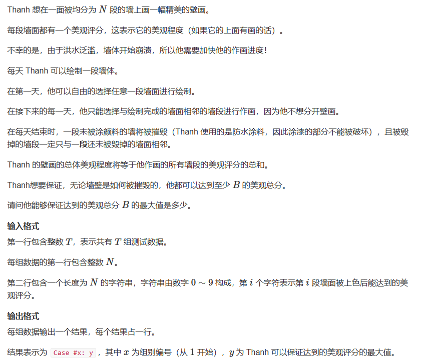
> 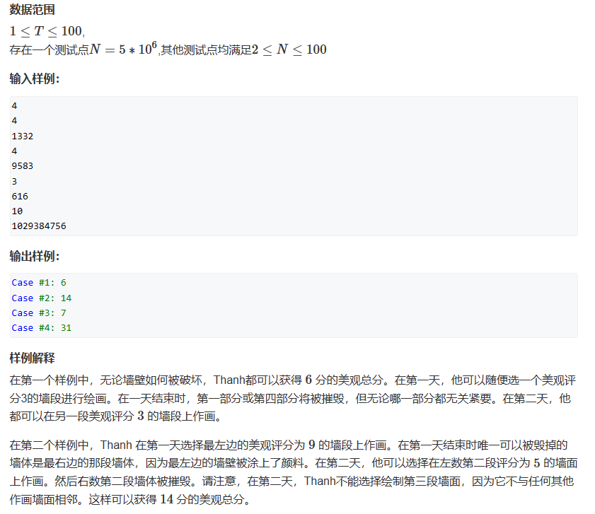

思路：一个比较简单的思维题目——本质是要求你算出一段序列中固定大小的滑动窗口的区间和最大值，跟二分的最后一个题目差不多，利用前缀和和双指针就可以求出最大值。

代码：
```c++
#include<iostream>
#include<algorithm>
using namespace std;

const int N = 5e6+10;
int t, n;
int e[N], sum[N];

int main(){
    cin >> t;
    int num = 0;
    while(t--){
        cin >> n;
        num++;
        string tmp;
        cin >> tmp;
        for(int i = 0; i <= n; i++){
            e[i + 1] = tmp[i] - '0'; 
        }

        int cnt = n % 2 == 1 ? n / 2 + 1 : n / 2;
        for(int i = 1; i <= n; i++){
            sum[i] = sum[i - 1] + e[i];
        }

        int res = -1;
        for(int i = 1, j = cnt; j <= n; j++, i++){
            int s = sum[j] - sum[i - 1];
            res = max(res, s);
        }
        cout << "Case #" << num << ": " << res << endl;
    }
    return 0;
}
```


### 2.2 AcWing 795. 前缀和
> [AcWing 795. 前缀和](https://www.acwing.com/problem/content/797/)
> 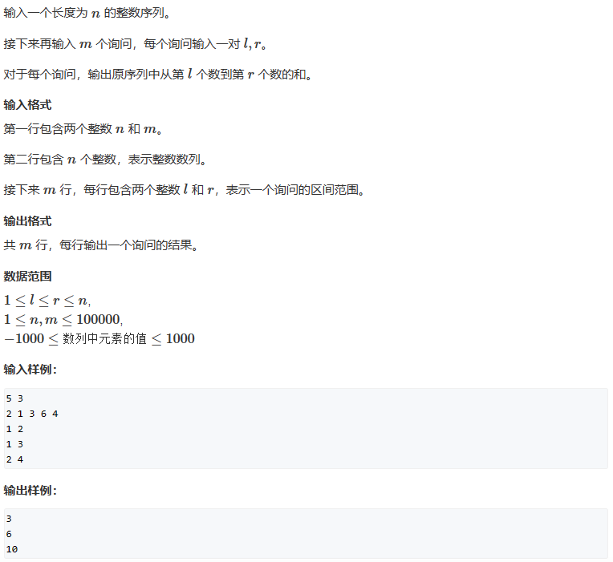

思路：模板题目，直接使用前缀和计算即可。

代码：
```c++
#include<iostream>
#include<algorithm>
#include<limits.h>
using namespace std;

const int N = 100005;
int n, q;
int e[N], sum[N];

int main(){
    cin >> n >> q;
    for(int i = 1; i <= n; i++){
        cin >> e[i];
        sum[i] = sum[i - 1] + e[i];
    }

    while(q--){
        int l, r;
        cin >> l >> r;
        cout << sum[r] - sum[l - 1] << endl;
    }
    return 0;
}

```

### 2.3 AcWing 796. 子矩阵的和
> [AcWing 796. 子矩阵的和](https://www.acwing.com/problem/content/798/)
> 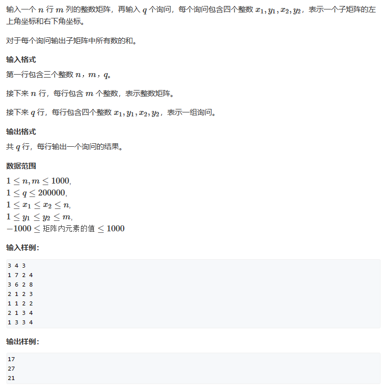

思路：二维前缀和的模板题，根据定义来计算即可。

代码：
```c++
#include<iostream>
#include<algorithm>
#include<limits.h>
using namespace std;

const int N = 1005;
int n, m, q;
int e[N][N], sum[N][N];

int main(){
    cin >> n >> m >> q;
    for(int i = 1; i <= n; i++){
        for(int j = 1; j <= m; j++){
            cin >> e[i][j];
            sum[i][j] = sum[i - 1][j] + sum[i][j - 1] - sum[i - 1][j - 1] + e[i][j];
        }
    }

    while(q--){
        int x1, y1, x2, y2;
        cin >> x1 >> y1 >> x2 >> y2;
        int s = sum[x2][y2] - sum[x2][y1 - 1] - sum[x1 - 1][y2] + sum[x1 - 1][y1 - 1];
        cout << s << endl;
    }
    return 0;
}

```


### 2.4 AcWing 1230. K倍区间
> [AcWing 1230. K倍区间](https://www.acwing.com/problem/content/1232/)
> 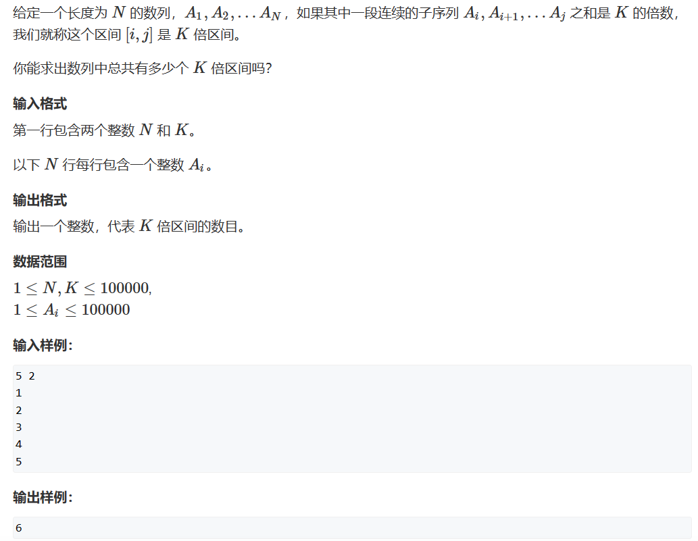

思路分析：

首先需要想到暴力怎么做，然后去优化方法。对于10的5次方的序列，如果我们根据每一个`e[i]`作为结尾的序列，那么我们可以遍历`i`之前的前缀和，然后相减判断是否是k的倍数。但是这个暴力的算法时间复杂度是`O(n)`。因此我们需要优化这个方式。

说实话我一开始想到的是动态规划，如果可以记录`e[i-1]`结尾的区间数为多少，然后判断`e[i]`是否也是k的倍数，这样计算。但是这里显然思路是错误的，因为不排除`e[i]`和某个`e[i-1]`结尾的区间相加之后成为k的倍数。因此还需要再思考。

这里如何根据前缀和进行优化才是问题。

首先我们还是使用暴力的整体思路，但是在求出每一个`e[i]`作为结尾的序列中有几个k的倍数的区间时，进行优化。

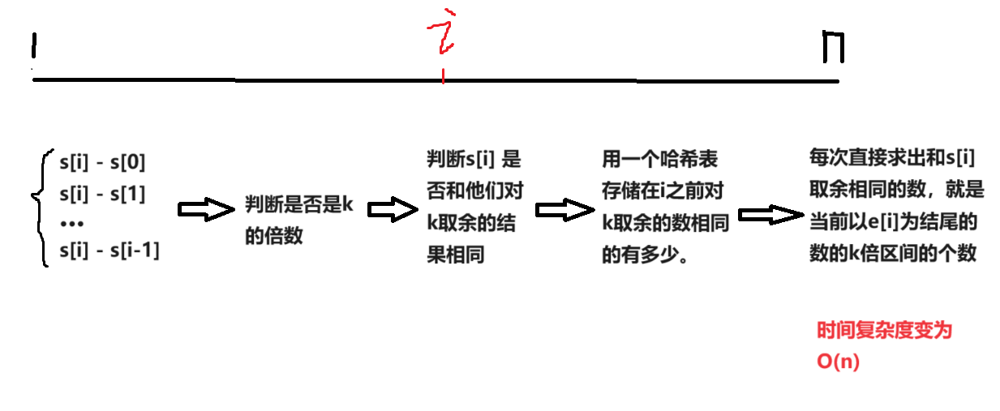

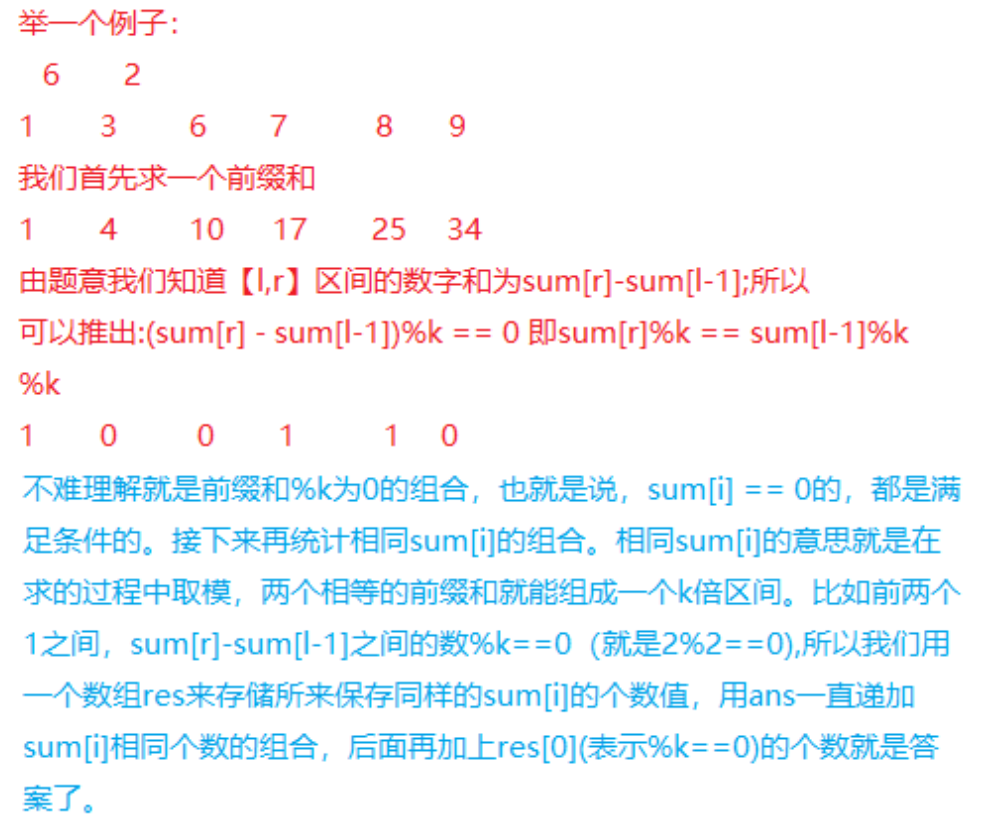

代码：
```c++
#include<iostream>
using namespace std;

typedef long long LL;
const int N = 100005;
LL sum[N];
int n, k;
int e[N];     
LL cnt[N], num[N];  // 记录余数和i结尾的区间个数

int main(){

    cin >> n >> k;
    for(int i = 1; i <= n; i++){
        cin >> e[i];
        sum[i] = sum[i - 1] + e[i];
    }

    for(int i = 1; i <= n; i++){
        num[i] += cnt[sum[i] % k];
        cnt[sum[i] % k]++;
    }

    LL res = 0;
    for(int i = 1; i <= n; i++){
        res += num[i];
    }

    cout << res + cnt[0] << endl;

    return 0;
}
```


### 2.5 AcWing 4405. 统计子矩阵
> [AcWing 4405. 统计子矩阵](https://www.acwing.com/problem/content/4408/)
> 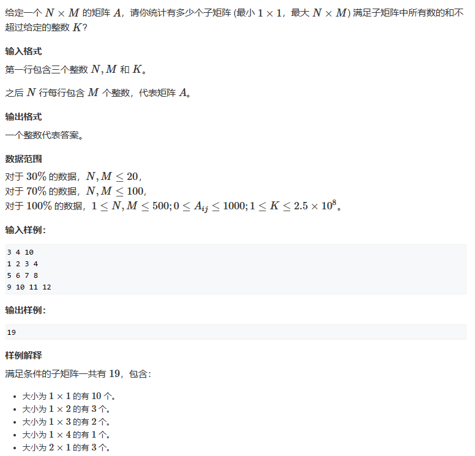

分析：这个题目和前面一个题目很像，但是升级成了二维。首先看到这里说求出多少个子矩阵，他们的和小于等于k。这里其实是可以想到一类题目：求一个一维序列，有多少子区间，他们的和等于k。如果是这个问题，我们可以使用双指针来计算和维护区间。如果是和前面一样，用到了取余的方式来计数。

**所以，如果是一维序列，求有多少个子区间的和小于等于k，那么也可以使用双指针来计算的。** 我们只需要求出以`e[i]`结尾的区间中有多少个区间满足条件即可——满足条件的区间需要计数，一旦不满足条件的时候，就可以移动慢指针来维护区间。 **这里就体现了双指针应用的条件了——单调性。** 我现在慢慢理解了，如果需要优化时间复杂度，考虑二分和双指针——这里需要应用到单调性。但是两者的单调性完全不同—— **二分的单调性是指目标边界和整个二分的序列有一个单调关系，双指针的单调性是指左右指针维护的区间和指针有单调性。** 在这个题目中，如果元素存在负数，那么就无法使用双指针来维护区间。

现在来分析题目。

这里的题目如果用暴力方法，那么时间复杂度就是`O(n^4)`——数量级到达`10^11`，一定会超时。所以我们考虑如何将其降维到`O(n^3)`。二维中降一维，那么可以联想到如何使用一维的情况进行分析—— **这里难的地方在于想到：将一维的双指针模式使用到这里，相当于如何将一维的双指针应用到二维中。** 我们可以从前到后遍历数组的行，每一种行的组合都遍历到——这里是双重循环。所有的行都遍历到了之后就可以遍历用双指针来计算和维护列区间的元素和。 

这里可以用该图来标识：
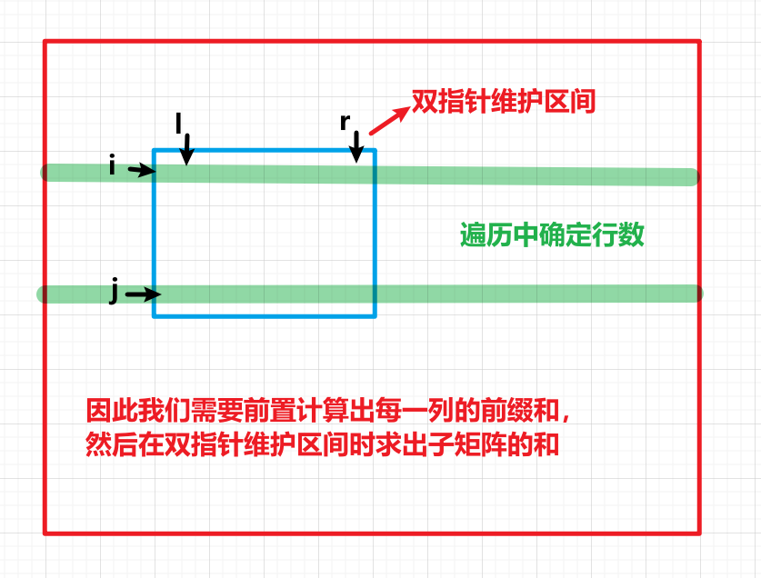

代码：
```c++
#include<iostream>

using namespace std;
const int N = 505;
typedef long long LL;
int n, m, k;
int sum[N][N];


int main(){

    cin >> n >> m >> k;
    int tmp = 0;
    // 求出每一列的前缀和
    for(int i = 1; i <= n; i++){
        for(int j = 1; j <= m; j++){
            cin >> tmp;
            sum[i][j] = sum[i - 1][j] + tmp;
        }
    }

    // 遍历求区间
    LL res = 0;
    for(int i = 1; i <= n; i++){
        for(int j = i; j <= n; j++){
            for(int l = 1, r = 1, s = 0; r <= m; r++){
                s += sum[j][r] - sum[i - 1][r];
                while (s > k)
                {
                    s -= sum[j][l] - sum[i - 1][l];
                    l++;
                }
                res += r - l + 1;
            }
        }
    }
    cout << res << endl;
    return 0;
}
```


### 2.6 AcWing 1236. 递增三元组
> [AcWing 1236. 递增三元组](https://www.acwing.com/problem/content/description/1238/)
> 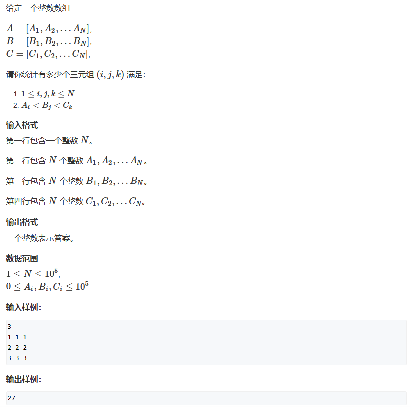

思路：首先思考用暴力的方法怎么实现，然后思考如何去优化。

如果直接用暴力的方法，时间复杂度是`O(n^3)`，一定会超时，而且即使是`O(n^2)`的时间复杂度，也会超时，因此这里肯定是需要优化到`O(n)`或者`O(nlogn)`的时间复杂度的。观察题目不难发现，我们可以先对数组进行排序，然后通过二分求出下一个数组中满足条件的元素个数。

例如对于数组c，对于元素`c[i]`，我们可以很快求出数组b中小于他的元素个数，对于a数组同理。

因此我们首先对于数组b和数组a，求出a数组中小于`b[i]`的元素个数，并且记录下来。对于c数组，我们同理也可以求出b数组中小于`c[i]`的元素个数。

但是接下来应该如何进行？

这里我们只能根据c数组遍历。首先遍历c数组，容易求出b数组对应的位置。如果b数组该位置满足条件，那么求出该位置和前面的位置中a数组满足条件的全部元素之和——这里就可以使用前缀和来进行。

也就是首先对于数组b和数组a，求出a数组中小于`b[i]`的元素个数，然后用前缀和数组记录下来。最后遍历c数组进行加和即可。

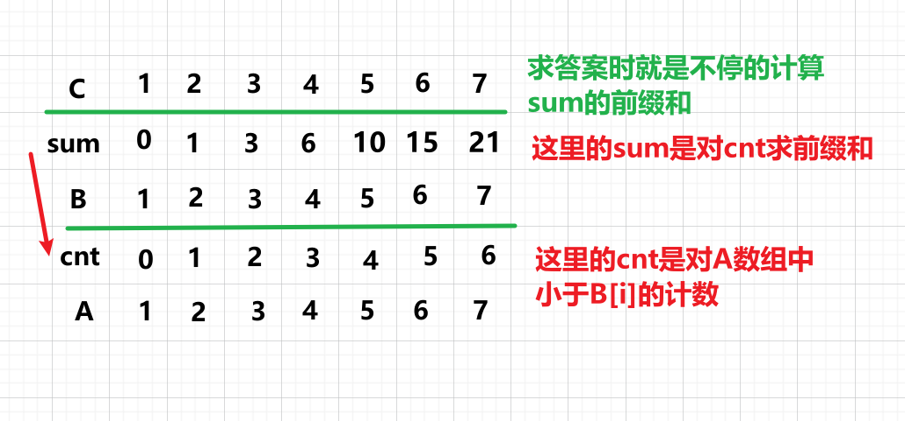


```c++
#include<iostream>
#include<algorithm>
using namespace std;

typedef long long LL;
const int N = 100005;
int n;
int a[N], b[N], c[N];
LL sum[N];

int f(int t, int *e){
    int l = 1, r = n;
    while(l < r){
        int mid = l + r + 1 >> 1;
        if(e[mid] < t)
            l = mid;
        else
            r = mid - 1;
    }
    return l;
}


int main(){
    
    cin >> n;
    for(int i = 1; i <= n; i++) cin >> a[i];
    for(int i = 1; i <= n; i++) cin >> b[i];
    for(int i = 1; i <= n; i++) cin >> c[i];
    
    sort(a + 1, a + n + 1);
    sort(b + 1, b + n + 1);
    sort(c + 1, c + n + 1);
    
    // 初始化求b大于a的数的前缀和
    for(int i = 1; i <= n; i++){
        int idx = f(b[i], a);
        int cnt = a[idx] >= b[i] ? 0 : idx;
        sum[i] = sum[i - 1] + cnt;
    }
    
    LL res = 0;
    for(int i = 1; i <= n; i++){
        int idx = f(c[i], b);
        if(b[idx] < c[i]){
            res += sum[idx];
        }
    }
    
    cout << res;
    return 0;
}
```


### 2.7 AcWing 99. 激光炸弹
> [AcWing 99. 激光炸弹](https://www.acwing.com/problem/content/101/)
> 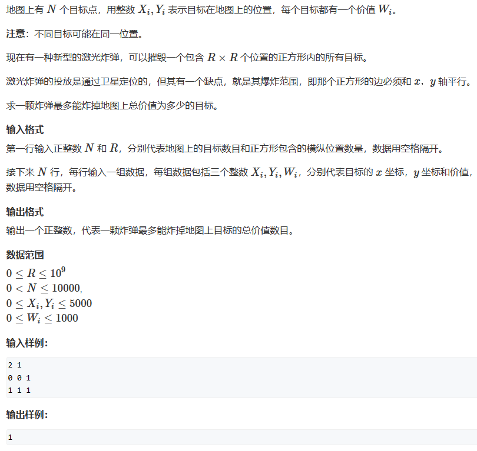

思路：这里的本质是求出二维矩阵中大小为`R X R`的子矩阵的最大值是多少。我一开始想不到如何求固定子矩阵的大小，将他和前面的求满足条件的区间数量混淆了。前面的区间数量的问题时间复杂度直接使用暴力的做法会超时。这里如果使用前缀和，然后暴力遍历是不会超时的。

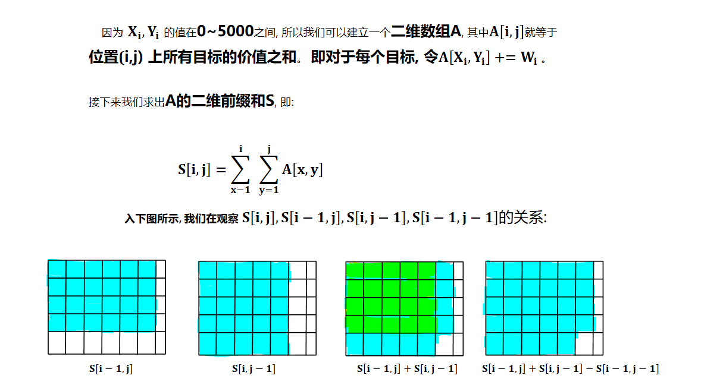
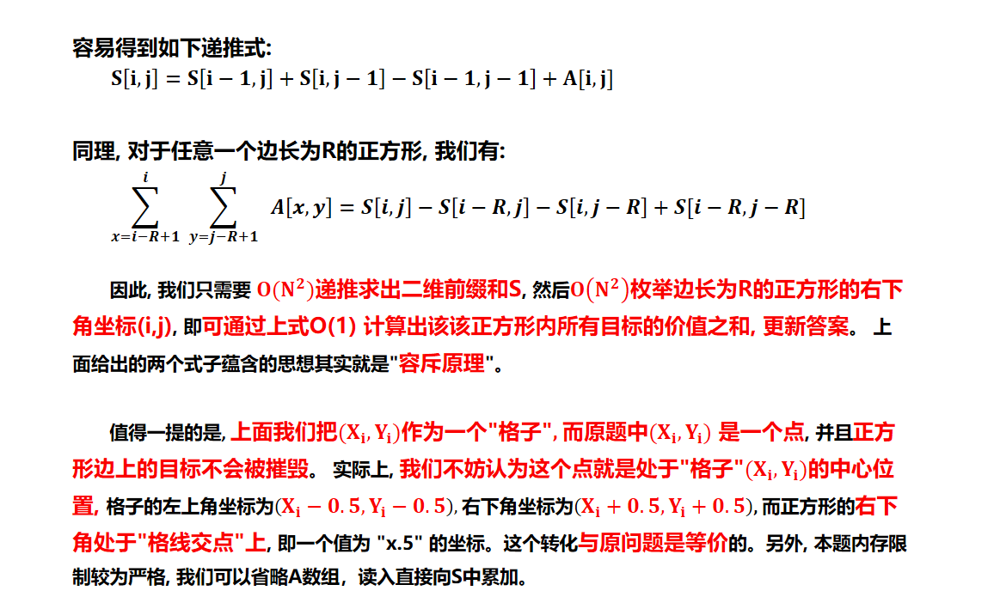

代码：
```c++
#include<iostream>
#include<algorithm>
using namespace std;

typedef long long LL;
const int N = 5005;
int n, R;
int s[N][N];

int main(){

    cin >> n >> R;
    R = min(R, 5001);
    int x, y, w;
    for(int i = 1; i <= n; i++){
        cin >> x >> y >> w;
        x++, y++;
        // 这里可能出现多个在同一位置的目标，所以用加权来处理
        s[x][y] += w;
    }

    for(int i = 1; i <= 5001; i++){
        for(int j = 1; j <= 5001; j++){
            s[i][j] = s[i - 1][j] + s[i][j - 1] - s[i - 1][j - 1] + s[i][j];
        }
    }

    int res = 0;
    for(int i = R; i <= 5001; i++){
        for(int j = R; j <= 5001; j++){
            res = max(res, s[i][j] - s[i - R][j] - s[i][j - R] + s[i - R][j - R]);
        }
    }

    cout << res << endl;
    return 0;
}
```