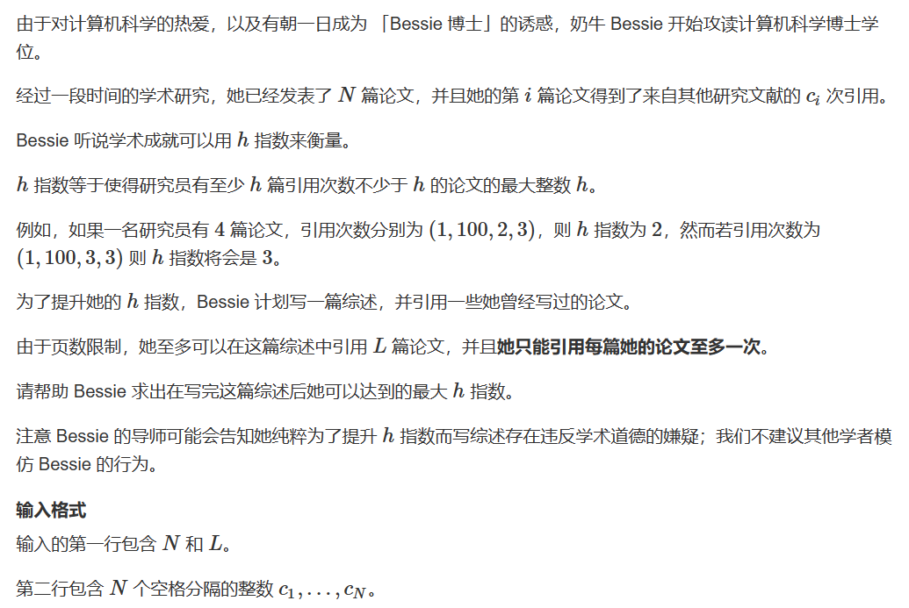
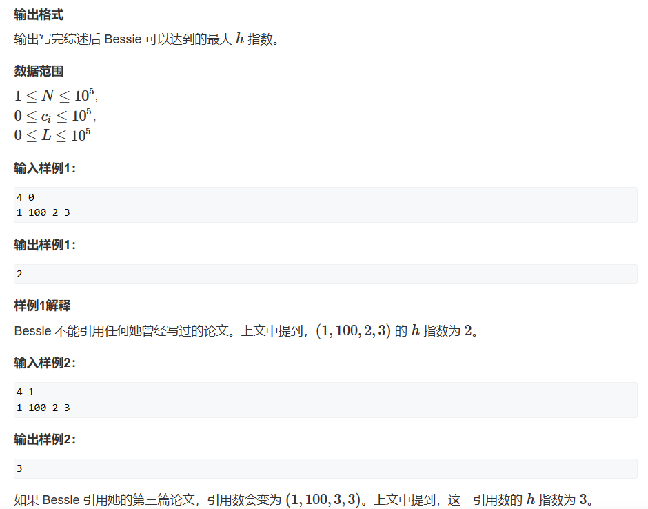
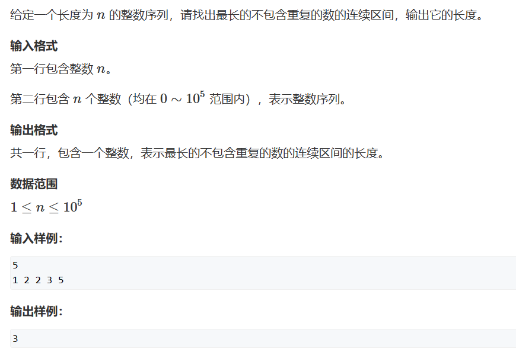
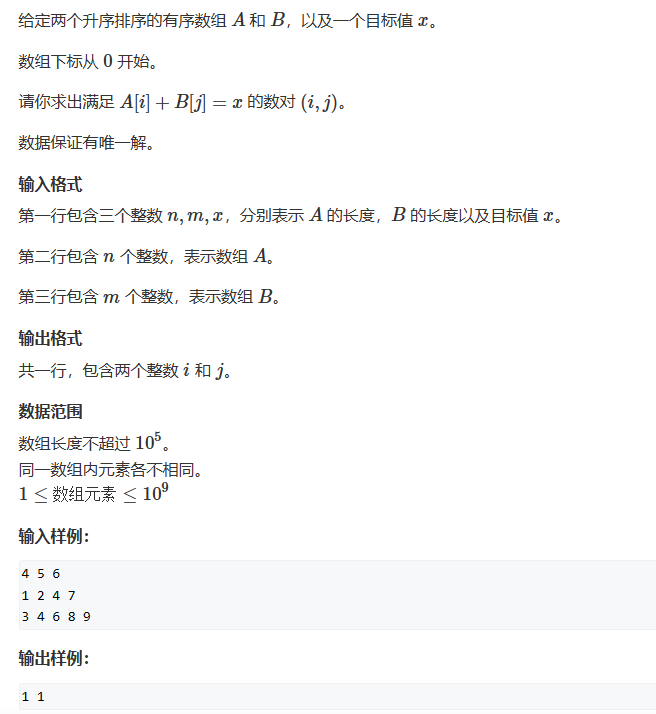
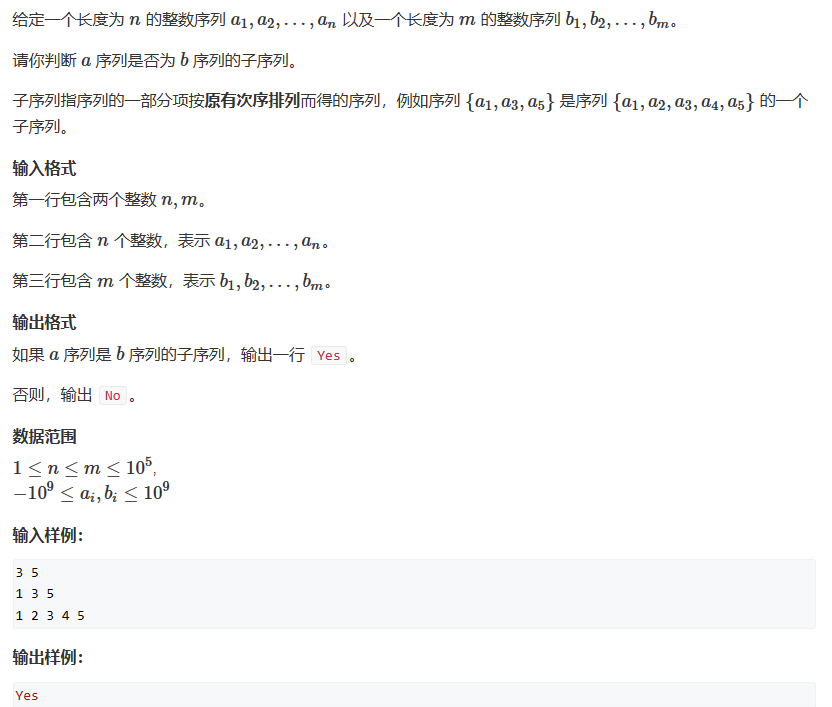
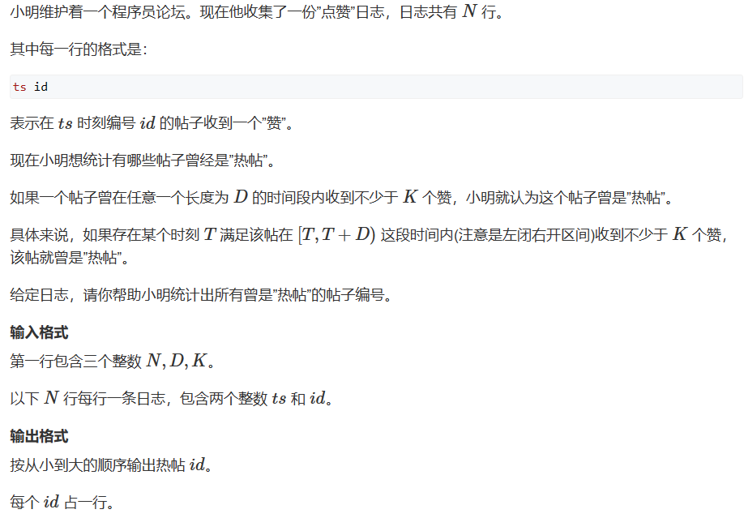
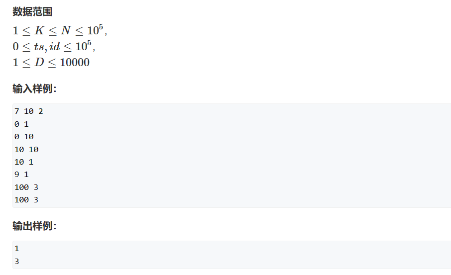
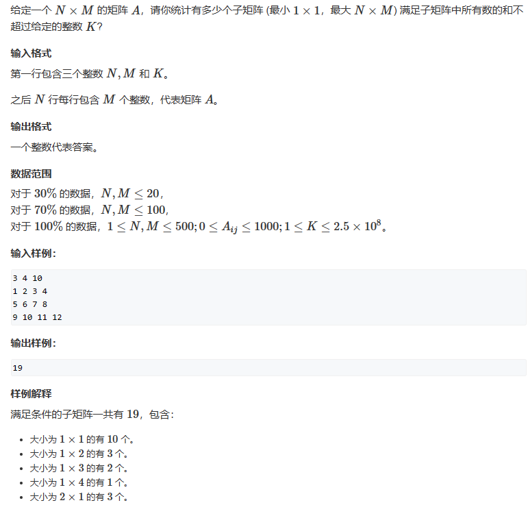

# 前缀和
[TOC]

## 1. 算法综述

双指针算法通常是根据两边指针的单调性来维护区间。


## 2. 题目练习

### 2.1 AcWing 3745. 牛的学术圈 I
> [AcWing 3745. 牛的学术圈 I](https://www.acwing.com/problem/content/3748/)
> 
> 

思路：我自己的思路是使用二分进行分析的。这里的题目含义是求出引用指数h，引用指数h是说引用次数大于等于h的论文的数量要大于等于h。一个很绕的问题。首先对序列进行排序，然后求出二分求出论文引用次数大于等于h的论文数量。如果数量大于等于h，那么就符合条件。

这里我们可以确定某种函数关系：引用次数大于等于h的论文数量和h的关系，h越大，论文数量越小。我们可以通过二分来求出这个边界。就是用一个判断函数来判断一下。但是这里有一个比较特殊的地方是他自己可以写一篇综述来增加论文的引用次数。

但是这里需要学习的是双指针算法。这里的思路是遍历h的每一种可能，然后根据双指针算法h的取值是否成立。也就是设置两个指针——i指针记录h-1的大小，j指针记录第一个大于等于h的位置。那么区间i到j是维护序列中大于等于h-1小于等于h的数的多少。如果这个个数少于等于L（综述中引用论文的数量），那么h成立，记录下来。

由于h是从小到大遍历的，因此最后遍历完之后，就会得到h的最大值。

代码1：（双指针算法）
```c++
#include<iostream>
#include<algorithm>
using namespace std;
const int N = 100005;
int n, L;
int s[N];

int main(){

    cin >> n >> L;
    for(int i = 1; i <= n; i++){
        cin >> s[i];
    }
    
    // 从大到小排序
    sort(s + 1, s + n + 1, greater<int>());

    // 双指针算法
    int res = 0;
    for(int i = 1, j = n; i <= n; i++){
        while(s[j] < i && j > 0) j--;
        if(s[i] >= i - 1 && i - j <= L)
            res = i;
    }

    cout << res << endl;

    return 0;
}
```


代码2：（二分）
```c++
#include<iostream>
#include<algorithm>
using namespace std;
const int N = 100005;
int n, L;
int s[N];

// 判断函数
bool check(int h){
    int cnt = 0, res = 0;
    for(int i = 1; i <= n; i++){
        if(s[i] >= h)   res++;
        else if(s[i] + 1 == h ) cnt++;
    }

    cnt = min(cnt, L);
    res += cnt;
    return res >= h;
}


int main(){

    cin >> n >> L;
    for(int i = 1; i <= n; i++){
        cin >> s[i];
    }
    
    int l = 0, r = n;
    while(l < r){
        int mid = l + r + 1>> 1;
        if(check(mid))
            l = mid;
        else
            r = mid - 1;
    }
   
    cout << l;

    return 0;
}
```


### 2.2 AcWing 799. 最长连续不重复子序列
> [AcWing 799. 最长连续不重复子序列](https://www.acwing.com/problem/content/801/)
> 


代码：
```c++
#include<iostream>

using namespace std;

const int N = 100003;
int q[N], cnt[N];
int n;

int main(){
    cin >> n;
    for(int i = 0; i < n; i++)  cin >> q[i];

    int res = 0;
    for(int i = 0, j = 0; j < n; j++){
        cnt[q[j]]++;
        while(cnt[q[j]] > 1 && i < j){
            cnt[q[i]]--;
            i++;
        }
        res = max(res, j - i + 1);
    }

    cout << res << endl;
    return 0;
}
```


### 2.3 AcWing 800. 数组元素的目标和
> [AcWing 800. 数组元素的目标和](https://www.acwing.com/problem/content/description/802/)
> 

代码：
```c++
#include<iostream>

using namespace std;

const int N = 100005;
int n, m, x;
int a[N], b[N];

int main(){

    cin >> n >> m >> x;
    for(int i = 0; i < n; i++)  cin >> a[i];
    for(int i = 0; i < m; i++)  cin >> b[i];

    int i = 0, j = m - 1;
    while(i < n && j >= 0){
        int tmp = a[i] + b[j];
        if(tmp == x)    break;
        else if(tmp > x)    j--;
        else                i++;
    }

    cout << i << " " << j << endl;
    

    return 0;
}
```


### 2.4 AcWing 2816. 判断子序列
> [AcWing 2816. 判断子序列](https://www.acwing.com/problem/content/2818/)
> 

代码：
```c++
#include<iostream>
using namespace std;

const int N = 100005;
int n, m;
int a[N], b[N];

int main(){

    cin >> n >> m;
    for(int i = 0; i < n; i++)  cin >> a[i];
    for(int i = 0; i < m; i++)  cin >> b[i];

    int i = 0, j = 0;
    while(i < n && j < m){
        if(a[i] == b[j]){
            i++;
        }
        j++;
    }

    if(i == n)  cout << "Yes" << endl;
    else        cout << "No" << endl;

    return 0;
}
```


### 2.5 AcWing 1238. 日志统计
> [AcWing 1238. 日志统计](https://www.acwing.com/problem/content/1240/)
> 
> 

思路：这个题目很有意思，一个很有实际应用的题目情景。但是一旦看到两个数据相互结合在一起我就不会了。这个不行，如果两个数据在一起是一对，就把他们存放在pair里面。

首先我们可以选择遍历时间段，计算在D时间段内是否存在某个帖子出现的次数超过了设定值。这里类似滑动窗口的原理，不断进队和出队。每次进队和出队都需要记录帖子出现的次数。而且每一次维护了窗口之后，都需要判断进队的帖子是否满足热帖的条件。

这里是一道非常典型的双指针问题。

代码:
```c++
#include<iostream>
#include<algorithm>

using namespace std;

const int N = 100005;
typedef pair<int, int> PII;
int n, d, k;
PII q[N];
int cnt[N];
bool s[N];

int main(){

    cin >> n >> d >> k;
    for(int i = 0; i < n; i++)
        cin >> q[i].first >> q[i].second;
    
    sort(q, q + n);

    // 双指针
    for(int i = 0, j = 0; i < n; i++){
        cnt[q[i].second]++;
        while(q[i].first - q[j].first >= d){
            cnt[q[j].second]--;
            j++;
        }

        if(cnt[q[i].second] >= k)   s[q[i].second] = true;

    }

    // 注意这里需要遍历的是从0到idx的最大值，并不只是n
    for(int i = 0; i < 1e5 + 1; i++)
        if(s[i])    cout << i << endl;

    return 0;
}
```


### 2.6 AcWing 4405. 统计子矩阵
> [AcWing 4405. 统计子矩阵](https://www.acwing.com/problem/content/4408/)
> 

思路：这里看到题目要求判断有多少子矩阵的区间和满足条件。如果直接暴力做法肯定会超时。这里看到类似滑动窗口，判断区间和是否满足条件。我们可以将遍历横轴，然后对于纵轴使用全部双指针的算法来维护满足条件的区间。

代码：
```c++
#include<iostream>

using namespace std;
const int N = 505;
typedef long long LL;
int n, m, k;
int s[N][N];

int main(){

    cin >> n >> m >> k;
    int tmp = 0;
    for(int i = 1; i <= n; i++)
        for(int j = 1; j <= m; j++){
            cin >> tmp;
            s[i][j] = s[i - 1][j] + tmp;
        }

    LL res = 0;
    for(int i = 1; i <= n; i++){
        for(int j = i; j <= n; j++){
            int sum = 0;
            for(int l = 1, r = 1; r <= m; r++){
                sum += s[j][r] - s[i - 1][r];
                while(sum > k){
                    sum -= s[j][l] - s[i - 1][l];
                    l++;
                }
                // 这里计算的是满足条件的以j为结尾的子矩阵的数量
                if(sum <= k)    res += r - l + 1;
            }
        }
    }

    cout << res << endl;
    
    return 0;
}
```


