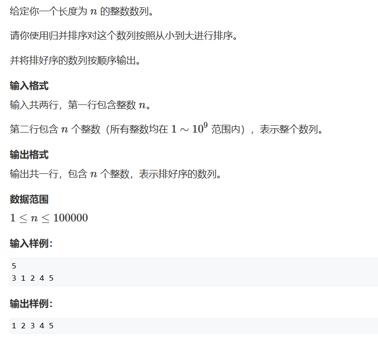

# 归并排序
[TOC]

## 1. 算法综述
归并排序的本质是实现二叉树的后序遍历。假设一组数分成两个部分呢，首先不断分类，最终使得两个部分有序，再对两个有序数组进行合并。

只是对于递归，我们需要考虑清楚边界条件，边界条件处理不好会出现死循环。所以在考虑边界时，不仅要分析他的定义，还需要用极端情况判断是否会陷入死循环。


## 2. 题目练习

### 2.1 AcWing 787. 归并排序
> [AcWing 787. 归并排序](https://www.acwing.com/problem/content/789/)
> 

思路：模板题目。

代码：
```c++
#include<iostream>

using namespace std;

const int N = 100005;
int n;
int q[N], tmp[N];

void merge_sort(int l, int r){
    if(l >= r)  return;

    int mid = (r - l) / 2 + l;
    merge_sort(l, mid);
    merge_sort(mid + 1, r);
    int k = 0;
    int i = l, j = mid + 1;
    while(i <= mid && j <= r){
        if(q[i] <= q[j])
            tmp[k++] = q[i++];
        else
            tmp[k++] = q[j++];
    }

    while(i <= mid) tmp[k++] = q[i++];
    while(j <= r)   tmp[k++] = q[j++];

    for(int i = 0; i < k; i++){
        q[l++] = tmp[i];
    }
}

int main(){

    cin >> n;
    for(int i = 0; i < n; i++)  cin >> q[i];

    merge_sort(0, n - 1);
    for(int i = 0; i < n; i++)  cout << q[i] << " ";


    return 0;
}
```


### 2.2 AcWing 788. 逆序对的数量
> [AcWing 788. 逆序对的数量](https://www.acwing.com/problem/content/790/)
> 

这道题目很神奇，一般想不到会使用归并排序这种思想。但是这里归并排序的本质思想是分治——就是将问题分而治之，数据范围不断缩小，处理小范围的问题，然后再求出大范围的问题。

这里的数据量，如果直接使用暴力的算法，就会超时。因此使用归并排序可以是优化时间复杂度。

代码：
```c++
#include<iostream>

using namespace std;

const int N = 100005;
int q[N], tmp[N];
int n;
long long res;

void merge_sort(int l, int r){
    if(l >= r)  return;

    int mid = (r - l) / 2 + l;
    merge_sort(l, mid);
    merge_sort(mid + 1, r);

    int i = l, j = mid + 1;
    int k = 0;
    while(i <= mid && j <= r){
        if(q[i] <= q[j])    tmp[k++] = q[i++];
        else{
            tmp[k++] = q[j++];
            res += mid - i + 1;
        }
    }

    while(i <= mid) tmp[k++] = q[i++];
    while (j <= r)  tmp[k++] = q[j++];

    for(int i = 0; i < k; i++)
        q[l++] = tmp[i];
    
}

int main(){

    cin >> n;
    for(int i = 0; i < n; i++)  cin >> q[i];

    merge_sort(0, n - 1);
    cout << res;

    return 0;
}
```


### 2.3 AcWing 505. 火柴排队
> [AcWing 505. 火柴排队](https://www.acwing.com/problem/content/507/)
> 


思路：这个题目的分析很麻烦，我看了很久其实也没完全明白这里的严谨原理。

首先需要分析什么情况才能得到目标的最小值？通过分析我们可以发现如果两个数组相对的位置都是从小到大排序的位置，那么相减之后平方再加和就是目标的最小值。

然后分析这么一个问题：如果需要把一个数组变成有序序列，但是方式是每次只能交换相邻的两个数，那么最小要交换多少次。

这里的结论就是次数是整个数组的逆序对的个数。严谨证明如下：（略）。

接着我们需要升级思路：如何在不移动a数组的情况下，将b数组的每个元素移动到a数组的中相对排序位置？这里我们希望只对b数组排序，求相对的逆序对。

那么：假设a有序，按照a有序的坐标系准则情况下，得到b数组相对于a的数组分布。


这一点貌似还可以理解，但是实现上确实非常麻烦，为了实现整个映射，我们希望将a和b数组进行离散化，也就是得到他们元素的相对大小即可，不考虑实际的值——毕竟我们也没要求要计算出最小值。

**这里三个数组变化很神奇：**


代码：
```c++
#include<iostream>
#include<algorithm>
using namespace std;

const int N = 100005;
int n;
int a[N], b[N], p[N], c[N];
int MOD = 99999997;
int res, tmp[N];

void work(int a[]){

    for(int i = 1; i <= n; i++) p[i] = a[i];

    sort(p + 1, p + 1 + n);

    for(int i = 1; i <= n; i++){
        int l = 1, r = n;
        while(l < r){
            int mid = (r - l) / 2 + l;
            if(a[i] <= p[mid])  r = mid;
            else                l = mid + 1;
        }
        a[i] = l;
    }

}

void merge_sort(int l, int r){
    if(l >= r)  return ;

    int mid = (r - l) / 2 + l;
    merge_sort(l, mid);
    merge_sort(mid + 1, r);

    int i = l, j = mid + 1, k = 0;
    while(i <= mid && j <= r){
        if(b[i] <= b[j])   tmp[k++] = b[i++];
        else{
            tmp[k++] = b[j++];
            res += mid - i + 1;
            res %= MOD;
        } 
    }

    while(i <= mid) tmp[k++] = b[i++];
    while(j <= r)   tmp[k++] = b[j++];

    for(int i = 0, j = l; i < k; i++, j++)
        b[j] = tmp[i];
}


int main(){

    cin >> n;
    for(int i = 1; i <= n; i++) cin >> a[i];
    for(int i = 1; i <= n; i++) cin >> b[i];

    work(a), work(b);
    for(int i = 1; i <= n; i++) c[a[i]] = i;
    for(int i = 1; i <= n; i++) b[i] = c[b[i]];

    // 求逆序对
    merge_sort(1, n);
    cout << res << endl;

    return 0;
}
```


### 2.4 AcWing 1215. 小朋友排队
> [AcWing 1215. 小朋友排队](https://www.acwing.com/problem/content/1217/)
> 

思路：没想到还是求逆序对的个数。每次交换相邻的元素，要实现数组有序，最少交换次数是该数组中逆序对的个数。但是这里和直接求出逆序对个数不一样，他需要根据每个位置对应的逆序对个数来求一个总和。

首先需要理解为什么该位置对应的逆序对个数就是最小移动次数。然后需要优化求出每个位置的逆序对的时间复杂度。如果直接使用暴力应该怎么解决，如果需要优化应该如何优化。

这里的优化是使用树状数组来优化查询区间和的时间复杂度。和树状数组的图腾题目类似。

```c++
#include<iostream>
#include<cstring>
using namespace std;
typedef long long LL;
const int N = 100005, M = 1000005;
int a[N], n;
LL tr[M], cnt[M];

int lowbit(int x){
    return x & -x;
}

void add(int x, int k){
    for(int i = x; i <= 1000000; i += lowbit(i))    tr[i] += k; 
}

int sum(int x){
    int res = 0;
    for(int i = x; i > 0; i -= lowbit(i))   res += tr[i];
    return res;
}

int main(){

    cin >> n;
    for(int i = 1; i <= n; i++){
        cin >> a[i];
        a[i]++;     // 避免为0
    }
    for(int i = 1; i <= n; i++){
        int lessL = sum(a[i]);
        int bigL = i - 1 - lessL;
        cnt[i] += bigL;
        add(a[i], 1);
    }

    memset(tr, 0, sizeof tr);

    for(int i = n; i > 0; i--){
        int lessL = sum(a[i] - 1);
        cnt[i] += lessL;
        add(a[i], 1);
    }

    LL res = 0;
    for(int i = 1; i <= n; i++){
        res += (1 + cnt[i]) * cnt[i] / 2;
    }

    cout << res << endl;
    
    return 0;
}
```


### 2.5 AcWing 107. 超快速排序
> [AcWing 107. 超快速排序](https://www.acwing.com/problem/content/description/109/)
> 
> 

思路：仍然是求逆序对。

代码: 
```c++
#include <iostream>
using namespace std;
typedef long long LL;
const int N = 500010;
int n;
int a[N],tmp[N];
LL merge_sort (int l,int r) {
    if (l == r) return 0;
    int mid = l + r >> 1;
    LL ans = merge_sort (l,mid) + merge_sort (mid + 1,r);
    int i = l,j = mid + 1,k = 0;
    while (i <= mid && j <= r) {
        if (a[i] <= a[j]) tmp[k++] = a[i++];
        else {
            tmp[k++] = a[j++];
            ans += mid - i + 1;
        }
    }
    while (i <= mid) tmp[k++] = a[i++];
    while (j <= r) tmp[k++] = a[j++];
    for (int i = l,j = 0;i <= r;i++,j++) a[i] = tmp[j];
    return ans;
}
int main () {
    while (cin >> n,n) {
        for (int i = 1;i <= n;i++) cin >> a[i];
        cout << merge_sort (1,n) << endl;
    }
    return 0;
}

```


