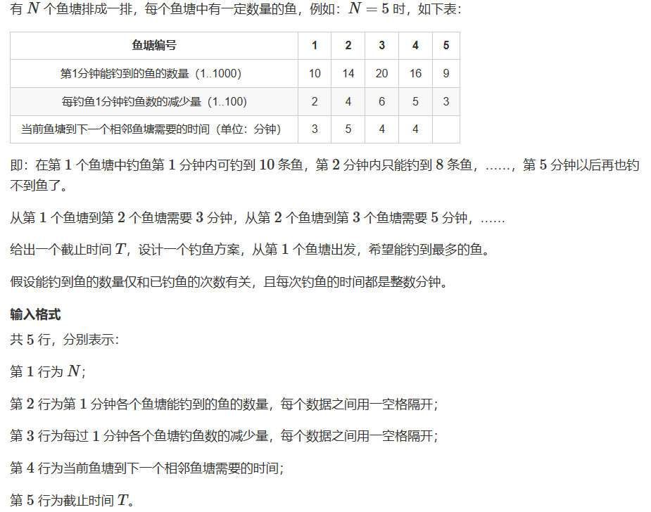
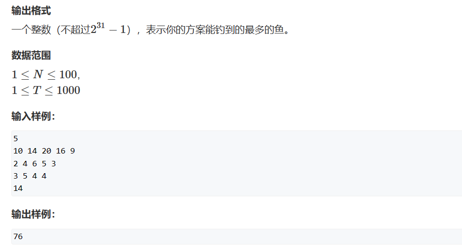
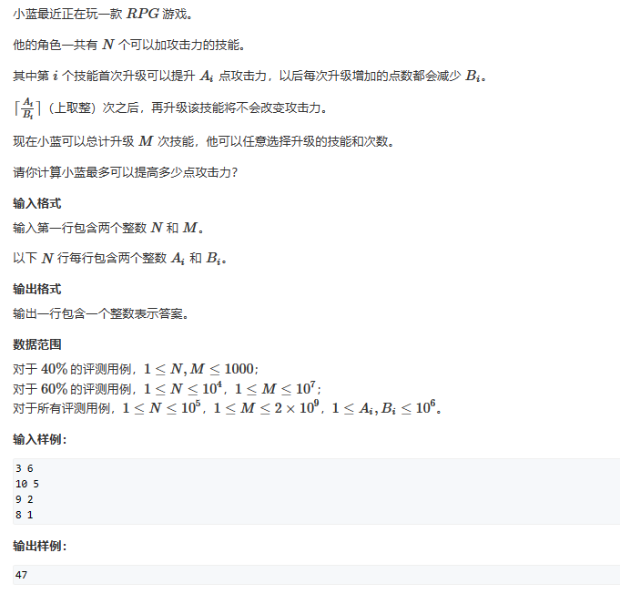

# 多路归并
[TOC]

## 1. 算法综述

多路归并是一种算法思想，并不是特指某一种算法。

他的思想是将n个有序数组合并成一个有序数组。听起来其实跟归并排序中的合并两个有序部分有点像。将多变一，不过这里我们通常需要用堆来优化。毕竟堆每次然会一堆元素中的最大部分只需要`O(logn)`的时间复杂度。


## 2. 例题讲解
### 2.1 AcWing 1262. 鱼塘钓鱼
> [AcWing 1262. 鱼塘钓鱼](https://www.acwing.com/problem/content/1264/)
> 
> 

思路：这里看起来过程还是相当复杂的。我们先考虑贪心。

一开始我们大概就会被这个复杂度过程打败了。因为我们需要考虑是否在选择池塘是不断在两个池塘之间穿梭，像一个s曲线那样？其实要求钓鱼数量最多，那么需要用最少的时间在路上跑。所以我们只需要确定在每个池塘钓鱼的数量，从前到后依次钓鱼就可以了。

其次是如何分配每个池塘钓鱼的数量，才能获得最多的鱼？根据题目我们可以发现根据，每个池塘每一次钓鱼的数量是一个等差数组，我们将n个等差数组合并成一个序列，然后求出前面中规定次数的最大值之和即可。

不过还需要考虑一个问题：每到一个鱼塘都是会消耗时间的。假如最远会到达第i个鱼塘，路上白白消耗的时间是变多了，但是钓鱼的时间就变少了——也就是选择排列在前面的项数也变少了。因此我们需要遍历n个池塘，查看最远达到哪个池塘时能得到最多的钓鱼量。因为并不一定是到最远的池塘才能得到最大的钓鱼量。

代码:
```c++
#include<iostream>
#include<queue>
#include<algorithm>
using namespace std;
typedef pair<int, int> PII;
const int N = 105;
int a[N], b[N], spend[N];
int n, t;


int main(){

    cin >> n;
    for(int i = 1; i <= n; i++) cin >> a[i];
    for(int i = 1; i <= n; i++) cin >> b[i];
    for(int i = 2; i <= n; i++){
        int tmp = 0;
        cin >> tmp;
        spend[i] = spend[i - 1] + tmp;
    }

    cin >> t;

    int res = 0;
    for(int i = 1; i <= n; i++){
        int fishtime = t - spend[i];
        int fish = 0;
        priority_queue<PII> que;

        // 将i个池塘全部压入队列
        for(int j = 1; j <= i; j++)
            que.push({a[j], j});

        while(que.size() && fishtime > 0){
            PII tmp = que.top();
            int y = tmp.second;
            int x = tmp.first;
            fish += x;
            fishtime--;
            que.pop();

            x -= b[y];
            if(x > 0)   que.push({x, y});
        }

        res = max(res, fish);
    }

    cout << res << endl;
    return 0;
}
```


### 2.2 AcWing 4656. 技能升级
> [AcWing 4656. 技能升级](https://www.acwing.com/problem/content/4659/)
> 

思路：确实是有难度的。按照前面的贪心思想，利用堆来优化查找时间，可以实现`O(mlogn)`的时间复杂度。但是m的数量级太大了，不能通过全部案例。

因此我们需要再思考其他方法。这里的多路归并就是体现在将n个等差序列合并成一个有序数列，然后去除前面m个最大的即可。我们知道合并成一个有序数列，这个有序数列是单调递减的。那么我们是否可能通过二分在这个序列中找到一个值，满足在序列下标上等于m。

这样的话时间复杂度就是`O(nlogm)`了。

值得注意的是：我们并没有将所有序列真的合并成一个序列，而是通过等差数组的性质，每次根据二分的值计算和判断数量。

这里的二分就可以抽象成：一个单调递减的序列，每个元素并不唯一，求出第m个位置的元素是多少。我们二分通常是求出边界，因此这里的目标应该是`num[mid] >= m`.

这里需要时刻注意数据是否爆int类型，而且mid是可能取到0的。因此需要注意细节。

代码：
```c++
#include<iostream>
#include<algorithm>
#include<queue>
using namespace std;
typedef long long LL;
const int N = 100005;
int n;
LL m;
int a[N], b[N];
LL res;

bool check(int mid){

    LL cnt = 0;
    for(int i = 1; i <= n; i++){
        if(a[i] >= mid){
            cnt += (a[i] - mid) / b[i] + 1;
        }
    }

    return cnt >= m;
}

int main(){
    
    cin >> n >> m;
    for(int i = 1; i <= n; i++){
        cin >> a[i] >> b[i];
    }

    int l = 0, r = 1e6 + 5;
    while(l < r){
        int mid = (LL) l + r + 1 >> 1;
        if(check(mid))  l = mid;
        else            r = mid - 1;
    }

    LL num = 0;
    for(int i = 1; i <= n; i++){
        if(a[i] >= l){
            int cnt = (a[i] - l) / b[i] + 1;
            num += cnt;
            int ed = a[i] - (cnt - 1) * b[i];
            res += (LL) (a[i] + ed) * cnt / 2;
        }
    }

    cout << res - (num - m) * l << endl;

    return 0;
}
```


### 2.3 


