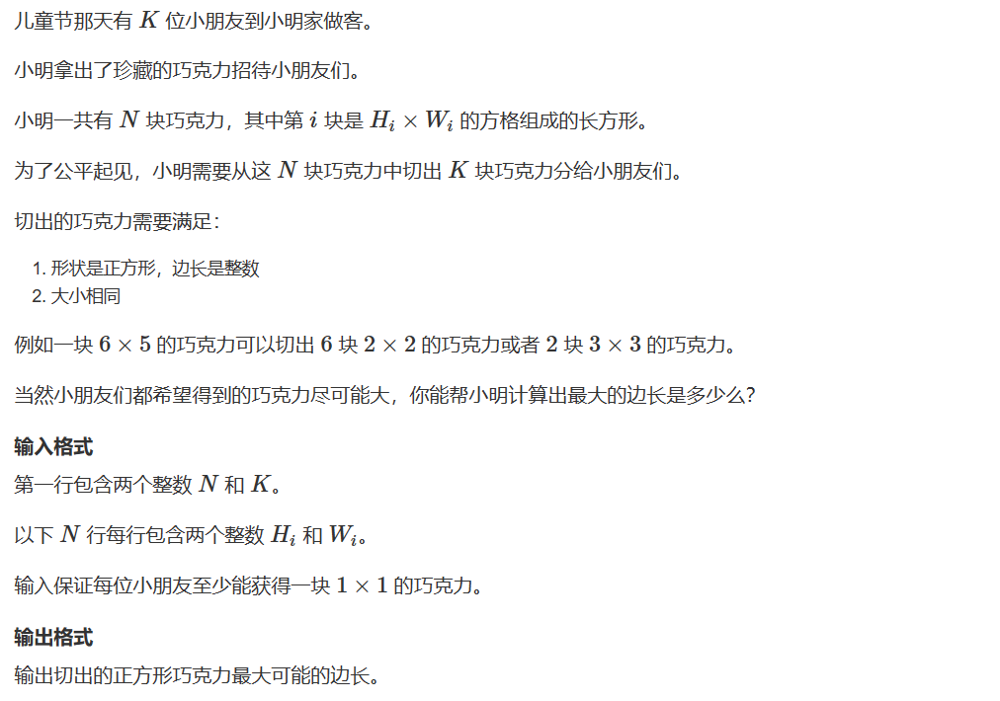
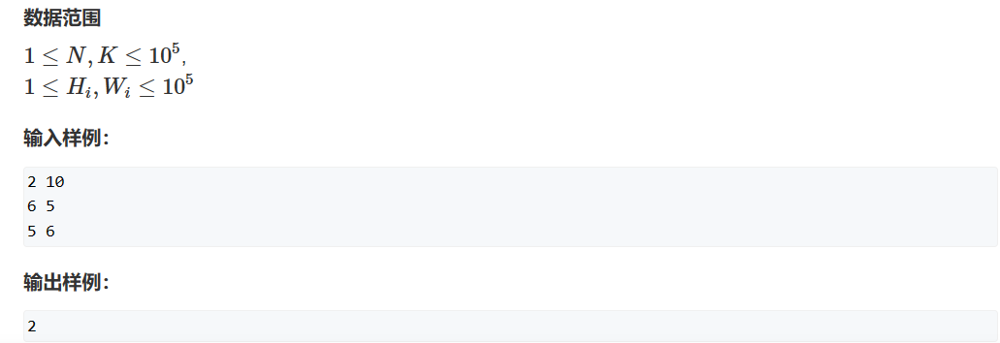

# 二分
[TOC]

## 1. 算法综述

二分查找虽然逻辑很好理解,但是在实际的代码编写中很容易写出死循环的代码.我们需要理解为什么会出现死循环。

二分中出现的中点是 `mid = l + r >> 1`，循环条件是`l < r`，那么死循环时就是一直满足`l < r`。这说明在用中点`mid`更新`l`和`r`的时候出现了问题。

**重点：在`mid = l + r >> 1`中，即mid取中点时会向下取整。也就是`l`和`r`相邻时，`mid`会取`l`的值。** 如果针对这种情况不进行处理，就会出现死循环。

然后对于二分的本质是什么？我想应该是区间性质分明吧。**二分查找的本质是双指针。** 我们需要用左右指针来查找目标区间的分解点。这里就可以用左右指针来不同查找。设`l`和`r`指针分别为左右指针。

1. 如果`[0, l]`是目标区间，`mid`满足条件时`l = mid`,`r`是不满足目标的位置，他需要不停跑在mid前面即`r = mid - 1`。分析此时是否会出现死循环：**当`l`和`r`相邻时，`mid`等于`l`，`l = mid`，最后`l`和`r`没有更新，陷入死循环。** 想要摆脱困境，只能在mid更新的时候向上取整，即`mid = l + r + 1 >> 1`,当`l`和`r`相邻的时候，mid就可以取到`r`的位置，`r`也会相对`mid`向前一步，突破死循环。

2. 如果`[r, n]`是目标区间，`mid`满足条件时是`r = mid`，`l`是不满足目标的位置，他就会走在mid前面，即`l = mid + 1`。分析是否会陷入死循环：**当`l`和`r`相邻时，`mid`等于`l`，`l = mid + 1`，最后`l`实现更新，不会陷入死循环。** 此时可以直接使用`mid`的更新条件`mid = l + r >> 1`。

综上所述：二分查找的思路：
1. 确定目标区间是`[0, l]`还是`[r, n - 1]`。
2. 确定目标区间之后确定`l`和`r`的更新方式。
3. 根据`l`和`r`相邻时是否陷入死循环来判断mid的更新方式。
4. 返回下标。

**也可以直接记忆：`[0, l]`为目标区间时，`l = mid`，`mid`必须变成向上取整；`[r, n - 1]`为目标区间时，r = mid，`mid`还是向下取整。**

***
 ## 2. 题目练习
 ### 2.1 AcWing 503. 借教室
 > [AcWing 503. 借教室](https://www.acwing.com/problem/content/505/)
 > 
 > 

思路：很难想到是二分的思想。但是这里会用到差分是显而易见的。首先说明以下这里的题意：

给出`n`天的空教室数量，然后给出`m`个订单的详细信息。请你判断最早从哪一个订单开始就出现空教室供不应求了。订单是说出从那个区间开始连续占用多少个教室。

这里优化多不同区间多次加减的算法是**差分模型**。但是如果只是使用差分模型，如何求出最早出现问题的订单？暴力做法是什么？

到这一步我的思维就出现问题了。我看你把题意理解成了求出最早出现问题是哪一天？那如果是这样，就直接使用全部订单对区间进行操作，遭到第一个不满足要求的日期即可对吧。

但是求出最早出现问题的订单就不一样了。因为不同订单选择的日期不一样，减少的天数不一样。要计算直到第`i`个订单是是否出现问题，就需要将前面所有`i`个区间的操作都处理，然后遍历所有天数。如果遍历所有天数发现都没问题，那么这`i`天都没问题。

这里就体现出来二分的某种性质的连续性。我们需要找到不同性质区间的分界点，自然是可以使用二分算法的。只需要写好判断函数就可以了。

如果使用暴力的做法，那么就必须从前到后遍历每个订单，每一次更新一个订单的操作，都需要遍历所有天数，那么即使差分可以让整体区间的加减复杂度到达`O(n)`，遍历全部订单之后，总复杂度还是`O(m*n)`。`m`和`n`的数量级都达到了`10^6`，这样的时间复杂度一定会超时，必须进行优化。

如果使用二分的算法进行遍历，就能将时间复杂度优化到`O(nlogm)`，能够实现。

难点还是理解题意。

代码：
```c++
#include<iostream>
using namespace std;

typedef long long ll;
const int N = 1000010;
int n, m;
int  a[N], d[N], s[N], t[N];
ll b[N];

// 检查前mid个订单是否出现问题
bool check(int mid){
    // 进行当前mid个订单操作
    // 每次要对差分数组更新
    // 求差分数组
    for(int i = 1; i <= n; i++) b[i] = a[i] - a[i - 1];
    for(int i = 1; i <= mid; i++){
        b[s[i]] -= d[i];
        b[t[i] + 1] += d[i];
    }

    // 检查n天中是否出现有问题的时间
    for(int i = 1; i <= n; i++){
        b[i] += b[i - 1];
        if(b[i] < 0)   return true;
    }

    return false;
}

int main(){
    
    cin >> n >> m;
    for(int i = 1; i <= n; i++) cin >> a[i];
    for(int i = 1; i <= m; i++) cin >> d[i] >> s[i] >> t[i];

    // 二分求订单号
    int l = 1,  r = m;
    while(l < r){
        int mid = (l + r) >> 1;
        if(check(mid)){
            r = mid;
        }else{
            l = mid + 1;
        }   
    }

    if(check(l)){
        cout << -1 <<endl;
        cout << l << endl;
    }else{
        cout << 0 << endl;
    }

    return 0;
}
```


### 2.2 AcWing 1227. 分巧克力
> [AcWing 1227. 分巧克力](https://www.acwing.com/problem/content/1229/)
> 
> 

思路:这里需要根据某种区间的性质找出分界点,就是二分的特点.我们可以发现,当分的巧克力边长越大,那么数量就会越少.因此我们可以找到某种边界,当满足边长最大的时候,也满足数量关系,但是边长再变大一点,数量关系就不满足了,这就是可以用二分来实现.当然也可以分析暴力的做法:从`1`枚举边长,判断边长最大为多少时刚好不满足条件对吧.这里时间复杂度就到达了`O(n*t)`,但是使用二分时间复杂度可以优化为`O(n*logt)`,其中`t`是巧克力的最小边.

代码:
```c++
#include<iostream>
using namespace std;

typedef long long ll;
const int N = 100010;
int n, m;
int a[N], b[N];
int r = 0;

bool check(int mid){
    ll res = 0;
    for(int i = 1; i <= n; i++){
        res += (ll) (a[i] / mid) * (b[i] / mid);
    }
    if(res >= m)    return true;
    else            return false;
}


int main(){
    
    cin >> n >> m;
    for(int i = 1; i <= n; i++){
        cin >> a[i] >> b[i];
        r = max(a[i], r);
        r = max(b[i], r);
    }

    int l = 1;
    while(l < r){
        int mid = (l + r + 1) >> 1;
        if(check(mid)){
            l = mid;
        }else{
            r = mid - 1;
        }
    }

    cout << l << endl;
    
    return 0;
}
```

