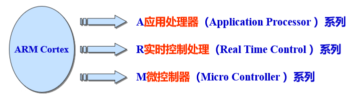

# git简单操作
[TOC]
## 1. 介绍
### 版本控制系统（VCS）
在协作开发中，对于大量来自不同的开发者的改动，一个版本控制系统（VCS）非常重要。例如一个基本项目中，不同开发者负责在此基础上开发不同的功能，项目版本的更新和合并是一个难题。

目前最流行的版本控制工具是`git`，他有最大开源项目网站`github`，国内使用的`git`网站是阿里巴巴的`gitee`。两者操作相似。

### git介绍
`git`是一个分布式版本控制系统。

**区分集中式和分布式版本控制系统：**
1. 集中式的版本控制系统：有中央服务器，每个人的都已中央服务器的版本为主。
2. 分布式版本控制系统：每个人将代码仓库完整的镜像下来，包括历史记录，相当于对代码仓库进行备份。

集中式的缺点是中央服务器出现了问题，大家都无法使用。分布式就可以解决这个问题：任何溢出的服务器出现问题，事后都可以用任何一个镜像出来的本地仓库恢复。


Git是快照流，如果文件在两个版本之间没有改动，就保留一个链接指向之前的文件；如果改动了，就将文件存入快照。
> 什么是快照和快照流？
> 在Git中，"快照"指的是对项目工作目录中所有文件和文件夹的一个完整拷贝，存储在某个特定时间点的状态。每次进行提交（commit）时，Git会创建一个新的快照，记录当前工作目录中所有文件的状态，并将这个快照保存在Git仓库中。这个快照包含了项目在提交时的所有文件内容。
>
> 快照流指的是版本控制系统通过记录项目的整个文件系统状态的快照来进行工作的方式。相当于快照的目录，可以方便的回溯历史版本。


### 文件的状态和阶段
一个文件会处在三种状态之一：已修改（modified）、已暂存（staged）、已提交（committed）。
1. 已修改表示修改了文件，但还没保存到数据库中。
2. 已暂存表示对一个已修改文件的当前版本做了标记，使之包含在下次提交的快照中。
3. 已提交表示数据已经安全地保存在本地数据库中。

这使得git项目有三个阶段：工作区、暂存区以及 Git 目录。
1. 在工作区中修改文件。
2. 将你想要下次提交的更改选择性地暂存，这样只会将更改的部分添加到暂存区。
3. 提交更新，找到暂存区的文件，将快照永久性存储到 Git 目录。


## 2. git的安装和使用
### 安装
在git官网上下载安装包即可。
安装完成之后，首先需要设置用户名和邮件地址。
```
git config --global user.name "John Doe"
git config --global user.email johndoe@example.co
```

### 使用流程
1. 从远程仓库中克隆 Git 资源作为本地仓库。
2. 从本地仓库中checkout代码然后进行代码修改.
3. 在提交前先将代码提交到暂存区。
4. 提交修改。提交到本地仓库。本地仓库中保存修改的各个历史版本。
5. 在修改完成后，需要和团队成员共享代码时，可以将代码push到远程仓库。

流程图


### git实际操作

1. fork别人的开源项目或者自己建立一个新仓库。
    >在Git中，"fork"通常指的是将一个仓库的完整拷贝复制到另一个位置（自己的仓库中），使得复制后的仓库独立于原始仓库。
**新建仓库示意图**

**fork位置**


***
2. 将远程仓库clone到本地
两种方式，第一种使用的是http网址，第二种使用的是密钥。使用第二种较稳定，但是需要设置自己的密钥。[设置密钥](https://zhuanlan.zhihu.com/p/108972475)

    `git clone https://github.com/***/algorithm-notes.git`

    `git clone git@github.com:***/algorithm-notes.git`


***
3. 进入本地工作区，开发和修改项目。
前面将远程仓库克隆到电脑，得到自己的本地仓库。打开本地仓库，用IDE（如vscode等）打开文件进入工作区。

***
4. 当前任务完成之后，需要将新文件保存到本地仓库
   (1).  `git add .`  将当前工作区全部文件保存到暂存区。 
   (2).  `git commit -m"first commit"`  将暂存区的文件提交保存到本地仓库
   `需要注意的是，这里只是保存到本地仓库中，还没有推送更新到github（远程仓库）中。`

***
5. 将本地仓库推送到远程仓库
    `git push origin main` 这里的`origin`是在git clone后默认设置远程仓库的名字，`main`是远程仓库的主支。

***

### 操作总结
这里只涉及到最简单的操作：将远程仓库克隆到本地，形成本地仓库；对本地仓库有新的开发之后，在推送回远程仓库。但是git操作还有很多复杂的操作，例如创建分支，合并分支等等。
**任何在工作区的操作，都需要提交到本地仓库，然后再提交到远程仓库，才算更新。**


## 3. 常见命令行
**git clone**
```
// 克隆远程仓库到本地
git clone [仓库网址/ssh地址]
```
***
**git add**
```
// 将工作区文件保存至暂存库,注意add后面是空格+'.'
git add .
```
***
**git commit**
```
// 将暂存库文件保存至本地仓库，此时本地仓库才有更新
git commit -m""
```
***
**git push**
```
// 将本地仓库推送和更新到远程仓库origin的main分支上
git push origin main
```
***
**git pull**
```
// 从origin仓库拉取master分支，并和本地仓库进行merge
git pull origin master
```

***
**git remote**
查看现有远程仓库、添加远程仓库，其中pb和origin是为远程仓库起的名字。这里演示了连接到GitHub的两种协议，通常使用后者能在一定程度上规避网络问题
```
git remote -v
git remote add pb https://github.com/paulboone/ticgit
git remote add origin git@github.com:wihn2021/git-tut.git
```
***

**git branch**
```
// 1. 打印仓库的全部分支
git branch

// 2. 创建新分支
git branch testing

// 3. 删除分支
git branch -d testing
```
***
**git checkout**
```
// 切换分支
git checkout testing
```

***
**git merge**
```
// 合并分支，将testing分支合并到main分支去
git checkout main
git merge testing
```
***
**git log**
```
// 打印仓库的提交日志
git log
```
***
**git init**
```
// 将当前目录初始化为一个git仓库
git init
```
***
**git rm**
```
// 1. 删除文件
git rm example.txt
// 2. 删除文件夹，"-r"表示递归删除
git rm -r foldername
```

****
**git mv**
```c++
// 重命名文件，将文件SSD300重命名为ssd
git mv SSD300 ssd
```


