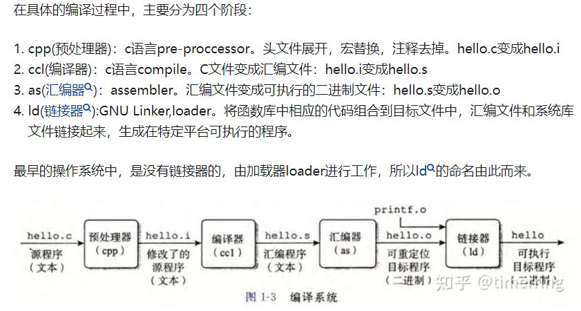
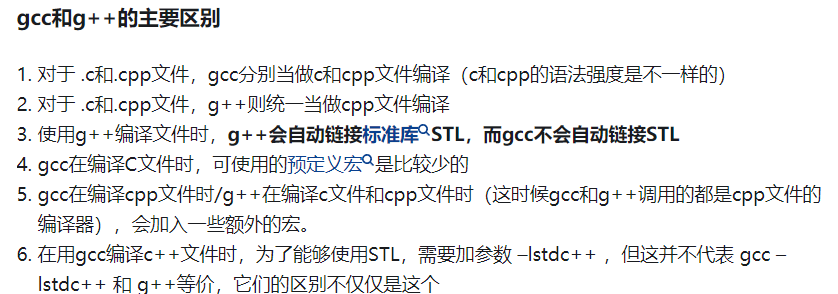

# vscode + cmake 运行c++项目
[TOC]

## 1. 关于c++编译

什么是GCC / G++
GCC(GNU编译器套件)：GNU Compiler Collection。可以编译C、C++、JAVA、Fortran、Pascal、Object-C、Ada等语言。gcc是GCC中的GNU C Compiler（C 编译器）g++是GCC中的GNU C++ Compiler（C++编译器）.


想让c代码在Linux上运行，我们需要使用GCC
```
1. 预编译：将hello.c和stdio.h预编译为hello.i;
2. 编译:将hello.i编译为hello.s
3. 汇编:将hello.s翻译为机器指令hello.o（.o目标文件）
4. 链接：链接各种需要的库和其他目标文件（该hello程序不需要）得到可执行文件hello.out（相当于windows的.exe）
```

整个过程将高级语言翻译成了机器语言，而编译器，就是这样的一个工具。GCC可以完成从预编译编译，汇编，链接整个过程。





什么是Cmake？

CMake 是一个跨平台的、开源的构建工具。cmake 是 makefile 的上层工具，它们的目的正是为了产生可移植的makefile，并简化自己动手写makefile时的巨大工作量.可以把cmake看成一款自动生成 Makefile 的工具，所以编译流程就变成了：cmake—>make–>用户代码–>可执行文件。


## 2. 关于命令行使用编译指令
```c++
g++ 文件.cpp  生成可执行文件 a.exe，该生成文件不包含调式信息
g++ 标识一种编译器，该命令行可以执行c++文件
g++ -g 文件.cpp -o 输出的文件名   这里-g要求输出有调式信息的可执行文件， -o 指定输出文件名
```

## 3. 关于vscode配置c++项目的配置文件
1. `launch.json`调试配置文件

```json
{
    // 使用 IntelliSense 了解相关属性。 
    // 悬停以查看现有属性的描述。
    // 欲了解更多信息，请访问: https://go.microsoft.com/fwlink/?linkid=830387
    "version": "0.2.0",
    "configurations": [
        {
            "name": "g++.exe - 生成和调试活动文件",
            "type": "cppdbg",
            "request": "launch",

            // 这里设置的是工作目录中的build目录中的main.exe文件为调试的执行文件
            "program": "${workspaceFolder}/build/main.exe",
            "args": [],
            "stopAtEntry": false,

            // 说明在当前工作目录中执行
            "cwd": "${workspaceFolder}",
            "environment": [],

            // 设置黑框框
            "externalConsole": true,
            "MIMode": "gdb",

            // 调试文件配置gdb
            "miDebuggerPath": "C:\\mingw64\\bin\\gdb.exe",
            "setupCommands": [
                {
                    "description": "为 gdb 启用整齐打印",
                    "text": "-enable-pretty-printing",
                    "ignoreFailures": true
                }
            ],

            // 调试需要先执行这个命令,这个命令在task.json中
            "preLaunchTask": "Build"
        }
    ]
}
```

2. `tasks.json`生成执行文件的配置文件


```json
{
    "version": "2.0.0",
    // 指定当前工作目录
    "options": {
        "cwd": "${workspaceFolder}/build"
    },

    // 任务数组
    "tasks": [
        {
            "type": "shell",
            "label": "cmake",
            "command": "cmake",         // 执行指令
            "args": [                   // 执行指令的参数
                ".."
            ]
        },
        {
            "label": "make",
            "group": {
                "kind": "build",
                "isDefault": true
            },
            "command": "mingw32-make.exe",  // 执行make命令
            "args": [

            ]
        },
        {
            "label": "Build",           // 对应命令
            "dependsOn":[
                "cmake",
                "make"
            ]
        }
    ],
    
}

```


## 4. 执行camke方式

配置号cmake之后启动cmake,这会生成build目录.后面生成的可执行文件也会在build目录中.

命令行中进入build目录,执行`cmake ..`是为了在 build 目录下生成构建所需的 Makefile 或者其他构建系统的配置文件。这个命令的含义是告诉 CMake 在上一级目录中查找 CMakeLists.txt 文件，并根据这个文件的内容生成构建系统所需的配置文件。

然后执行`make`命令创建可执行文件.但是windows中由于可执行文件名不同,一般可以执行命令行`cmake --build .`来生成,或者也可以执行`mingw32-make.exe`执行,如果在目录中将`mingw32-make.exe`改名为`make.exe`,也可以执行这个命令.

最后生成的可执行文件,我们可以进行调试运行,或者用快捷键`Fn + F5`编译运行.


## 5. cmake教程

> 推荐教程
> [cmake保姆教程上](https://subingwen.cn/cmake/CMake-primer/index.html)
> [cmake保姆教程下](https://subingwen.cn/cmake/CMake-advanced/index.html)
> [引入外界库](https://blog.csdn.net/CHWB2580/article/details/117600611)


### 5.1 cmake语法使用
CMake支持大写、小写、混合大小写的命令。如果在编写CMakeLists.txt文件时使用的工具有对应的命令提示，那么大小写随缘即可，不要太过在意。
#### 1. 注释
注释行
```txt
# 这是一个 CMakeLists.txt 文件
cmake_minimum_required(VERSION 3.0.0)
```

注释块
```
# 这是一个 CMakeLists.txt 文件
cmake_minimum_required(VERSION 3.0.0)
```

#### 2. 


