# 嵌入式ARM体系
## 1.嵌入式系统概述
### 1.1 定义
1. IEEE（国际电气和电子工程师协会）的定义——控制装置

**嵌入式系统是“用于控制、监视或者辅助操作机器和设备的装置”**，

原文为devices used to control, monitor, or assist the operation of equipment, machinery or plants）
>可以看出此定义是从应用上考虑的：嵌入式系统是软件和硬件的综合体，还可以涵盖机电等附属装置。
由此可以得出以下结论：

**嵌入式系统通常执行特定功能，其核心是嵌入式微处理器，有严格的时序和稳定性要求，并且可以全自动循环操作**


2. 另一个普遍使用的定义——专用计算机系统

>所谓嵌入式系统是以应用为中心、以计算机技术为基础的，并且软硬件是可裁剪的，能满足应用系统对功能、可靠性、成本、体积、功耗等指标严格要求的专用计算机系统

3. 总结嵌入式定义和特点：

**嵌入式系统定义：嵌入到对象体系中的专用计算机系统；**

**3个基本要素：嵌入性、专用性、计算机系统。**

**特点**：嵌入式系统集系统的应用软件与硬件于一体，具有**软件代码小、高度自动化、响应速度快**等特点，特别适合于那些要求**实时和多任务的体系结构**，可以实现对其他设备的控制、监视或管理等功能

### 1.2 特点
1. 嵌入式系统通常是面向特定应用的；
2. 嵌入式系统功耗低、体积小、集成度高、成本低；
3. 嵌入式系统具有较长的生命周期；
4. 嵌入式系统具有固化的代码，嵌入式系统的应用软件生命周期也和嵌入式产品一样长；
5. 嵌入式系统开发需要专用开发工具和环境；
6. 嵌入式系统软件需要RTOS开发平台，嵌入式系统一般使用实时操作系统RTOS（Real-Time Operating System），；
7. 嵌入式系统对开发人员的专业性要求更高；
8. 嵌入式系统是知识集成系统；
9. 一句话来表达出嵌入式系统的特点，我们可以将之称为：定制化的计算系统。


### 1.3 嵌入式构成
就其组成而言，它们一般都是由**硬件、软件以及嵌入式系统的开发工具和开发系统**3部分组成的。


#### 1.3.1 硬件
嵌入式系统的硬件是以**嵌入式处理器为中心**，由存储设备、I/O设备、通信接口设备、扩展设备接口以及电源等必要的辅助接口构成。


1. 嵌入式核心芯片
 >1.1 嵌入式微处理器EMPU
 >1.2 嵌入式微控制器EMCU
 >1.3 嵌入式数字信号处理器EDSP-有时为了提高系统的信息处理能力，常外接DSP和DSP协处理器（也可内部集成），以完成高性能信号处理
 >1.4 嵌入式片上系统ESoC-以微处理器为核心的集成多种功能的SoC系统芯片已成为嵌入式系统的核心；这些SoC集成了大量的外围USB、UART、以太网、AD/DA、IIS等功能模块.

2. 保存固件的ROM（非挥发性只读存储器）

3. 保存程序、数据的RAM（挥发性的随机访问存储器）

4. 通信接口
 >4.1 RS-232接口(通用异步收发器UART-Universal Asynchronous Receiver Transmitter，软件开发调试时用于进行各种输入/输出操作)
 >4.2 USB接口（通用串行总线）
 >4.3 Ethernet（以太网接口）

5. 人机交互接口
 >包括键盘、鼠标、CRT、LCD和触摸屏等，构成了嵌入式系统中重要的信息输入/输出设备

6. 电源及其他辅助设备

#### 1.3.2 软件
由嵌入式操作系统和各种应用程序构成软件部分。
应用程序控制系统的动作和行为，而由操作系统控制应用程序编程与硬件的交互。

1. 驱动层程序（考点）
**作用：** 上层软件提供了设备的操作接口，上层软件不用理会设备的具体内部操作，只需调用驱动层程序提供的接口即可。
**分类：** 硬件抽象层（HAL）、板级支持包BSP和设备驱动程序。
    - 硬件抽象层：
        > **操作系统内核与硬件电路之间的接口层**，其目的在于将**硬件抽象化**；可通过程序来控制所有硬件电路如CPU、I/O、Memory等的操作。这样就使得系统的**设备驱动程序与硬件设备**无关.
    - 板级支持包:
        > 介于主板硬件和操作系统中驱动层程序之间的一层，一般认为它**属于操作系统的一部分**, **为上层的驱动程序提供访问硬件设备寄存器的函数包**，使之能够更好地运行于硬件主板。**BSP是相对于操作系统而言的**，不同的操作系统对应于不同定义形式的BSP。
    - 设备驱动程序：
        > 驱动程序为上层软件提供了设备的操作接口，上层软件只需要调用驱动程序提供的接口，而不用理会设备内部操作。


2. 实时操作系统（RTOS）
RTOS是针对不同处理器优化设计的高效率实时多任务内核, 它将CPU时间、中断、I/O、定时器等资源都封装起来，留给用户一个标准的API，并根据各个任务的优先级合理地在不同任务之间分配CPU时间。实现了操作系统软件和用户应用软件的分离。

3. 操作系统的应用程序接口（API）
API（Application Programming Interface，应用程序接口）是一系列复杂的函数、消息和机构的集合体
    > 在计算机系统中有很多可通过硬件或外部设备去执行的功能，这些功能可以通过计算机操作系统或硬件预留的标准指令调用，而软件人员在编制应用程序时，只需按系统或某些硬件事先提供的API调用即可完成功能的执行

4. 应用程序
    >在用户应用程序中，也可创建用户自己的任务。任务之间的协调主要依赖于系统的消息队列


5. 开发工具和开发系统
    嵌入式系统的硬件和软件处于嵌入式系统产品本身之中，开发工具则独立于嵌入式系统产品之外
    开发工具一般用于开发主机，包括语言编译器、连接定位器、调试器等，这些工具一起构成了嵌入式系统的开发系统和开发工具 

### 1.4 嵌入式处理器分类
嵌入式处理器可以分成嵌入式微处理器（EMPU）、嵌入式微控制器（EMCU）、嵌入式DSP处理器（EDSP）、嵌入式片上系统（ESoC）4类。

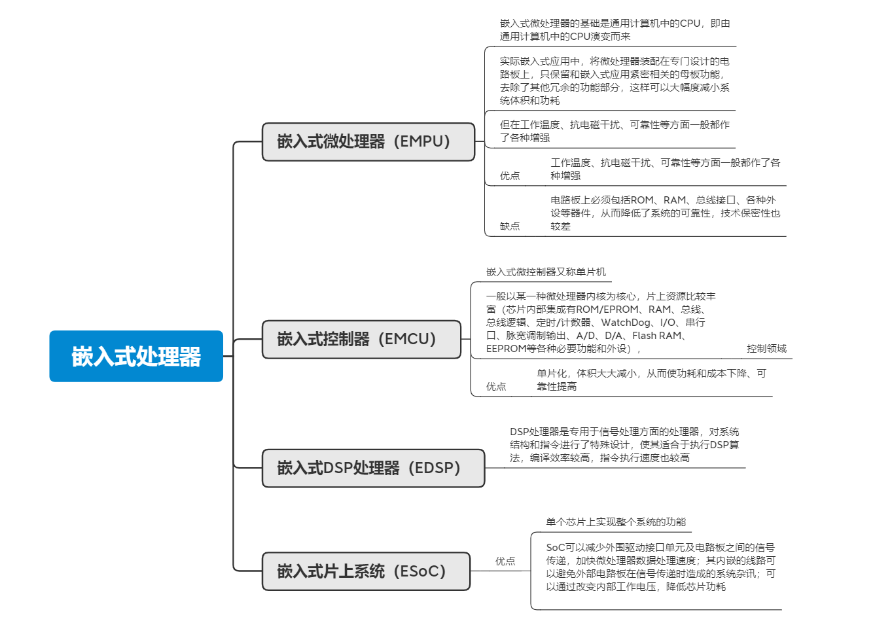


### 1.5 嵌入式操作系统
嵌入式操作系统——专用的、可定制的操作系统。

尽管嵌入式操作系统的发展经历了这三个阶段，并不意味着现在的嵌入式系统都有操作系统。

#### 1.5.1 嵌入式操作系统发展阶段
1. 第一阶段（简单操作系统）
    由于嵌入式操作系统刚发展起来，加之嵌入式CPU种类繁多，没有一个统一的标准。因此，此时的嵌入式操作系统通用性比较差、用户界面不够友好。但是，操作系统具有一定的兼容性和扩展性。
2. 第二阶段（通用的嵌入式实时操作系统）
    - 以嵌入式实时操作系统为核心的嵌入式系统成为主流；
    - 能运行于各种类型的微处理器上、兼容性好、内核精小、效率高、具有高度的模块化和扩展性；
    - 还具备文件和目录管理、设备支持、多任务、网络支持、图形窗口以及用户界面等功能。通用的嵌入式实时操作系统通过提供大量的API接口来增加系统的可扩展性和灵活性。
3. 第三阶段（Internet嵌入式系统）
    所有的设备都有联网的趋势，嵌入式设备与Internet的结合将代表着嵌入式技术的真正未来。例如，4G功能的智能手机。


#### 1.5.2 嵌入式操作系统的特点
嵌入式操作系统首先是操作系统，所以嵌入式操作系统具有通用操作系统的基本特点：
    可以完成**进程管理、存储管理、文件管理、设备管理**等等功能，通常还包括与硬件相关的底层驱动软件、系统内核、设备驱动接口、通信协议、图形界面、标准化浏览器等等。

嵌入式操作系统既具有通用操作系统的基本特点，又具有自身的一些优势，这主要体现在如下几个方面：
1. 系统内核小。
2. 专用性强。
3. 系统精简。
4. 高实时性。
5. 多任务的操作系统。
6. 需要开发工具和环境。


#### 1.5.3 嵌入式操作系统的主要概念
1. 前后台系统的概念
    对基于芯片的开发来说，应用程序一般是一个无限的循环，可称为前后台系统或超循环系统。
    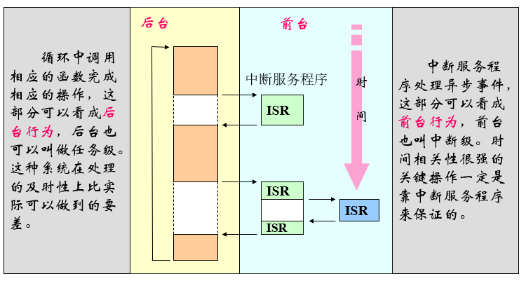

2. 操作系统作用
    - 操作系统是计算机中最基本的程序；
    - 操作系统负责计算机系统中全部软硬资源的分配与回收、控制与协调等并发的活动；
    - 操作系统提供用户接口，使用户获得良好的工作环境；
    - 操作系统为用户扩展新的系统功能提供软件平台。

3. 实时操作系统（RTOS）
    - 实时操作系统是一段在嵌入式系统启动后首先执行的背景程序，用户的应用程序是运行于RTOS之上的各个任务；
    - RTOS根据各个任务的要求，进行资源(包括存储器、外设等)管理、消息管理、任务调度、异常处理等工作；
    - 在RTOS支持的系统中， 每个任务均有一个优先级，RTOS根据各个任务的优先级，动态地切换各个任务，保证对实时性的要求。

4. 内核
    - 内核提供的基本服务是任务切换；
    - 多任务系统中，内核负责管理各个任务，或者说为每个任务分配CPU时间，并且负责任务之间的通信；

5. 调度
    - 调度就是决定该轮到哪个任务运行了；
    - 多数实时内核是基于优先级调度法的。

6. **非占先式内核（考点）**
    - 非占先式内核要求每个任务自我放弃CPU 的所有权；
    - 非占先式调度法也称作合作型多任务，各个任务彼此合作共享一个CPU。
    - 中断服务可以使一个高优先级的任务由挂起状态变为就绪状态。但**中断服务以后控制权还是回到原来被中断了的那个任务，直到该任务主动放弃CPU的使用权时，那个高优先级的任务才能获得CPU的使用权**
7. **占先式内核（考点）**
    - **最高优先级的任务一旦就绪，总能得到CPU的控制权**；
    - 如果是中断服务子程序使一个高优先级的任务进入就绪态，中断完成时，**中断了的任务被挂起，优先级高的那个任务开始运行**。
8. 中断
    中断是一种硬件机制，用于通知CPU有个异步事件发生了。中断一旦被识别，CPU保存部分（或全部）上下文即部分或全部寄存器的值，跳转到专门的子程序，称为中断服务子程序（ISR）。中断服务子程序做事件处理，处理完成后，程序回到：
    - 在前后台系统中，程序回到后台程序；
    - 对非占先式内核而言，程序回到被中断了的任务；
    - 对占先式内核而言，让进入就绪态的优先级最高的任务开始运行。
    

### 1.6 智能移动终端操作系统
Android是Google于2007年11月05日宣布的基于Linux平台的开源手机操作系统的名称。
1. Andy Rubin创立了两个手机操作系统公司：Danger和Android；
2. Danger 5亿美元卖给微软，成为了Kin，Android4千万美元卖给Google。

#### 1.6.1 安卓的构成
该平台由**操作系统、中间件、用户界面和应用软件**组成。它采用软件堆层（Software Stack，又名软件叠层）的架构。
1. 底层以Linux内核工作为基础，由C语言开发，只提供基本功能；
2. 中间层包括函数库Library和虚拟机Virtual Machine，由C++开发；
3. 最上层是各种应用软件，包括通话程序，短信程序等，应用软件则由各公司自行开发，以Java作为编写程序的一部分。


## 2.ARM处理器及系统结构
### 2.1 ARM微处理器概述
ARM（Advanced RISC Machines）有三种含义：
- 一个公司的名称
- 一类微处理器的通称
- 一种技术的名称


#### 2.1.1 ARM微处理器的特点
采用RISC架构的ARM微处理器一般具有如下特点：
- 体积小、低功耗、低成本、高性能；
- 支持Thumb（16位）/ARM（32位）双指令集，能很好的兼容8位/16位器件；
- 大量使用寄存器，指令执行速度更快；
- 大多数数据操作都在寄存器中完成；
- 寻址方式灵活简单，执行效率高；
- 指令长度固定。

#### 2.1.2  ARM微处理器系列
1. ARM7系列简介—基于冯诺依曼体系结构
    ARM7系列广泛应用于多媒体和嵌入式设备，包括Internet设备、网络和调制解调器设备，以及移动电话、PDA等无线设备。
2. ARM9系列简介—基于哈佛体系结构
    - 兼容ARM7系列。该系列包括ARM9TDMI、ARM920T和带有高速缓存处理器宏单元的ARM940T。
    - ARM9系列主要应用于引擎管理、仪器仪表、安全系统和机顶盒等领域。
    - ARM9系列特点：
        >(1) 具有五级整数流水线，指令执行效率高；
        >(2) 基于嵌入式ICE  JTAG软件调试方式，调试开发方便；
        >(3) 提供1.1MIPS/MHz的哈佛结构；
        >(4) 支持32位ARM指令集和16位Thumb指令集；
        >(5) 支持32位的高速AMBA总线端口；
        >(6) 全性能的内存管理单元，支持WinCE、Linux等多种主流嵌入式操作系统；
        >(7) MPU支持实时操作系统；
        >(8) 支持数据缓存和指令缓存，具有更强的指令和数据处理能力。

3. ARM10E系列简介
    可以用于视频游戏机和高性能打印机等场合。

4. Xscale简介
    主要应用于手提式通讯和消费电子类设备。

5. ARM Cortex系列简介
    基于ARMv7版本的ARM Cortex系列产品由A、R、M三个系列组成，具体分类延续了一直以来ARM面向具体应用设计CPU的思路。 
    

6. CortexTM-M3处理器简介
    该处理器是首款基于ARMv7-M架构的处理器，采用了纯Thumb2指令的执行方式，具有极高的运算能力和中断响应能力。

7. CortexTM-R4处理器简介
    该处理器是首款基于ARMv7架构的高级嵌入式处理器，其主要目标为产量巨大的高级嵌入式应用系统，如硬盘，喷墨式打印机，以及汽车安全系统等等。

### 2.2 ARM微处理器系统结构
#### 2.2.1  RISC体系结构
1. 嵌入式CISC微处理器
    传统的CISC（Complex Instruction Set Computer，复杂指令集计算机）结构有其固有的缺点，即随着计算机技术的发展而不断引入新的复杂的指令集，为支持这些新增的指令，计算机的体系结构会越来越复杂，然而，在CISC指令集的各种指令中，其使用频率却相差悬殊，大约有20％的指令会被反复使用，占整个程序代码的80％。而余下的80％的指令却不经常使用，在程序设计中只占20％，显然，这种结构是不太合理的。

2. 嵌入式RISC微处理器
    基于以上的不合理性，1979年美国加州大学伯克利分校提出了RISC（Reduced Instruction Set Computer，精简指令集计算机）的概念.

    RISC是精简指令集计算机，但RISC并非只是简单地去减少指令，而是把着眼点放在了如何使计算机的结构更加简单合理地提高运算速度上。RISC结构优先选取使用频度最高的简单指令，抛弃复杂指令，固定指令长度，减少指令格式和寻址方式，以控制逻辑为主，不用或少用微码控制等措施来达到上述目的。 
    
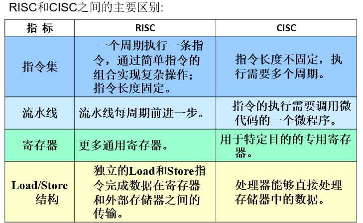

3. ARM体系结构的版本
    体系结构用来定义指令集和基于这一体系结构下处理器的编程模型，包括数据类型、工作模式、寄存器组。
    目前ARM体系结构一共定义了9个版本V1-V9
    - V1-V3：最早的版本，目前已经废弃。
    - V4-V6：经典处理器中运用的比较多。
    - V7：目前Cortex系列处理器主要是这种架构，支持Thumb-2指令集。
    - V8：兼容ARMv7架构的特性，并支持64位数据处理。
    - V9：与Armv8在核心指令集上变化不大，着重升级了安全性、机器学习、数字信号处理这三大块。
    
    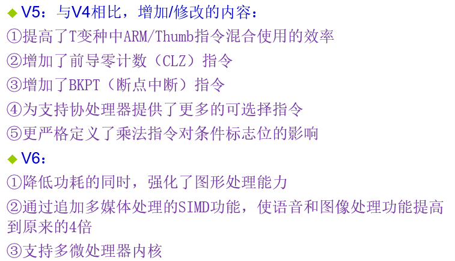
    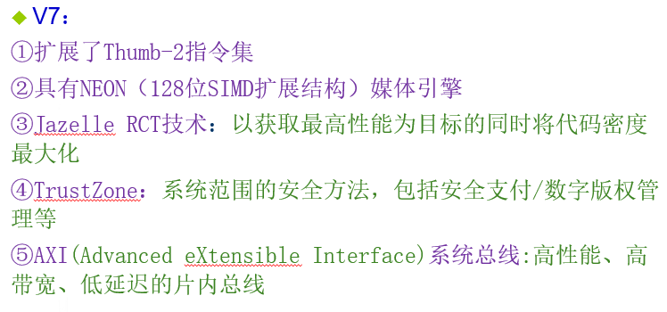
    
    

#### 2.2.2  ARM微处理器的寄存器结构
ARM处理器共有37个32位的寄存器，其中有31个通用寄存器，包括程序计数器（PC指针），6个状态寄存器，用以标识CPU的工作状态及程序的运行状态。

ARM处理器又有**7种不同的处理器模式（Cortex A8核开始追加第8种模式-寄存器达40个）**，在每一种处理器模式下均有一组相应的寄存器与之对应。

即在任意一种处理器模式下，**可访问的寄存器包括15个通用寄存器（R0～R14）和程序计数器PC，以及1~2个状态寄存器**。

在所有的寄存器中，有些是在7种（或8种）处理器模式下共用的同一个物理寄存器，而有些寄存器则是在不同的处理器模式下有不同的物理寄存器。

总结：
>1. 37个32位寄存器，其中31个通用寄存器，6个状态字寄存器；
>2. 7种不同的处理器模式,但是任意一种处理器模式下，可访问的寄存器包括15个通用寄存器（R0～R14）和程序计数器PC，以及1~2个状态寄存器；
>3. 不同处理模式下可能使用同一个物理寄存器。


#### 2.2.3 ARM微处理器的指令结构
ARM微处理器在较新的体系结构中支持两种指令集：ARM指令集和Thumb指令集。

- ARM指令为32位的长度
- Thumb指令为16位长度

**Thumb指令集为ARM指令集的功能子集，但与等价的ARM代码相比较，可节省30％～40％以上的存储空间，同时具备32位代码的所有优点。**

### 2.3 ARM微处理器的工作状态（考点）

ARM微处理器有两种工作状态，并可在两种状态之间进行切换：

- ARM状态：处理器执行32位的字对齐的ARM指令
- Thumb状态：处理器执行**16位的、半字对齐的Thumb指令**

**用BX  Rn指令进行两种状态的切换。**
1. ARM指令集和Thumb指令集均有切换处理器状态的指令BX，可在两种工作状态之间切换；ARM微处理器在开始执行代码时，应该处于ARM状态。
2. ARM和Thumb两种状态之间的切换不影响处理器的工作模式和寄存器的内容

#### 2.3.1 ARM状态切换到Thumb状态
1. **操作数寄存器的状态位（位0）为1**；
2. 通过执行BX指令，使微处理器从ARM状态切换到Thumb状态；
3. 此外，当处理器处于Thumb状态时发生异常（如IRQ、FIQ、Undef、Abort、SWI等），则异常处理返回时，**自动切回到Thumb状态**。


#### 2.3.2 Thumb状态切换到ARM状态
1. **操作数寄存器的状态位（位0）为1**；
2. 执行BX指令，使微处理器从Thumb状态切换到ARM状态；
3. 此外，在处理器进行异常处理时，**把PC指针放入异常模式链接寄存器中，并从异常向量地址开始执行程序**，也可以使处理器切换到ARM状态；
4. ARM在处理异常时，不管处于什么状态，都将切换到ARM状态。


### 2.4 ARM体系结构的存储器系统

ARM IP核主要有AHP和APB两条总线，各厂商根据需要在这两条总线上添加外设和存储器。

ARM系统使用存储器映射I/O。I/O口使用特定的存储器地址，当从这些地址加载（用于输入）或向这些地址存储（用于输出）时，完成I/O功能。

#### 2.4.1 ARM体系结构的存储器格式
ARM体系结构的存储器是从零地址开始的字节的线性组合。
- 从零字节到三字节放置第一个存储的字数据。
- 从第四个字节到第七个字节放置第二个存储的字数据，依次排列。

作为32位的微处理器，ARM体系结构所支持的最大寻址空间为4GB（232字节）。

ARM体系结构可以用两种方式存储字数据：
1. 大端格式 
    在这种格式中，字数据的**高字节存储在低地址中，而字数据的低字节则存放在高地址中**，如下图所示。
    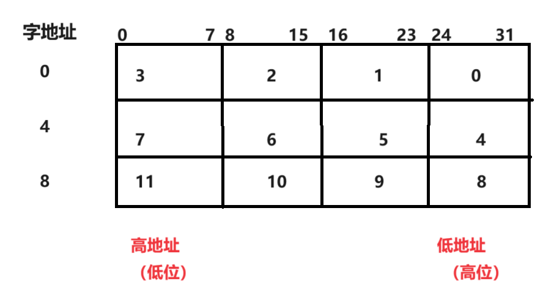

2. 小端模式
    在这种格式中，字数据的高字节存储在高地址中，而字数据的低字节则存放在低地址中，如下图所示。
    

这里必须对一串数字的高位和低位做一个说明：
> 对于十进制数字 1234 = 1*10^3 + 2*10^2 + 3*10^1 + 4*10^0，也就是说一串数据的高地址位是进制数的高位。


#### 2.4.2 指令长度及数据类型
1. ARM微处理器的指令长度可以是
    - 32位（在ARM状态下）
    - 16位（在Thumb状态下）
2. ARM微处理器中支持字节（8位）、半字（16位）、字（32位）三种数据类型.
3. 字需要4字节对齐（地址的低两位为0）、半字需要2字节对齐（地址的最低位为0）。

#### 2.4.3 Flash组织形式
1. 目前几乎所有MCU的程序都存储在Flash中
2. Flash分为片内和片外两种。
3. 片外Flash又分为两种：
    - NOR Flash：读取速度快，但擦除和写入速度慢；
    - NAND Flash：读取速度比NOR Flash慢，但擦除和写入速度快。

#### 2.4.4 RAM的组织形式
1. RAM的种类：
    - SRAM：只需要在IDE中设置好地址即可。
    - SDRAM/DDR RAM：除了在IDE中设置好起始地址，还要在程序中做好初始化工作。
因为成本原因，芯片自带的RAM不够时，**外接的一般是SDRAM和DDR RAM**。


#### 2.4.5 存储管理单元--MMU

在复杂的嵌入式系统设计时，越来越多的会选用带有存储管理单元（MMU）的微处理器芯片。

MMU完成的主要功能为：
1. 将主存地址从虚拟存储空间映射到物理存储空间。
2. 存储器访问权限控制。
3. 设置虚拟存储空间的缓冲特性等。


### 2.5 处理器工作模式（考点）
1. ARM微处理器支持7种运行模式，分别为：
    - 用户模式（usr）：ARM处理器正常的程序执行状态；
    - 快速中断模式（fiq）：用于高速数据传输或者通道处理；
    - 外部中断模式（irq）：用于通用的中断处理；
    - 管理模式（svc）：操作系统的保护模式；
    - 数据访问终止模式（abt）：数据或者指令预取终止的时候进入该模式，可以用于支持一硬件协处理器的软件仿真；
    - 系统模式（sys）：运行具有特权的操作系统任务；
    - 未定义指令中止模式（und）：当未定义的指令执行时进入该模式，用于支持硬件协处理器的软件仿真；
    - Cortex A8核开始追加第8种模式-安全监视模式（mon，Secure Monitor）
    


2. 特权模式
    - 除用户模式外，其它模式均为特权模式。
    - ARM内部寄存器和一些片内外设在硬件设计上只允许（或者可选为只允许）特权模式下访问。
    - 特权模式可以自由的切换处理器模式，而用户模式不能直接切换到别的模式。

3. 异常模式
    - 除用户模式和系统模式外，其它模式均为异常模式。
    - 它们除了可以通过程序切换进入外，也可以由特定的异常进入。
    - 当特定的异常出现时，处理器进入相应的模式。
    - 每种异常模式都有一些独立的寄存器，以避免异常退出时用户模式的状态不可靠。

4. 用户和系统模式
    - 这两种模式都不能由异常进入，而且它们使用完全相同的寄存器组。
    - 系统模式是特权模式，不受用户模式的限制。
    - 操作系统在该模式下访问用户模式的寄存器就比较方便，而且操作系统的一些特权任务可以使用这个模式访问一些受控的资源。

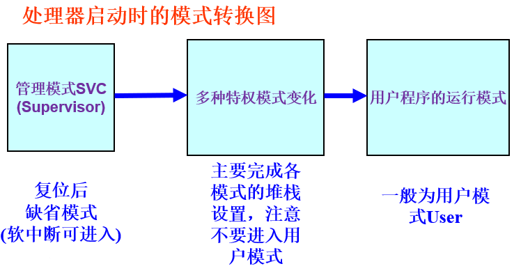


### 2.6 寄存器组织

ARM微处理器中的寄存器不能被同时访问，具体哪些寄存器是可编程访问的，取决微处理器的工作状态及具体的运行模式。

但在任何时候，通用寄存器R0～R14、程序计数器PC、一个或两个状态寄存器都是可访问的。 

#### 2.6.1 ARM状态下的寄存器组织
1. 通用寄存器
    通用寄存器包括R0～R15，可以分为三类：
    - 未分组寄存器R0～R7；
    - 分组寄存器R8～R14；
    - 程序计数器PC(R15)
    在汇编语言中寄存器R0～R13为保存数据或地址值的通用寄存器。它们是完全通用的寄存器，不会被体系结构作为特殊用途，并且可用于任何使用通用寄存器的指令。

2. 未分组寄存器R0～R7
    - 在所有的运行模式下，未分组寄存器都指向同一个物理寄存器；
    - 未被系统用作特殊的用途，因此，在中断或异常处理进行运行模式转换时，由于不同的处理器运行模式均使用相同的物理寄存器，可能会造成寄存器中数据的破坏。

3. 分组寄存器R8～R14
    - 分组寄存器，他们每一次所访问的物理寄存器与处理器当前的运行模式有关。
    - 对于R8～R12来说：每个寄存器对应两个不同的物理寄存器
        - 当使用fiq模式时，访问寄存器R8_fiq～R12_fiq；
        - 当使用除fiq模式以外的其他模式时，访问寄存器R8_usr～R12_usr；
            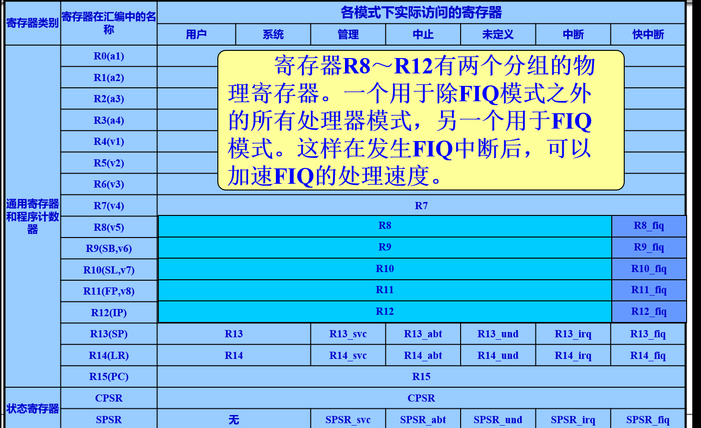
    - 对于R13、R14来说，每个寄存器对应6个不同的物理寄存器：
        - 其中的一个是用户模式与系统模式共用；
        - 另外5个物理寄存器对应于其他5种不同的运行模式；
        - 采用以下的记号来区分不同的物理寄存器：
            

        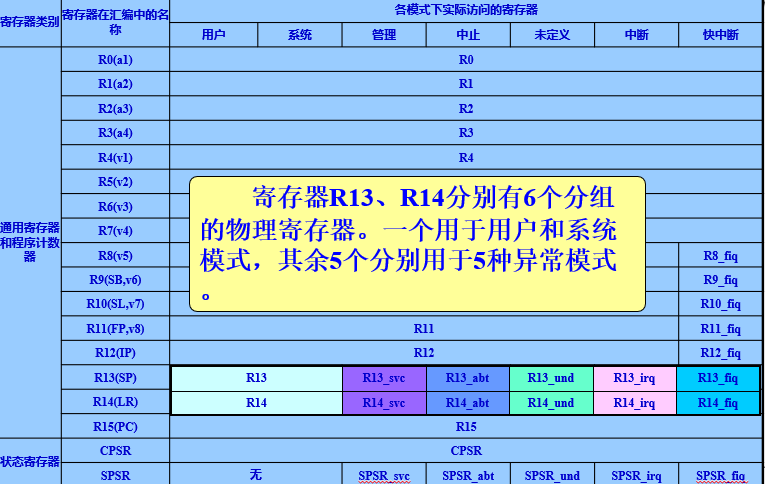


4. 堆栈指针寄存器R13（SP）
    寄存器R13在ARM指令中常用作堆栈指针，但这只是一种习惯用法，用户也可使用其他的寄存器作为堆栈指针。
    而在Thumb指令集中，某些指令强制性的要求使用R13作为堆栈指针。 
    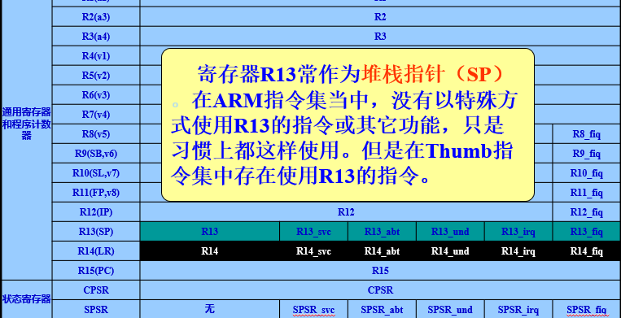

5. 链接寄存器R14（LR）
    R14也称作子程序链接寄存器（Subroutine Link Register）或链接寄存器LR。
    当执行BL子程序调用指令时，R14中得到R15（程序计数器PC）的备份。
    
    子程序返回指的是当子程序执行完毕后，程序控制权从子程序返回到调用它的主程序的过程。下面是子程序返回的过程：
    - 在每一种运行模式下，都可用R14保存子程序的返回地址；
    - 当用BL或BLX指令调用子程序时，将PC的当前值拷贝给R14；
    - 执行完子程序后，再将R14的值拷贝回PC，即可完成子程序的调用返回。 
        - 在子程序入口处保存LR到堆栈（STMFD SP!, {<Regs>, LR}）。
        - 在子程序返回时从堆栈恢复PC（LDMFD SP!, {<Regs>, PC}），或者直接使用MOV PC, LR或BX LR来实现返回。

    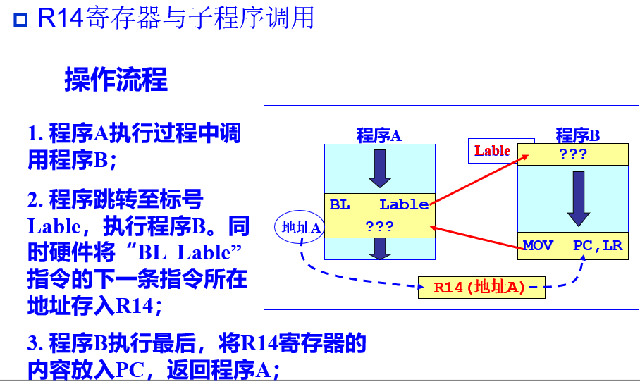

6. 寄存器R15用作程序计数器（PC）
    在ARM状态下，位[1:0]为0，位[31:2]用于保存PC；
    在Thumb状态下，位[0]为0，位[31:1]用于保存PC；
    - 由于ARM体系结构采用了多级流水线技术，对于ARM指令集而言，PC总是指向当前指令的下两条指令的地址，即PC的值为当前指令的地址值加8个字节。
    
7. 程序状态寄存器
    当前程序状态寄存器（Current Program Status Register，CPSR）和程序状态保存寄存器（Saved Program Status Register，SPSR）有一些区别，下面是定义：
    - 当前程序状态寄存器（CPSR）
        - CPSR是一个关键寄存器，用于保存处理器当前的状态信息。它包含以下信息：
            - **条件码标志（Condition Code Flags）**：如零标志（Z）、进位标志（C）、溢出标志（V）和负数标志（N）。
            - **控制位（Control Bits）**：如中断使能位（I和F）、处理器模式位（Mode Bits），例如用户模式、特权模式等。
            - **其他状态信息**：如处理器当前执行的状态（ARM或Thumb）。

    - 程序状态保存寄存器（SPSR）
        - SPSR是一个专门用于异常处理的寄存器。当处理器进入某种异常模式时（如中断、异常），SPSR会保存进入异常时CPSR的值，以便异常处理完成后能恢复原来的状态。


**异常模式与SPSR：**
1. **进入异常模式**：当处理器因为某个异常事件（例如外部中断）进入异常模式时，会执行以下操作：
   - 当前的CPSR值会被保存到对应异常模式的SPSR中。
   - 处理器切换到异常模式，CPSR更新以反映新模式的状态。

2. **每种异常都有自己的SPSR**：不同类型的异常（如中断、数据异常、预取异常等）有各自独立的SPSR。这意味着每种异常处理模式都有自己的SPSR寄存器来保存和恢复状态。

3. **恢复异常前的状态**：当异常处理完毕，需要返回到异常发生前的状态时：
   - SPSR中的值会被恢复到CPSR中。
   - 处理器切换回原来的模式，继续执行被中断的程序。

总言之：
- **CPSR**：保存处理器的当前状态。
- **SPSR**：在异常模式下使用，用于保存进入异常时的CPSR值。
- **异常处理**：当处理器进入异常模式时，当前的CPSR值被保存到SPSR，处理完成后可以通过SPSR恢复CPSR，从而恢复处理器原来的状态。

#### 2.6.2 Thumb状态下的寄存器组织
Thumb状态寄存器集是ARM状态集的子集，程序员可以直接访问的寄存器为：
- 8个通用寄存器R0～R7；
- 程序计数器（PC）；
- 堆栈指针（SP）；
- 链接寄存器（LR）；
- 有条件访问程序状态寄存器（CPSR）。

ARM状态和Thumb状态之间寄存器的关系
- Thumb状态R0～R7与ARM状态R0～R7相同；
- Thumb状态CPSR和SPSR与ARM状态CPSR和SPSR相同；
- Thumb状态SP映射到ARM状态R13；
- Thumb状态LR映射到ARM状态R14；
- Thumb状态PC映射到ARM状态PC（R15）。


#### 2.6.3  程序状态寄存器
1. 程序状态寄存器 

2. 程序状态寄存器格式

3. CPSR模式位设置表


### 2.7 异常（Exceptions）
当正常的程序执行流程发生暂时的停止时，称之为异常。

例如处理一个外部的中断请求。在处理异常之前，当前处理器的状态必须保留，这样当异常处理完成之后，当前程序可以继续执行。

处理器允许多个异常同时发生，它们将会按固定的优先级进行处理。

#### 2.7.1 异常类型


1. 复位：
    - 当处理器的复位电平有效时，产生复位异常；
    - ARM处理器立即停止执行当前指令。
    - 复位后ARM处理器在禁止中断的管理模式下；
    - 程序跳转到复位异常处理程序处（地址0x00000000或0xFFFF0000）开始执行。

2. 未定义指令异常：
    - 当ARM处理器或协处理器遇到不能处理的指令时，产生未定义指令异常。

3. 软件中断SWI(Software Interrupt)异常 ：
    - 由执行SWI指令产生，可使用该异常机制实现系统功能调用；
    - 用于用户模式下的程序调用特权操作指令，以请求特定的管理(操作系统)函数。

4. 指令预取中止：
    - 若处理器预取指令的地址不存在，存储器会向处理器发出存储器中止(Abort)信号；
    - 但直到预取的指令被执行时，才会产生指令预取中止异常。

5. 数据中止(数据访问存储器中止)：
    - 若处理器数据访问的地址不存在；
    - 或该地址不允许当前指令访问；
    - 存储器系统发出存储器中止信号，产生数据中止异常。

6. 外部中断请求(IRQ)异常：
    - **当处理器的外部中断请求引脚有效，且CPSR中的I位为0时，产生IRQ异常；**
    - 系统的外设可通过该异常请求中断服务；
    - IRQ异常的优先级比FIQ异常的低，进入FIQ处理时，会屏蔽掉IRQ异常。

7. 快速中断请求(FIQ)异常：
    - **当处理器的快速中断请求引脚有效，且CPSR中的F位为0时，产生FIQ异常。**
    - FIQ支持数据传送和通道处理，并有足够的私有寄存器。

    
#### 2.7.2 异常优先级
当多个异常同时发生时，ARM9处理器将按照异常的优先级高低顺序处理，异常优先级由高到低的排列次序如表所示。

可以发现：关于软件异常优先级是最低的。

#### 2.7.3  异常的响应及返回
**异常响应**
1. 将下一条指令的地址存入相应链接寄存器LR，以便程序在处理异常返回时能从正确的位置重新开始执行。 
    - 若异常是从ARM状态进入，LR寄存器中保存的是下一条指令的地址（当前PC＋4或PC＋8，与异常的类型有关）；
    - 若异常是从Thumb状态进入，则在LR寄存器中保存当前PC的偏移量。
2. 将CPSR复制到相应的SPSR中。
3. 根据异常类型，强制设置CPSR的运行模式位。
4. 强制PC从相关的异常向量地址取下一条指令执行，从而跳转到相应的异常处理程序处，同时设置相应的中断禁止位，以禁止中断发生。

    注意：如果异常发生时，处理器处于Thumb状态，则当异常向量地址加载入PC时，处理器自动切换到ARM状态。 

**异常状态是在ARM状态处理，处理完之后可以回到原状态。**

异常的响应流程：
1. 复位的流程
    复位不需要修改LR，因为不用返回。首先会进入管理模式，异常处理会切入ARM状态，并且禁止FIQ中断和IRQ中断（CPSR的F位和I位置1）.
    

2. 未定义指令异常响应流程
    首先将CPSR的数据存放到SPSR中，进入UND模式，再切换到ARM状态并且禁止IRQ中断。
    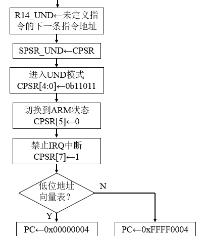

3. 软中断异常响应流程
    

4. 预取指令中止异常响应流程
    

5. 数据中止异常响应流程
    

6. 普通中断响应流程
    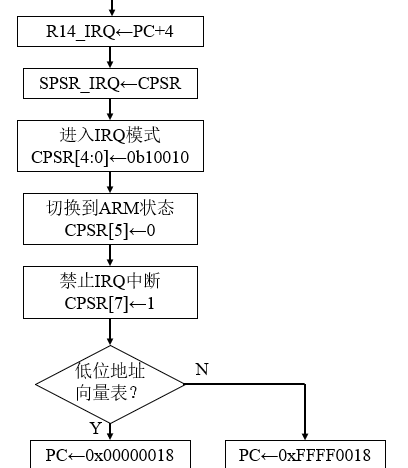

7. 快速中断响应流程
    


**异常返回**
1. 将链接寄存器LR的值减去相应的偏移量后送到PC中。
2. 将SPSR复制回CPSR中。
3. 若在进入异常处理时设置了中断禁止位，要在此清除。

注意：恢复CPSR的动作会将T、F和I位自动恢复为异常发生前的值。
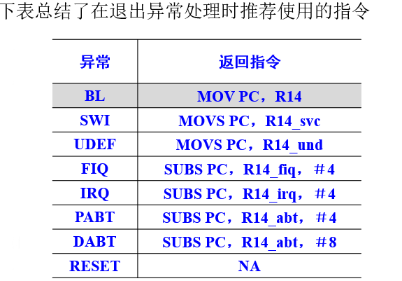

一个非嵌套中断响应：


**图示异常流程**
1. 用户程序下，

2. 发生中断时，将CPSR的内容存放到SPSR中，并将I位置1（禁止IRQ中断），将T位置0（进入ARM状态）

3. 保护现场——将原来位置地址放到IRQ模式的LR中，然后用pc跳转到异常处理程序的位置。
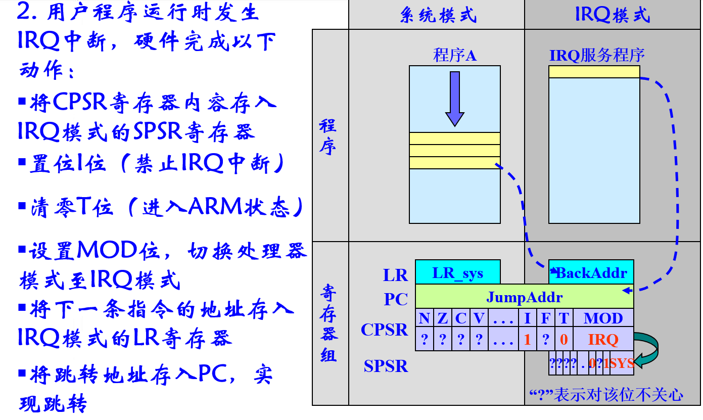
4. 然后PC跳转到异常处理程序。
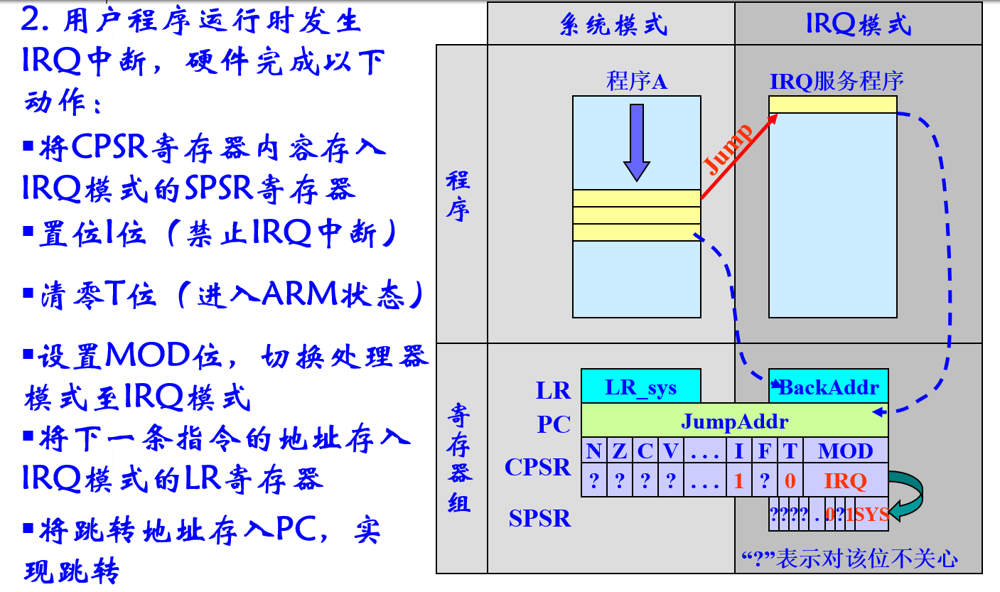
5. 异常处理结束后，将LR的内容存放到PC中，将SPSR寄存器内容赋值给CPSR中，也就是恢复现场。
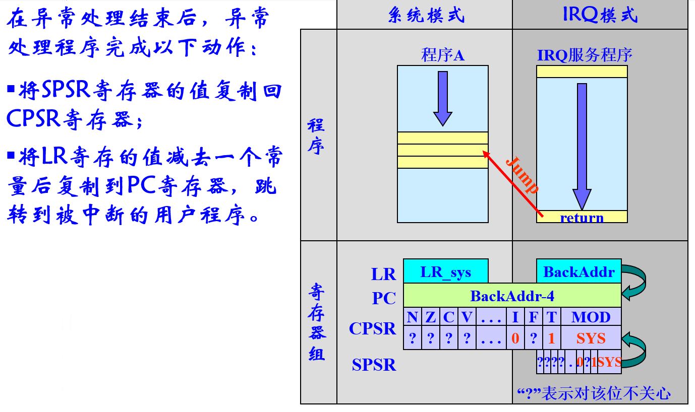

**总结异常处理流程：（考点）**
1. CPSR备份（自动执行）
2. 修改CPSR的值（自动执行）
    - 修改处理器模式
    - 修改中断禁止位
    - 修改状态位，进入ARM状态
3. 保存返回地址（自动执行）
4. 跳转到异常向量表（自动执行）
5. 执行异常处理程序（自己编写）
6. 异常处理完毕的返回操作（自己编写）
    - 恢复之前的状态
    - 回到之前中断的下一个位置

也就是硬件自动执行的内容有——
- 处理异常时，将CPSR的内容被分到SPSR中；
- 修改CPSR标志位；
- LR寄存器存放现场的下一条地址（保护现场）；
- 用PC跳转带异常处理位置。

自己编写的内容有：
- 执行异常处理程序；
- 异常处理完毕的返回操作：
    - LR的内容存放到PC中。
    - 将SPSR寄存器内容赋值给CPSR中，也就是恢复现场。


****

## 3. ARM寻址方式和指令系统
### 3.1 ARM处理器的寻址方式
寻址方式是处理器根据指令中给出的地址信息来寻找物理地址的方式。
目前ARM指令系统支持8种寻址方式。
- 寄存器寻址
- 立即数寻址
- 寄存器间接寻址
- 基址寻址
- 寄存器移位寻址 
- 多寄存器寻址
- 堆栈寻址
- 相对寻址

#### 3.1.1 寄存器寻址
利用寄存器中的内容作为操作数，寄存器本身就是操作数地址。
```
MOV R2, R3 ; R2 <- R3,将R3的内容给R2
ADD R2, R3, R4  ; R2 <- R3 + R4
```
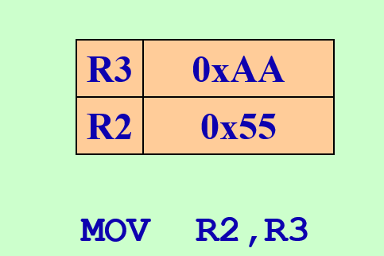


#### 3.1.2 立即数寻址
也叫立即寻址，这是一种特殊的寻址方式，操作数没有存储在寄存器或存储器中，而是包含在指令代码中，只要取出指令也就取到了操作数。这个操作数被称为立即数，对应的寻址方式也就叫做立即寻址。
```
MOV	R0,#0xFF000  ;将立即数0xFF000装入R0寄存器 
ADD   R1,R1,＃0x7f ; R1←R1＋0x7f
```

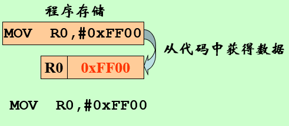

#### 3.1.3 寄存器间接寻址
以寄存器中的内容作为操作数的地址，而操作数本身存放在存储器中。
```
LDR	R1，[R2]			；R1←[R2]
STR	R1，[R2]			；[R2]←R1
```

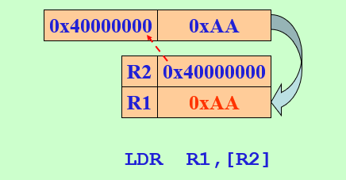

#### 3.1.4  基址寻址
也称基址变址寻址，就是将寄存器（该寄存器一般称作基址寄存器）的内容与指令中给出的地址偏移量相加，从而得到一个操作数的有效地址。基址变址寻址方式常用于访问某基地址附近的地址单元。
```
# 前索引：
LDR R0，[R1，＃8]         ;R0←[R1＋8]
# 自动索引：
LDR R0，[R1，＃8]！;R0←[R1＋8], R1←R1＋8;在前索引的基础上，把新地址写回到R1; ”!”表示回写地址
# 后索引： 
LDR R0，[R1]，＃2       ;R0←[R1]，R1←R1＋2
# 偏移量也可以是寄存器的内容，如：
LDR R0，[R1，R2]	  ；R0←[R1＋R2]
```

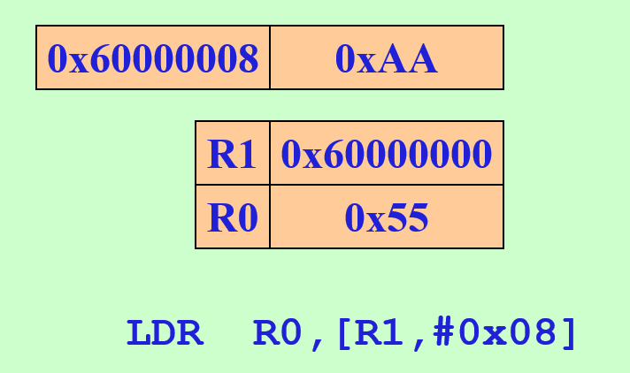
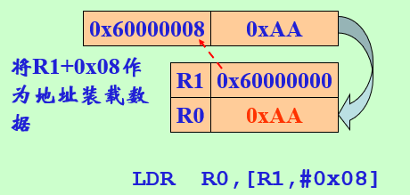


#### 3.1.5  寄存器移位寻址
寄存器移位寻址是ARM指令集独有的寻址方式，操作数由寄存器的数值进行相应移位而得到；移位的方式在指令中以助记符的形式给出，而移位的位数可用立即数或寄存器寻址方式表示。

ARM微处理器内嵌的桶型移位器（Barrel Shifter），移位操作在ARM指令集中不作为单独的指令使用，它只能作为指令格式中的一个字段，在汇编语言中表示为指令中的选项。

例如，数据处理指令的第2个操作数为寄存器时，就可以加入移位操作选项对它进行各种移位操作。移位操作包括如下6种类型：LSL(同ASL) 、LSR 、 ROR、 ASR、 RRX.

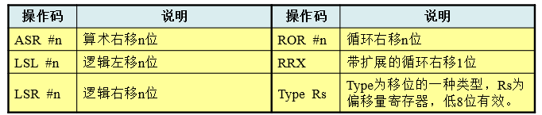


1. LSL（或ASL）操作
    - 格式为：通用寄存器，LSL（或ASL） 操作数 ;
    - 任务：对通用寄存器中的内容进行逻辑（或算术）的左移操作；
        - **按操作数所指定的数量向左移位，低位用零来填充**；
        - 最后一个左移出的位放在状态寄存器的C位(CPSR[29])中。
        - 操作数可以是通用寄存器，也可以是立即数(0～31)。
    - 示例：
        

2. LSR操作
    - 格式：通用寄存器，LSR  操作数；
    - 任务：
        - LSR可完成对通用寄存器中的内容进行逻辑右移的操作，按操作数所指定的数量向右移位，
        - **左端用零来填充，最后一个右移出的位放在状态寄存器的C位(CPSR[29])中**。
        - 其中，操作数可以是通用寄存器，也可以是立即数（1～32）。
    - 示例：
        

3. ASR操作
    - 格式为：通用寄存器，ASR   操作数      
    - 任务：
        - ASR可完成对通用寄存器中的内容进行**算术右移**的操作，
        - **按操作数所指定的数量向右移位，最左端的位保持不变**，
        - 最后一个右移出的位放在状态寄存器的C位CPSR[29] 。
        - 其中，操作数可以是通用寄存器，也可以是立即数（1～32）。
        - 这种移位对有符号数据使用时可以保持符号位不变。
    - 示例：
        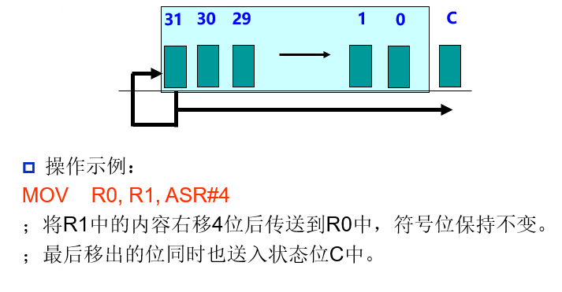
    
4. ROR操作
    - 格式为：通用寄存器，ROR   操作数 
    - 任务：     
        - ROR可完成对通用寄存器中的内容进行**循环右移**的操作，
        - **按操作数所指定的数量向右循环移位，右端移出的位填充在左侧的空位处**，
        - 最后一个右移出的位同时也放在状态寄存器的C位CPSR[29]中。
        - 其中，操作数可以是通用寄存器，也可以是立即数（1～31）。
    - 示例：
        

5. RRX操作
    - 格式为：通用寄存器，RRX      
    - 任务：
        - RRX可完成**对通用寄存器中的内容进行带扩展的循右移的操作，但一次只能移一位，不带操作数**；
        - 左侧空位由状态寄存器C位来填充，右侧移出的位移进状态位C中。
    - 示例：
        

#### 3.1.6 多寄存器寻址
采用多寄存器寻址方式，一条指令可以完成多个寄存器值的传送。这种寻址方式可以一次对多个寄存器寻址，多个寄存器由小到大排列，最多可传送16个寄存器。


注意：该指令的后缀！表示在每次执行完加载/存储操作后，R1按字长度增加，因此，指令可将连续存储单元的值传送到R2～R5，并更新寄存器R1。

执行过程如下：
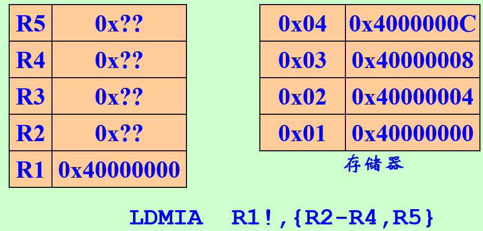


#### 3.1.7  堆栈寻址
堆栈是一种数据结构，按先进后出（First In Last Out，FILO）的方式工作，使用一个称作堆栈指针的专用寄存器指示当前的操作位置，堆栈指针总是指向栈顶。

满堆栈：当堆栈指针指向最后压入堆栈的数据时，称为满堆栈（Full Stack）;
空堆栈：当堆栈指针指向下一个将要放入数据的空位置时，称为空堆栈（Empty Stack）。

同时，根据堆栈的生成方式，又可以分为递增堆栈（Ascending  Stack）和递减堆栈（Decending Stack），当堆栈由低地址向高地址生成时，称为递增堆栈，当堆栈由高地址向低地址生成时，称为递减堆栈。

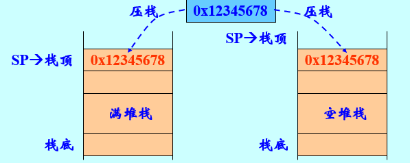


#### 3.1.8  相对寻址 
相对寻址是基址寻址的一种特例。**由程序计数器PC提供基准地址，指令中的地址码字段作为偏移量，两者相加后得到的地址即为操作数的有效地址。**

该寻址方式中的偏移量实际上是操作数存储器单元与当前PC值的相对位置，即指令执行时操作数存储器单元的地址等于PC的值加上指令中提供的偏移量△L。


### 3.2 ARM指令集—简单ARM程序
一个汇编程序示例


ARM微处理器的指令集是加载/存储型的.
    指令集仅能处理寄存器中的数据，处理结果仍要放回寄存器中，而对存储器的访问则需要通过专门的加载/存储指令来完成。
ARM微处理器的指令集，包括
- ARM指令集——32位，字对齐；大多数都可以条件执行
- Thumb指令集——16位，半字对齐；


#### 3.2.1 指令格式

  一条ARM指令通常由2～3部分构成：操作码(+条件码)+地址码
基本格式：
```
<opcode> {<cond>} {S}    <Rd> ,<Rn>{,<op2>} 
```
其中<>号内的项是必须的，{}号内的项是可选的。各项的说明如下：


对于第二个操作数，通常有一下格式：
    #immed_8r——常数表达式；
    Rm——寄存器方式；
    Rm,shift——寄存器移位方式；

1. #immed_8r——常数表达式
    该常数必须对应8位位图，即必须是一个8位的常数通过循环右移偶数位可以得到的数。
    
    

2. Rm——寄存器方式
    在寄存器方式下，操作数即为寄存器的数值。
        例如：
        SUB	R1,R1,R2

3. Rm,shift——寄存器移位方式
    寄存器中的数据通过相应移位后，作为操作数，但是寄存器Rm的值不变。
    ```
    ADD	R2,R3,R1,LSL#4
    MOV	R4,R2,ROR R3
    MOV	R5,R2,ASR #2
    ```

#### 3.2.2 条件码
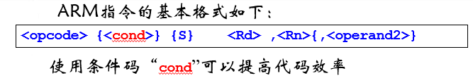

1. 当处理器工作在ARM状态时，几乎所有的指令均根据CPSR中条件码的状态和指令的条件域有条件的执行。当指令的执行条件满足时，指令被执行，否则指令被忽略。
2. 每一条ARM指令包含4位的条件码，位于指令的最高4位[31:28]。条件码共有16种(15种可用)，每种条件码用两个字符表示，添加在指令助记符的后面和指令一起使用。
    例如，指令ADD可以加上后缀EQ变为ADDEQ表示“相等则加”，即当CPSR中的Z标志置位时执行加法操作。
3. 如果指令不标明条件代码，将默认为无条件（AL）执行。


#### 3.2.3 ARM 存储器访问指令
ARM微处理器内部没有RAM，而ARM除了寄存器（即R0~R15）外没有别的存储单元；

在以ARM为核的嵌入式系统中，所有的外围模块都和存储单元一样，是ARM微处理器的不同的地址单元。

**不管这些模块的功能如何（如输入/输出、定时器、存储器等），也不管这些模块的位置如何（如片内或片外），ARM微处理器都把它们看作是外部存储器。** 其操作过程和对存储器的操作是相同的。


加载/存储指令可分为3类：
##### 3.2.3.1 单一数据加载/存储指令
    
    
    

    示例：
        - LDR 	R3，[R4]   ; 将存储器地址为R4的字数据读入到寄存器R3中
        - LDR 	R3，[R1，R2]   ;将存储器地址为R1+R2的字数据读入到R3中
        - LDR 	R3，[R1，＃8]  ;将存储器地址为R1+8的字数据读入到R3中
        - LDR 	R3，[R1，R2]**！** ;将存储器地址为R1+R2的字数据读入到R3中，**并将新地址R1＋R2写入到R1中**
        - LDR 	R3，[R1]，R2 ;**将存储器地址为R1的字数据读入寄存器R3，并将新地址R1＋R2写入R1。**
        - LDR 	R3，[R1，R2，LSL＃3]！	;**将存储器地址为R1＋R2×8的字数据读入寄存器R3，并将新地址R1＋R2×8写入R1。**
        - LDR 	R3，[R1]，R2，LSL＃3	;将存储器地址为R1的字数据读入寄存器R3，**并将新地址R1＋R2×8写入R1。**
        - LDR 	R3，Label	；**Label为程序标号，将存储器地址为Label的数据(指令代码)读入寄存器R3**，Label必须在当前指令的-4KB～4KB范围内
        另，伪指令LDR的使用：
        - LDR 	R3，=Label	 ； 与指令LDR不同，其参数带“=”； Label为程序标号，将Label标号处的地址值送到寄存器R3，Label必须在当前指令的-4KB～4KB范围内
        - STR 	R3，[R1，＃8]**！**;**将R3中的字数据写入到以R1+8为地址的存储器中，并将新地址R1＋8写入到R1中**
        - STR	R3,[R1],＃8	;将R3中的字数据写入到以R1为地址的存储器中，并将新地址R1＋8写入到R1中
        
2. LDRB/STRB指令
    

3. LDRH/STRH指令
    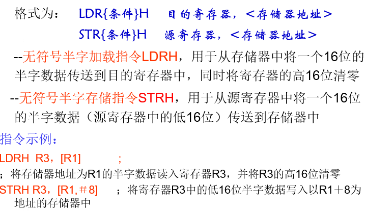
        

##### 3.2.3.2 批量数据加载/存储指令
ARM微处理器所支持批量数据加载/存储指令可以一次在一片连续的存储器单元和多个寄存器之间传送数据，批量加载指令用于将一片连续的存储器中的数据传送到多个寄存器，批量数据存储指令则完成相反的操作。

常用的加载存储指令如下：
1. LDM（或STM）指令
    
    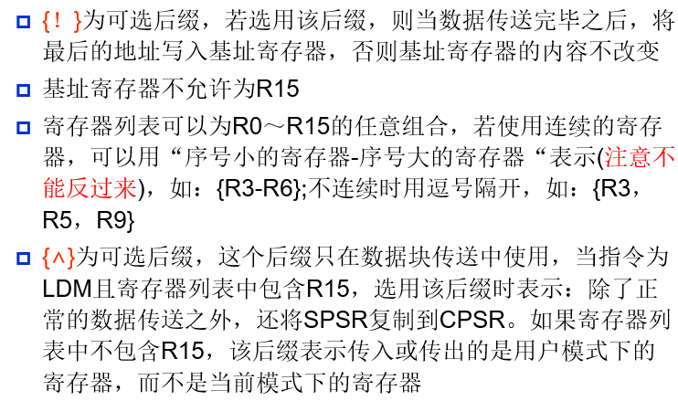

2. 多寄存器存取
    
    
    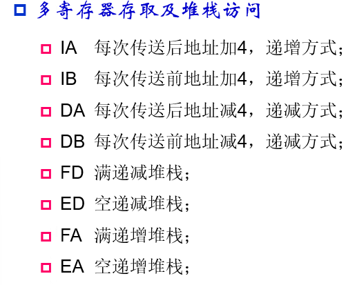
    - 示例
        - LDMFD  R13!，{R0，R4-R12，PC}；将堆栈内容恢复到寄存器（R0，R4到R12，LR）
        - STMFD  R13!，{R0，R4-R12，LR}		
        ；将寄存器列表中的寄存器（R0，R4到R12，LR）存入堆栈。
        
        - STMFD SP!,{R0-R7,LR}
            - 
            - 
        - LDMFD SP!,{R0-R7,PC}
            - 
            - 
        - LDMFD SP!,{R0-R7,PC}^ ;带状态寄存器恢复的出栈操作：
            - 
            - 


##### 3.2.3.3 交换指令
1. SWP指令
    - 格式：SWP{条件}  目的寄存器，源寄存器1，[源寄存器2]；
    - 
    - 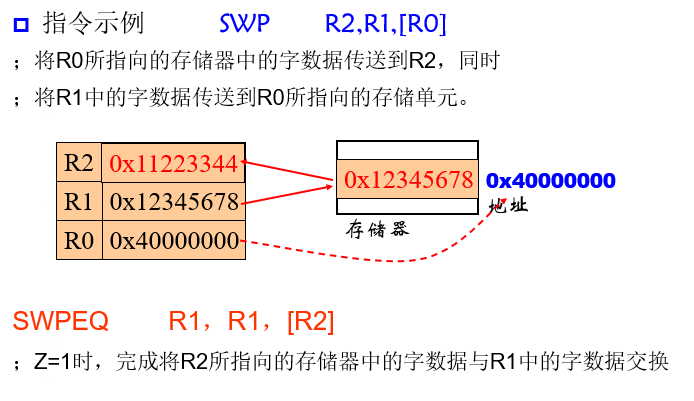

2. SWPB指令
    - 格式为：SWP{条件}B 目的寄存器，源寄存器1，[源寄存器2]；
    - SWPB指令是字节交换指令，用于将源寄存器2所指向的存储器中的字节数据传送到目的寄存器中，目的寄存器的高24清零，同时将源寄存器1中的字节数据传送到源寄存器2所指向的存储器中。显然，当源寄存器1和目的寄存器为同一个寄存器时，指令交换该寄存器和存储器的内容。
    - 


#### 3.2.4 ARM 数据处理类指令
数据处理指令只能对寄存器的内容进行操作，不允许对存储器中的数据进行操作，也不允许指令直接使用存储器的数据或在寄存器与存储器之间传送数据。

数据处理指令可分为3大类：
1. 数据传送指令
2. 算术逻辑运算指令
3. 比较和测试指令

##### 3.2.4.1 数据传送指令
数据传送指令用于在寄存器和寄存器之间进行数据的传输，或把常数送给寄存器。

数据传送指令MOV和MVN
1. MOV指令
    - 格式为：MOV{条件}{S}  目的寄存器，源操作数
    - 
    - 
2. MVN指令
    - 格式为：MVN{条件}{S}  目的寄存器，源操作数
    - 实现数据的非传递，即把操作数取反后送至目的寄存器。与MOV指令不同之处是在传送之前按位被取反了，其他同MOV指令。
    - 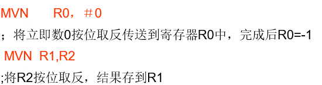

##### 3.2.4.2 算术逻辑运算指令
   
1. ADD指令
    - 格式为：ADD{条件}{S} 目的寄存器，操作数1，操作数2
    - 操作数1应是一个寄存器；操作数2可以是一个寄存器，被移位的寄存器，或一个立即数。
    - 

2. ADC指令
    - 格式为：ADC{条件}{S} 目的寄存器，操作数1，操作数2
    - ADC指令是带进位加法指令，用于把两个操作数相加，再加上CPSR中的C条件标志位的值，并将结果存放到目的寄存器中。
    - 它使用一个进位标志位，这样就可以做比32位大的数的加法，注意不要忘记设置S后缀来更改进位标志。
    - 

3. SUB指令
    - 格式为：SUB{条件}{S} 目的寄存器，操作数1，操作数2
    - SUB指令是减法指令，用于把操作数1减去操作数2，并将结果存放到目的寄存器中。
    - 该指令可用于有符号数或无符号数的减法运算。注意不要忘记设置S后缀来更改进位标志。
    - 

4. SBC指令
    - 格式为：SBC{条件}{S} 目的寄存器，操作数1，操作数2
    - SBC指令是带借位减法指令，用于把操作数1减去操作数2，再减去CPSR中的C条件标志位的反码，并将结果存放到目的寄存器中。
    - SBC	R2，R2，R4         ； R2 = R2 – R4-!C

5. RSB指令
    - 格式为：RSB{条件}{S} 目的寄存器，操作数1，操作数2；
    - RSB指令是反减法(逆向减法)指令，用于把操作数2减去操作数1，并将结果存放到目的寄存器中。
    - 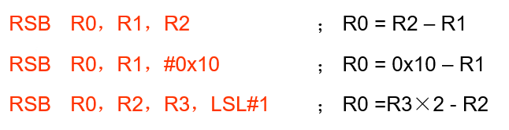

6. RSC指令
    - 格式为：RSC{条件}{S} 目的寄存器，操作数1，操作数2；
    - RSC指令是带借位反减法指令，用于把操作数2减去操作数1，再减去CPSR中的C条件标志位的反码，并将结果存放到目的寄存器中。
    - 

7. AND指令
    - 格式为：AND{条件}{S} 目的寄存器，操作数1，操作数2；
    - AND指令是逻辑与指令，用于在两个操作数上进行逻辑与运算，并把结果放置到目的寄存器中。该指令常用于屏蔽操作数1的某些位。带S后缀时影响标志位N、Z、C。
    - 

8. ORR指令
    - 格式为：ORR{条件}{S} 目的寄存器，操作数1，操作数2
    - ORR指令是逻辑或指令，用于在两个操作数上进行逻辑或运算，并把结果放置到目的寄存器中‘
   - 

9. EOR指令
    - 格式为：EOR{条件}{S} 目的寄存器，操作数1，操作数2
    - EOR指令是逻辑异或指令，用于在两个操作数上进行逻辑异或运算，并把结果放置到目的寄存器中。
    - 

10. BIC指令
    - 格式为：BIC{条件}{S} 目的寄存器，操作数1，操作数2；
    - BIC指令是位清除指令，用于清除操作数1的某些位，并把结果放置到目的寄存器中。
    - 

11. MUL指令
    - 格式为：MUL{条件}{S}	目的寄存器，操作数1，操作数2；
    - MUL指令是乘法指令，完成将操作数1与操作数2的乘法运算，并把结果放置到目的寄存器中，同时可以根据运算结果设置CPSR中相应的条件标志位（只设置N和Z）。
    - 

12. MLA指令
    - 格式为：MLA{条件}{S} 目的寄存器，操作数1，操作数2，操作数3；
    - MLA指令是乘加指令，完成将操作数1与操作数2的乘法运算，再将乘积加上操作数3，并把结果放置到目的寄存器中，同时可以根据运算结果设置CPSR中相应的条件标志位（N和Z）。
    - 

13. SMULL指令
    - 格式为：SMULL{条件}{S} 目的寄存器Low，目的寄存器High，操作数1，操作数2；
    - SMULL指令是带符号长乘法指令，完成将操作数1与操作数2的乘法运算；
    - 并把结果的低32位放置到目的寄存器Low中，
    - 结果的高32位放置到目的寄存器High中；
    - 同时可以根据运算结果设置CPSR中相应的条件标志位（N和Z）
    - 其中，操作数1和操作数2均为32位的有符号数。
    - 

14. SMLAL指令
    - 格式为：SMLAL{条件}{S} 目的寄存器Low，目的寄存器High，操作数1，操作数2；
    - SMLAL指令是长乘加指令，完成将操作数1与操作数2的乘法运算；
    - 并把结果的低32位同目的寄存器Low中的值相加后又放置到目的寄存器Low中；
    - 结果的高32位同目的寄存器High中的值相加后又放置到目的寄存器High中
    - 同时可以根据运算结果设置CPSR中条件标志位N和Z。
    - 其中，操作数1和操作数2均为32位的有符号数。
    - 

15. UMULL指令
    - 格式为：UMULL{条件}{S} 目的寄存器Low，目的寄存器High，操作数1，操作数2；
    - UMULL指令是无符号长乘法指令，完成将操作数1与操作数2的乘法运算；
    - 并把结果的低32位放置到目的寄存器Low中；
    - 结果的高32位放置到目的寄存器High中；
    - 同时可以根据运算结果设置CPSR中相应的条件标志位。
    - 其中，操作数1和操作数2均为32位的无符号数。
    - 

16. UMLAL指令
    - 格式为：UMLAL{条件}{S}	目的寄存器Low，目的寄存器High，操作数1，操作数2；
    - UMLAL指令是无符号长乘加指令，完成将操作数1与操作数2的乘法运算；
    - 并把结果的低32位同目的寄存器Low中的值相加后又放置到目的寄存器Low中；
    - 结果的高32位同目的寄存器High中的值相加后又放置到目的寄存器High中；
    - 同时可以根据运算结果设置CPSR中相应的条件标志位。
    - 其中，操作数1和操作数2均为32位的无符号数。
    - 

##### 3.2.4.3 比较和测试指令


1. CMP指令
    - 格式为：CMP{条件} 操作数1，操作数2
    - CMP指令是比较指令，**该指令是做一次减法运算，但不存储结果，只是刷新条件标志位**，根据条件标志位判断操作数的大小。
    - 对条件位的影响是：
        - 结果为正数则N=0，结果为负数则N=1；
        - 结果为0则Z=1，结果不为0则Z=0；
        - 如果产生借位则C=0，没有借位则C=1；
        - 结果是符号溢出则V=1，否则V=0。
    - 注意：比较指令本身有更新CPSR功能，故可以不使用后缀S。
    - 

2. CMN指令
    - 格式为：CMN{条件} 操作数1，操作数2
    - **CMN指令是比较非指令，也是做一次减法运算，用第1操作数减去第2操作数的非值**；
    - 结果不保存，只是刷新条件标志位，对条件标志位的影响和比较指令CMP相同。
    - 
3. TST指令
    - 格式为：TST{条件} 操作数1，操作数2；
    - **TST指令是位测试指令，用于把一个寄存器的内容和另一个寄存器的内容或立即数进行按位的与运算**，并根据运算结果更新CPSR中条件标志位的值。
    - 

4. TEQ指令
    - 格式为：TEQ{条件} 操作数1，操作数2
    - TEQ指令是相等测试指令，用于把一个寄存器的内容和另一个寄存器的内容或立即数进行**按位的异或运算**；
    - 并根据运算结果更新CPSR中条件标志位的值。**该指令通常用于比较操作数1和操作数2是否相等**。
    - 

#### 3.2.5 ARM 跳转指令

在ARM指令集中，**没有专门的子程序调用指令，把跳转和子程序调用看成是同一种操作**，分支指令用于实现程序流程的跳转，在ARM程序中可以通过使用**专门的跳转指令**或是**直接向程序计数器PC写入跳转地址值**的方法来实现。

1. B指令
    - 格式为：B{条件} 目标地址
    - B指令是最简单的跳转指令。**一旦遇到一个 B 指令，ARM 处理器将立即跳转到给定的目标地址**，从那里继续执行。
    - **注意存储在跳转指令中的实际值是相对当前PC值的一个24位的偏移量，而不是一个绝对地址**；
    - 它的值由汇编器来计算——先将24位位移量左移2位并扩展为32位有符号数，再与PC的当前值相加，送给PC（参考寻址方式中的相对寻址）
    - 可以完成从当前指令向前或向后的32MB的地址空间的跳转 。
    - 示例 ：
        - 

2. BL指令
    - 格式为：BL{条件} 目标地址
    - BL指令是跳转和链接指令，可用于子程序调用。
    - 具体实现过程是跳转（跳转的处理方式与B指令相同）之前，会把PC的当前内容保存到寄存器R14中；
    - 通过将R14 的内容重新加载到PC中，来返回到跳转指令之后的那个指令处执行。
    - 

3. BLX指令
    - 格式为：BLX{条件} 目标地址 或 BLX{条件}  Rm
    - BLX指令是带返回地址和状态切换的跳转指令；
    - 从ARM指令集跳转到指令中指定的目标地址；
    - **并把处理器的工作状态由ARM状态切换到Thumb状态**
    - 同时还会在寄存器R14中保存PC的当前内容。
    - 当子程序使用Thumb指令集，而调用者使用ARM指令集时，可以用BLX指令实现子程序的调用和处理器状态的切换。

4. BX指令
    - 格式为：  BX{条件}  Rm
    - BX指令是带状态切换的跳转指令，可以在ARM指令集和Thumb指令集之间跳转的指令。
    - 目标地址由Rm值与0xFFFFFFFE进行与得到，根据Rm最低位的值；
    - 目标地址处的指令可以是ARM指令，也可以是Thumb指令：
        - 如果目标地址的bit[0]=1，跳转时自动将CPSR中的T置为1，即将目标地址的代码解释为Thumb指令；
        - 如果目标地址的bit[0]=0，跳转时自动将CPSR中的T清除为0，即将目标地址的代码解释为ARM指令。
    - 示例
        - BX  R0；跳转到R0指定的地址，并根据R0中数据的最低位来切换处理器的状态。
        - 


#### 3.2.6 程序状态寄存器(PSR)传输指令
1. MRS指令
    - 格式为：MRS{条件} Rd，CPSR 或 MRS{条件} Rd，SPSR；
    - MRS指令用于把程序状态字寄存器的内容传送到通用寄存器Rd中。
    - 示例：
        - 
    
2. MSR指令
    - 格式为：MSR {条件} CPSR_Fields，操作数2 或 MSR {条件} SPSR_Fields，操作数2；
    - MSR指令用于把寄存器的内容或者立即数传送到程序状态字寄存器。Keil中程序状态字寄存器必须带域；操作数2可以是寄存器或者立即数。
    - 32位的程序状态寄存器分为4个域(每个域8位)，从高到低依次为：F(条件标志位域)、S (状态位域) 、X (扩展位域) 、C(控制位域)——不区分大小写，顺序任意。
    - 示例
        - 

#### 3.2.7 ARM 软件中断指令
ARM指令集中的软件中断指令是唯一一条不使用寄存器的ARM指令，也是一条可以有条件执行的指令。

因为ARM指令在**用户模式**中受到很大的局限，有一些资源不能够访问。所以，在需要**访问这些资源**时，使用软件控制的**唯一方法就是使用软件中断指令SWI**。

1. SWI指令
    - 格式为：SWI{条件}    24位的立即数
    - SWI指令用于产生软件中断，以便用户程序能**调用操作系统的系统例程**。
    - 执行SWI指令，软件中断进入的是**管理模式**，中断后会改变程序状态寄存器中的相关位。
    - 中断后ARM处理器把0x00000008赋给PC，并把中断处地址保存在LR中，同时把CPSR保存在SPSR中。
    

#### 3.2.8 ARM 伪指令
ARM伪指令不属于ARM指令集中的指令，是为了编程方便而定义的。伪指令可以像其它ARM指令一样使用，但在编译时这些指令将被等效的ARM指令代替。


1. 小范围的地址读取ADR
    - ADR伪指令将基于PC相对偏移的地址值或基于寄存器相对偏移的地址值读取到寄存器中。
    - 在汇编编译器编译源程序时，ADR伪指令被编译器替换成一条合适的指令。
    - 若不能用一条指令实现，则产生错误，编译失败。
    - 
    - 示例
        - 
        - 

2. 中等范围的地址读取ADRL
    - ADRL伪指令将基于PC相对偏移的地址值或基于寄存器相对偏移的地址值读取到寄存器中；
    - 比ADR伪指令可以读取更大范围的地址。
    - 在汇编编译器编译源程序时，ADRL伪指令被编译器替换成两条合适的指令。
    - **若不能用两条指令实现，则产生错误，编译失败。**
    - 
    - 示例：
        - 
        - 


3. 大范围的地址读取LDR
    - LDR伪指令用于加载32位的立即数或一个地址值到指定寄存器。
    - 在汇编编译源程序时，LDR伪指令被编译器替换成一条合适的指令。
    - 若加载的常数未超出MOV或MVN的范围，则使用MOV或MVN指令代替该LDR伪指令，否则汇编器将常量放入文字池，并使用一条程序相对偏移的LDR指令从文字池读出常量。
    - 
    - 示例
        - 
        - 

4. 空操作伪指令NOP
    - NOP伪指令在汇编时将会被代替成ARM中的空操作，比如可能是“MOV  R0,R0”指令等。NOP可用于延时操作。


## 4 LPC2000系列的GPIO
LPC2000系列微控制器基于ARM7TDMI-S  CPU内核。支持ARM和Thumb指令集，芯片内集成丰富外设，而且具有非常低的功率消耗。使该系列微控制器特别适用于工业控制、医疗系统、访问控制和POS机等场合。


### 4.1 通用输入/输出端口 GPIO
LPC2114 / 2124 系列 GPIO有两个通用端口，分别为P1和P2.其中每个端口有32个引脚，其中只有46个引脚可以作为IO接口。


1. 特性
    - 可以独立控制每个 GPIO 口的方向(输入/输出模式);
    - 可以独立设置每个 GPIO 口的输出状态(高/低电平);
    - 所有 GPIO 口在复位后默认为输入状态。

### 4.2 相关寄存器
LPC2114/2124微控制器具有两个端口--P0和P1，可以作为GPIO使用的引脚数为46个（P0.0-P0.25；P0.27-P0.30；P1.16-P1.31）。


#### 4.2.1 引脚功能选择寄存器PINSELN(N=0,1,2)


这里首先需要针对选择的引脚设置相关功能。由于可以选择4种功能，所以一个引脚对应两位。

功能选择寄存器表格：可以发现设置为输入输出时，通常是设置为0.


#### 4.2.2 GPIO引脚值寄存器IOPIN
该寄存器反映了当前引脚的状态。IOxPIN中的x对应于某一个端口，如P1口对应于IO1PIN。所以芯片存在多少个端口，就有多少个IOxPIN分别与之对应。


#### 4.2.3 GPIO方向控制寄存器IODIR
当引脚设置为GPIO输出模式时，可使用该寄存器控制引脚的方向。**向某位写入1使对应引脚作为输出功能，写入0时作为输入功能。** 注意端口时x，对口对应的引脚32位就是寄存器的值的设置。

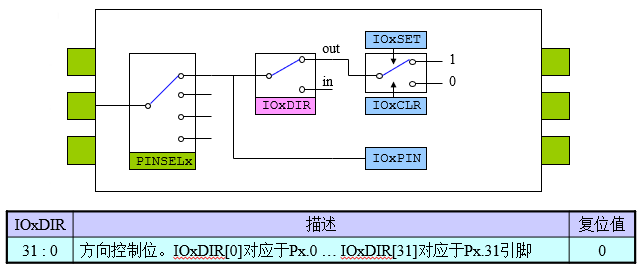

#### 4.2.4 GPIO输出置位寄存器IOSET
当引脚设置为GPIO输出模式时，可使用该寄存器从引脚输出高电平。向某位写入1使对应引脚输出高电平。写入0无效。

从该寄存器读回的数据为GPIO输出寄存器的值。该值不反映外部环境对引脚的影响。


#### 4.2.5 GPIO输出清零寄存器IOCLR
当引脚设置为GPIO输出模式时，可使用该寄存器从引脚输出低电平。向某位写入1使对应引脚输出低电平。写入0无效。

注意：读取该寄存器无效，不能读回输出寄存器的值。


#### 应用举例
1. 设置P0.0输出高电平
    

2. 读取P0.0引脚状态
    

3. 输出多位数据至IO口
    - 方法一
        
    - 方法二
        

3. 实现通过GPIO端口直接控制LED灯仿真实验。
    - 该程序电路原理图如图2所示(原理图程序为ex_led_beep)。四个按钮分别控制四个LED灯，按下一个按钮，对应灯亮一下，并且扬声器响一声。使用Keil集成开发环境建立并生成实现该程序的代码。
    
    - 分析：
        将p0.0-p0.3作为按钮（也是输入），p0.4-p0.7作为灯（输出），将p0.15作为蜂鸣器（输出）
        - 首先先设置好原来的标号；
        - 然后设置功能选择寄存器`PINSEL0`全部为0——GPIO，注意P0.15是`PINSEL1`；
        - 再设置GPIO方向寄存器`IO0DIR`,输入的为0，输出的为0；
        - 最后再无限循环中设置电平高低。

    - 代码：
        ```c
        //led、按钮、蜂鸣器
        #include "config.h"
        #include <LPC21xx.H>
        #define BUTTON1 0x00000001		 //P0.0
        #define BUTTON2 0x00000002		 //P0.1
        #define BUTTON3 0x00000004		 //P0.2
        #define BUTTON4 0x00000008		 //P0.3
        #define LED1 0x00000010			 //P0.4
        #define LED2 0x00000020			//P0.5
        #define LED3 0x00000040		   //P0.6
        #define LED4 0x00000080		   //P0.7
        #define BUZZER 0x00008000	   //P0.15

        typedef unsigned int uint32;

        void delayNS(uint32 dly)
        {
            uint32 i;
            for(;dly>0;dly--){
                for(i=0;i<5000;i++);
            }
        }
        int main(void)
        {
            // 设置为GPIO
            PINSEL0 = 0x00000000;
            PINSEL1 = 0x00000000;
            // 将按钮设置为输入，也就是0，这里用上与运算
            IO0DIR &= ~(BUTTON1 | BUTTON2 | BUTTON3 | BUTTON4); //设置为输入引脚，相应引脚设置为0
            // 将灯和蜂鸣器设置为输出，也就是1，这里用或运算
            IO0DIR |= (LED1 | LED2 | LED3 | LED4 | BUZZER);		//设置为输出引脚，相应引脚设置为1

            
            while(1){
                // IO0PIN为p0端口全部的电平情况，按钮按下去时输入端口接地，变成低电平，需要亮灯和响蜂鸣器
                if(!(BUTTON1 & IO0PIN)){  //低电平时，led闪烁，蜂鸣器蜂鸣
                    IO0SET = LED1;
                    IO0SET = BUZZER;
                    delayNS(60);
                    IO0CLR = LED1;
                    IO0CLR = BUZZER;
                }
                if(!(BUTTON2 & IO0PIN)){  //低电平时，led闪烁，蜂鸣器蜂鸣
                    IO0SET = LED2;
                    IO0SET = BUZZER;
                    delayNS(60);
                    IO0CLR = LED2;
                    IO0CLR = BUZZER;
                }
                if(!(BUTTON3 & IO0PIN)){  //低电平时，led闪烁，蜂鸣器蜂鸣
                    IO0SET = LED3;
                    IO0SET = BUZZER;
                    delayNS(60);
                    IO0CLR = LED3;
                    IO0CLR = BUZZER;
                }
                if(!(BUTTON4 & IO0PIN)){  //低电平时，led闪烁，蜂鸣器蜂鸣
                    IO0SET = LED4;
                    IO0SET = BUZZER;
                    delayNS(60);
                    IO0CLR = LED4;
                    IO0CLR = BUZZER;
                }		
            }
        }

        ```
    
## 5. LPC2000系列ARM中断控制
ARM7TDMI内核具有两类中断输入，分别为IRQ中断和FIQ中断。**向量中断控制器（VIC）负责管理芯片的中断源**，最多可以管理32个中断输入请求。


### 5.1 程序状态寄存器CPSR与VIC的关系
ARM内核通过CPSR来监视和控制内部的操作，CPSR中的“I”位和“F”位分别用来控制IRQ模式和FIQ模式的使能。


1. 当I = 1时，禁止IRQ中断；当I = 0时，使能IRQ中断。
    

2. 当F = 1时，禁止FIQ中断；当F = 0时，使能FIQ中断。
    


### 5.2 向量中断控制器VIC
#### 5.2.1 中断分类


1. FIQ中断硬件处理流程
    

2. IRQ中断相应流程
    

#### 5.2.2 中断控制寄存器
总硬件过程如下：


我的理解：
- 首先根据中断类型，判断中断使能相关寄存器是否禁止该中断——禁止时置1，允许时置0；
- 然后再将相关中断使能寄存器置1；
- 再根据中断类型设置VICIntSelect选择：
    - FIQ中断信号就一个通道，出现了执行相关操作；
    - IRQ中断有16个通道，优先级从高到低分别是IRQ0到IRQ15；
- 选择中断向量槽时，IRQ中断有16个通道（中断向量槽）
    - 向量IRQ0控制寄存器VICVectCntl0——这里编号越小优先级越大；
    - 向量地址0寄存器VICVectAddr0——每一个向量槽对应的地址寄存器也是相同编号，需要将中断程序的地址放到这个寄存器中。
    - 然后用硬件优先级选择哪一个向量槽执行，也就是将相关的地址送给VICVectAddr

注意：这里向量IRQ控制寄存器VICVectCntlx就已经设置好优先级了。


### 5.3 外部中断输入

#### 5.3.1 触发外部中断的类型
1. 边沿触发：
    - 上升沿触发
    - 下降沿触发
        
        

2. 电平触发：
    - 高电平触发
    - 低电平触发
        
        
        


#### 5.3.2 外部中断源


#### 5.3.3 寄存器汇总
1. 管脚链接控制PINSELx
    
2. 外部中断极性控制EXTPOLAR和外部中断方式控制EXTMODE
    
3. 掉电唤醒控制EXTWAKE
    - 
4. 中断标志EXTINT
    - 
    - 


#### 5.3.4 外部中断与VIC的关系


#### 5.3.5 LPC2124向量中断控制器的操作方法
涉及到的VIC相关寄存器

1. 中断选择寄存器VICIntSelect：设置FIQ或IRQ中断
2. 中断使能寄存器VICIntEnable：使能相应中断
3. 中断使能清零寄存器VICIntEnclr：清除相应中断的使能
4. 向量地址寄存器VICVectAddr：保存向量IRQ的中断地址
5. 默认向量地址寄存器VICDefVectAddr：保存非向量IRQ的中断地址
6. 向量地址寄存器0—15（VICVectAddr0—VICVectAddr15）：保存向量IRQ中断地址
7. 向量控制寄存器0—15（VICVectCntl0—VICVectCntl15）：为向量IRQ中断设置优先级(写入VICVectCntl0中的对应最高优先级)，并使能
8. 外部中断标志寄存器EXINT：可将对应中断标志清零；bit0-bit3分别对应于EINT0-EINT3。


**操作方法**
1. 在主程序中：
    - 在中断选择寄存器VICIntSelect中，将中断分配为IRQ中断；
        - 中断选择寄存器VICIntSelect：相应位置1，对应的中断分配FIQ；置0，分配IRQ中断
    - 在向量控制寄存器VICVectCntlX中，分配中断通道（优先级）；
    - 在向量地址寄存器VICVectAddrX中，设置中断服务程序的地址；
    - 通过中断使能寄存器VICIntEnable，使能外设中断。
        - 中断使能寄存器VICIntEnable：相应位置1，使能相应的中断；置0，无效
2. 中断服务程序中：
    - 中断处理；
    - 清除相应的中断标志，为响应下一次中断做准备；
    - 对VICVectAddr寄存器执行写操作（通常写0x00），结束向量中断，以更新硬件优先级。


**向量控制寄存器0—15(VICVectCntl0—VICVectCntl15)**

1. bit5：置1使能中断；
2. 向量IRQ，通道有0—15(对应向量控制寄存器3
3. VICVectCntl0—VICVectCntl15)，优先级依次降低；
4. **bit[4:0]：存放中断通道号（基于VIC的编号0—31）**，中断编号放入优先级较高向量IRQ通道控制寄存器，则该中断就是向量IRQ中断中优先级较高的。


**中断通道号**
每个类型的中断对应不同的VIC通道号


**外部中断标志寄存器EXINT**：
1. 若引脚出现符合要求的信号，EXINT中对应的中断标志位被置位；
2. bit0～bit3分别对应于EINT0～EINT3；
3. 向该寄存器的bit0～bit3写入1，可将对应的中断标志清零。


#### 5.3.6 示例


```C
/****************************************************************************
* 文件：main.c
* 功能：使用外部中断1进行LED控制,每当有一次中断时,即取反LED,以便指示中断输入
****************************************************************************/
#include  "config.h"
#include <LPC21xx.H>
#define LED2 0x00000800	 //P0.11
#define LED1 0x00000400  //P0.10
typedef unsigned int uint32;

/****************************************************************************
* 名称：DelayNS()
* 功能：长软件延时
****************************************************************************/

void  __irq IRQ_Eint1(void)
{ uint32  i;

  i=VICIRQStatus;                  //读出VICIRQStatus的值
  
  i=IO0SET;                         //读出当前LED2控制值
  if((i&LED2)==0)               //控制LED2控制值 
  { IO0SET=LED2; 				 //如果接led的引脚低电平,置该引脚高电平，灯灭
  }
  else
  { IO0CLR=LED2;				  //如果接led的引脚高电平,置该引脚低电平，灯亮
  }
  while((EXTINT&0x02)!=0)          //等待外部中断信号恢复为高电平
  { EXTINT=0x02;                   //清除EINT1中断标志	  EXTINT3:0对应EINT3~0
  }
  
  VICVectAddr=0x00;
}

void  __irq IRQ_Eint0(void)
{ uint32  i;

  i=VICIRQStatus;                  //读出VICIRQStatus的值
  
  i=IO0SET;                         //读出当前LED2控制值
  if((i&LED1)==0)               //控制LED2控制值 
  { IO0SET=LED1; 				 //如果接led的引脚低电平,置该引脚高电平，灯灭
  }
  else
  { IO0CLR=LED1;				  //如果接led的引脚高电平,置该引脚低电平，灯亮
  }
  while((EXTINT&0x01)!=0)          //等待外部中断信号恢复为高电平
  { EXTINT=0x01;                   //清除EINT1中断标志	  EXTINT3:0对应EINT3~0
  }
  
  VICVectAddr=0x00;
}
	
/****************************************************************************
* 名称：main()
* 功能：初始化外部中断1及I/O连接等 
外部中断1为14#中断源
****************************************************************************/
int  main(void)
	{
	PINSEL0=0x20000000;
	PINSEL1=0x00000200;     // ?
	IO0DIR=(LED1 | LED2);
	
	IO0SET=(LED1 | LED2);
	
	IO0CLR=(LED1 | LED2);	
	VICIntSelect=0;

	//设置外部中断1
	VICIntEnable |= 0x00008000;
	VICVectCntl1=0x2F;//5:向量IRQ使能，0:4中断号
    VICVectAddr1=(int)IRQ_Eint1;
	
	//设置外部中断0
	 VICIntEnable |= (1 << 14); // 使能外部中断0
    VICVectCntl0 = 0x20 | 14; // 使能中断向量槽0，对应中断号14（EINT0）
    VICVectAddr0 = (uint32)IRQ_Eint0; // 设置中断向量地址
		
	EXTINT=0x0F;	
	
	while(1);
}


```
