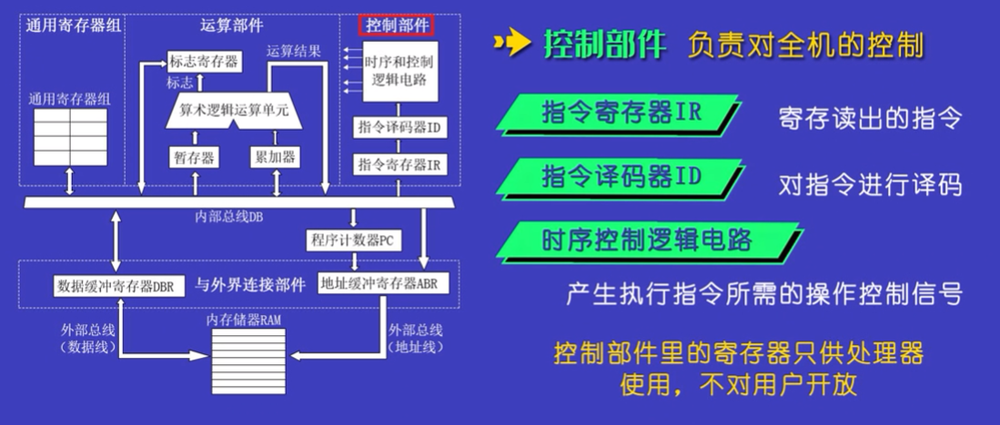
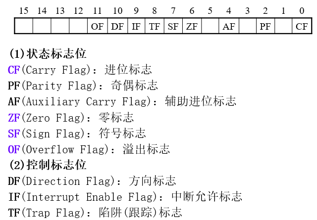
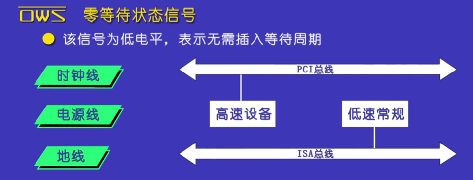
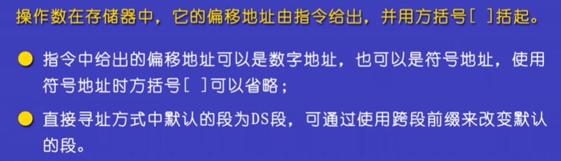
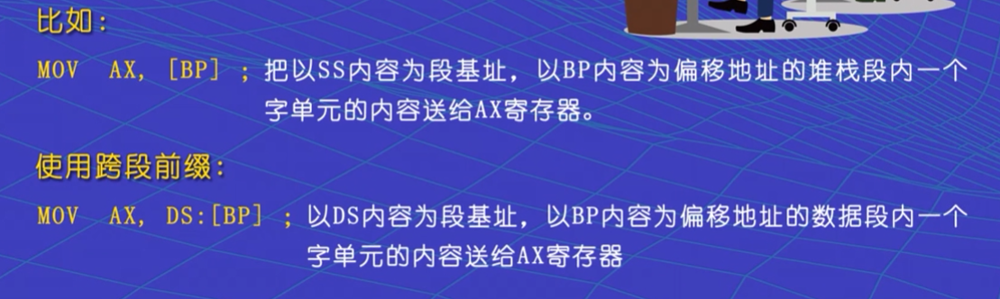
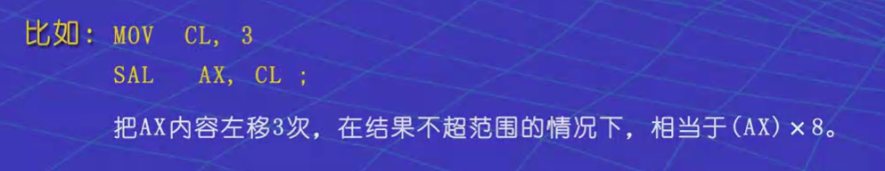

# 接口复习
[TOC]

## 1. 概述
### 1.1 微型计算机系统及发展简介
微型计算系统：
1. 硬件：
    1. 微型计算机（裸机）：
        - 微处理器：运算器，控制器，寄存器；
        - 内存储器：RAM，ROM；
        - I/O接口：并行接口、串行接口；
        - 总线：系统总线、PCI总线；
        - 基本IO设备；
    2. 外部设备：
        - 常规外部设备；
        - 多媒体设备；
2. 软件：
    系统软件、程序设计语言、应用软件、数据库。

发展简洁：
电子管、晶体管、集成电路、超大规模集成电路；基本原理没变。


### 1.2 微型计算机是怎样工作的
微机系统硬件——微处理器、存储器、I/O设备与I/O接口、总线
1. 进行控制与数据加工处理的微处理器
2. 完成数据记忆存储的存储器
    - 存储器系统的管理机制——分段与分页
    - 存储器的分级
3. 实现数据输入输出的I/O设备与接口
    1. I/O设备：原始数据的来源地，处理结果的目的地；
    2. 接口将来自I/O设备的信息和微处理器标准信息相互转换；
    3. **I/O设备抽象为逻辑概念：** 微处理器把I/O设备**抽象为端口**， **操作系统和设备驱动程序把设备抽象为文件**。

4. 提供数据通路的总线
    1. 微处理器、存储器和I/O设备之间信息流动的通路
    2. 总线结构的变化会影响到接口的设计。


### 1.3 汇编语言在微机系统中的作用

汇编语言的主要特点：
1. 优点：
    - 直接对硬件进行操作；
    - 编制的程序速度快；
2. 缺点：
    - 依附于底层硬件，可移植性差；
    - 不利于面向对象的程序设计；
    - 直接面向设备细节编程所以难度大，不利于大程序设计。

汇编语言讲述的主要内容
1. 指令——指示计算机做什么操作
    - 机器指令：简称指令，通过汇编程序翻译后生成的机器代码，微处理器执行操作；
    - 伪指令：汇编控制指令，为汇编过程服务。
2. 寻址方式——引导计算机如何寻址操作数
    寄存器、接口电路中的端口、存储单元
3. 程序结构——编写汇编语言源程序的书写格式
    完整段定义、程序段前缀、COM文件、简化段定义结构
4. 程序设计方法——描述汇编语言程序执行的走向
    顺序、分支、循环、子程序等

### 1.4 微型计算机接口技术的概念
#### 1.4.1 微机接口技术的作用与基本任务 
1. 接口：
   就是CPU与外界的连接电路，是CPU与外界进行信息交换的中转站。
2. 基本任务：实现设备与总线的连接，CPU通过接口访问设备。
3. 接口技术
    - 采用硬件与软件相结合的方法，研究微处理器如何与外界进行最佳连接，实现高效可靠的信息交换的一门技术
    - 接口技术：硬件— 支撑作用；软件— 驱动控制


#### 1.4.2 微机接口技术的层次与内容 
1. 总线结构的改变，使得接口在连接设备时硬件上要分层次
2. 操作系统的改变，使得通过接口访问设备时软件上要分层次
3. 微机接口技术的内容
    - 设备接口和应用程序；
    - 总线接口和设备驱动程序。

#### 1.4.3 微机接口技术的基本概念 
1. 设备接口：
    - 定义：IO设备和本地总线之间的连接电路，并进行信息交换的中转战。
    - 为什么要设置I/O设备接口
        - 微机的总线与I/O设备的信号线不兼容
        - CPU与I/O设备的工作速度不兼容
        - 若由CPU直接控制I/O设备，会降低CPU工作效率
        - 若由CPU直接控制I/O设备，对I/O设备发展不利
    - I/O设备接口的功能
        - 执行CPU命令
        - 返回外设状态
        - 数据缓冲
        - 信号转换
        - 设备选择
        - 数据宽度与数据格式转换
    - I/O设备接口的组成
        - 硬件——可编程接口芯片、端口地址译码电路、附加电路等
        - 软件——初始化程序段、主控程序段、辅助程序段
    - I/O设备接口与CPU交换数据的方式
        - 查询方式
            - 
        - 中断方式
            - 
        - DMA(直接存储器存取)方式
            - 
    - 分析与设计I/O设备接口电路的基本方法
        - 两侧分析法
        - 硬软结合法
        硬件：合理选用外围接口芯片，有针对性设计附加电路
        	软件：DOS环境下(直接对硬件编程、BIOS调用、DOS系统功能调用)；	Windows环境下(Win32的API调用)

2. 总线桥
    - 定义：用来实现微处理器总线和PCI总线、以及PCI总线和本地总线之间的连接与信息交换的接口，**时总线之间的接口**。
    - 总线桥与I/O设备接口的区别
        - 连接的对象不同
            IO设备接口连接的时IO设备和本地总线，总线桥连接的是总线和总线。
        - 传递信息的方法不同
            - IO设备接口是**直接传递信息，硬件传递接口两端信息是一一对应的固定信息。**
            - 桥是**简洁传递信息，桥两端是映射关系，是软件映射的规则实现，可以动态改变。**
    - 总线桥的任务
        - 负责总线与总线的连接与转换——总线转换器和控制器
        - 完成资源信息的传递——映射
        - 支持即插即用——配置空间，硬件资源的重新分配
        - 
    - 总线桥接电路
        单独的、通用的总线桥芯片；与内存控制器或I/O控制器组合


## 2. 微型计算机系统的组成及工作原理

### 2.1 微型计算机系统
1. 硬件组成


2. 软件配置
系统软件、工具软件、应用软件、用户应用程序

3. 微机系统中信息流与信息链的构成
    - 信息流：存储器中的数据、程序代码；接口寄存器中的I/O数据、状态、I/O命令
    - 信息链：信息流在系统中流动的路径；包括物理(硬件)环节和逻辑(软件)环节
    - 微机系统中信息流与信息链
        - 
        - 
——早期微机系统/现代微机系统中的信息链
4. 研究信息流与信息链的意义
    通过信息流从整体上认识微机体系结构和组成微机系统的各部件之间的关系


### 2.2 微处理器
1. 微处理器的作用
    主控者，通过总线连接存储器系统和I/O系统对数据加工处理、对存储器访问、对I/O设备控制

2. 微处理器组成的基本部件及工作原理
    - 运算部件:
        - 
    - 控制部件:
        - 
        - 
    - 通用寄存器:
        - 
    - 程序计数器PC：
        - 
    - 微处理器和外界连接电路：
        - 
        - 

3. 微处理器的功能结构
    - 内部功能结构图：
        - 
    - 执行单元EU——执行指令
        - 算术逻辑单元ALU
            - 
        - EU控制电路
            - 
        - 通用寄存器组
            - 
        - 标志寄存器
            - 
        运算数据寄存器
    - 总线接口单元BIU
        - 产生内存物理地址
            - 
            - 
        - 实现对内存和I/O端口的读/写操作
            - 
    - EU和BIU的相互作用
        - BIU的作用：
            - 
        - EU的作用：
            - 
        - 两者并行工作

4. 8086微处理器的外部特性
    - 外部结构：
        - 
    - 地址信号线(三态/输出)
        - 
    - 数据信号线(三态/双向)
    - 读/写操作控制信号线(输出)
        - 
    - 面向外部中断信号线
        - 
    - 面向外部DMA信号线
        - 
    
5. 16位微处理器的编程模型
    - 数据寄存器
        - 累加器AX；基址寄存器BX；计数器CX；数据寄存器DX
        - 
    - 段寄存器
        -
    - 指针寄存器和变址寄存器
        - 
    - 指令指针寄存器IP
        - 与CS配合；用户不可访问
    - 标志寄存器
        - 又称为程序状态字PSW
        - 16位微处理器的标志寄存器使用了9位——6个状态标志+3个控制标志
        - 

6. 微处理器的工作模式
    1. 实模式——16位微处理器的工作模式(本书涉及的内容)
        ①存储器地址空间采用实地址，不支持虚存
        ②使用20位地址，支持1MB的内存空间寻址
        ③存储器管理采用分段机制，不支持页式管理
        ④无保护机制，不支持存储器保护功能
        ⑤单任务运行，不支持多任务
    2. 保护模式——现代微处理器的本机模式
        ①采用虚拟技术，支持虚存，虚存地址空间可达64TB
        ②使用32位物理地址，支持4GB的物理内存空间
        ③采用分段与分页机制，实现虚存管理
        ④具有保护机制，实现存储器内容的保护与隔离
        ⑤基于虚拟机，支持多任务
    3. 虚拟8086模式(V86模式；限制了一些特权指令的执行)
        既保持与8086工作模式兼容，又支持保护模式下的保护机制、分页管理及多任务机制
    


### 2.3 存储器
#### 2.3.1 存储器的类型和层次
1. 类型：
    - 制造工艺：
        - 双极型：速度快、集成度低、功耗大、成本高，适合作为高速缓冲存储器
        - MOS性、集成度高、价格低、功耗低。
    - 存取方式：
        - 随机存取存储器RAM：
            - 可读可写的易失性存储器，保存运行的程序和数据。
            - 又可以分为静态的SRAM和动态的DRAM。
        - 只读存储器ROM：
            - 只读不写的非易失性存储器；
            - 掉电后信息不会丢失，一般用于存放固定不变的程序和数据。
2. 层次结构：
    

#### 2.3.2 存储器地址空间和数据组织
1. 存储器地址空间
    
2. 数据组织
    - 字节单元（8bit）
        - 
    - 字单元（两字节）
        - 
    - 双字单元（4字节）
        - 
    - 其中DB、DW、DD分别表示字节、字、双字。


#### 2.3.3 存储器的管理机制——分段技术与寻址方案
1. 存储器的分段技术
    - 
    - 存储器地址是20位，高16位是段基址。
    - 各段可以重叠的意思是每一个段不一定非要64kb。
    - 偏移地址是16位。
    - 寻址方案：
        - 
        - 
        - 
2. 存储器的寻址方案(机制)
    - 存储器物理地址的计算
        - 
        - 

#### 2.3.4 堆栈


#### 2.3.5 现代微机系统存储器的新特点


### 2.4 存储器
#### 2.4.1 I/O设备及其接口的作用
1. I/O设备的作用
    一切信息的来源地
2. I/O设备接口的作用——连接与转换
    

#### 2.4.2 I/O设备的类型及设备的逻辑概念


#### 2.4.3 现代微机接口技术的新概念
多总线的应用及总线结构层次化使接口技术分层次


### 2.5 总线
总线的基本任务是进行微机系统各成员之间的连接和信息传输。
1. 总线的组成
    四部分信号线组成。
    - 数据总线（双向三态）
        - 
    - 地址总线（单向三态）
        - 
    - 控制总线
    - 电源线和地线
        - 

2. 总线的性能参数
    - 
    - 
    - 
    - 

3. 总线传输操作过程
    - 主模块：例如cpu，由控制主线负责；
    - 从模块：受控模块，只能对主模块的数据进行译码；
    - 四个阶段：
        1. 申请与仲裁阶段：
            - 提出申请，由总线冲裁机构决定哪个主模块获得下一个传输周期的总线控制权。
        2. 寻址阶段：
            - 获得主线控制权的主模块发出本次要访问的从模块的地址，通过译码选中从模块，并开始启动。
        3. 传输阶段：
            - 主模块和从模块进行数据传输；
        4. 结束阶段：
            - 主模块和从模块的数据从总线上移除。

4. 总线标准和总线插槽
    - 

5. ISA总线
    - 
    - 
    - 
    - 
    - 
    - 
    - 
    - 
    - 

6. 现代危机总线技术新特点
    - 
    - 
    - 


## 3. 汇编语言寻址方式和指令集
### 3.1 汇编语言、汇编语言源程序和汇编程序
1. 汇编语言
    - 用符号指令编写程序的语言；
    - 与微处理器组织结构紧密相关，直接面向底层硬件；
2. 汇编语言源程序
3. 汇编程序
    - 把汇编语言源程序翻译成汇编语言目标程序


### 3.2 指令一般格式


### 3.3 寻址方式
1. 立即寻址方式
    - 
    - 
2. 寄存器寻址方式
    - 操作数是通用寄存器的内容；可以是源/目标操作数
    - 16位通用寄存器(AX、BX、CX、DX、BP、SP、SI、DI)
    - 8位通用寄存器(AH、AL、BH、BL、CH、CL、DH、DL)
    - 特殊地，部分指令可以对段寄存器CS、DS、ES、SS操作
    - 
3. 直接寻址方式
    - 
    - 
    - 
    - 
4. 寄存器间接寻址方式
    - 
    - 
    - 
    - 

5. 寄存器相对寻址方式
    - 
    - 
    - 
    - 

6. 基址+变址寻址
    - 
    - 
    - 

7. 相对基址+变址寻址方式
    - 
    - 

8. **I/O端口寻址方式与端口操作数**
    - 
    - 
    - 
    - 
    - 
    - 
    -  


### 3.4 指令集
1. 加法指令
    - 
        - 
        - 
    - 
        - 
2. 减法指令
    - 
    -  
    - 
        - 

3. 乘法指令（ask）
    - 
    - 
    - 
    - 

4. 除法指令（ask）
    - 
    - 
    - 
    - 

5. 符号扩展指令
    - 
    - 
    - 

6. 位操作指令
    - 
    - 
    - 
        - 
    - 
    - 
    - 
        - 
    - 
        - 
        - 
    - 
        - 
        - 
        - 
        - 
        - 
        - 
        - 
        - 


7. 串操作指令
    - 处理存放在存储器中的数据串，例如字符串和数组
    - 一般把串存储器首地址的变量名称为串名
    - 
    -     
        - 
        - 
        - 
        - 
        - 
        - 
    -  
        - 
    -  
        - 
    - 
        - 
    - 
        - 
    - 
        - 
        - 
        - 
    - 

8. 中断调用和返回指令
    - 
    - 
        - 
    - 
    -  
9. 处理器控制指令
    - 
        - 
    - 


## 4. 伪指令与语句格式
### 4.1 伪指令
1. 处理器选择伪指令——放在程序的开头
    - 使用80386以上的微处理器指令编程时才需要
        .8086		;接受并使用8086指令(缺省方式)
        .386			;接受并使用80386指令(除特权指令)
        .386P		;接受并使用80386指令(全部指令)

2. 数据定义伪指令
    - 
    - 
    - 

4. 符号定义伪指令
    - 
        - 
    - 

5. 段定义伪指令
    - 
    - 
        - 
        - 
        - 
        - 

6. 源程序结束伪指令
    - 

7. 过程定义伪指令
    - 
    
8. 数制表示伪指令    
    - 
    
9. 设置汇编地址计数器伪指令（ask）
    - 
    - 


### 4.2  汇编语言语句格式
1. 语句的格式
    一般格式：[语句名字] 操作码  操作数  [;注释]
2. 语句名字
    - 
    - 
    - 
        - 
3. 语句操作码
    机器指令或伪指令的助记符

4. 语句注释(;)

5. 语句操作数
    - 
    - 
        - 
        - 
        - 
            - 
            - 
            - 
            - 
            - 
            - 


### 4.3  常用的DOS系统功能调用
用户使用系统提供的服务程序的方法：
(1)DOS系统功能调用——系统与用户的高级接口，兼容性好
(2)BIOS调用——系统与用户的低级接口
    

1. DOS系统功能的调用方法
    - DOS调用模型(步骤)
        - 功能号送入AH
        - 若有入口参数，则按要求装入
        - 执行中断指令  INT 21H
        - 若有出口参数，则利用出口参数返回处理结果
        - 
2. 调用方法举例
    - 
    - 
    - 
        - 
    - 
        - 
        - 
        -  
    - 
        - 
        - 
    -     
        - 
    -  


## 5. 汇编语言程序设计
### 5.1  汇编语言源程序结构

主要学习完整段定义结构。剩下几种了解即可。

1. 完整段定义结构
    - 
    - 例题代码：
        - 采用完整段定义结构形式编写程序，将BUF存储区中的3个字节数据相加，结果(不超过1个字节)存入SUM单元中
            - 代码：
            ```asm
            DATA		SEGMENT
                    BUF  DB  12H,34,56H
                    SUM  DB  ?
            DATA		ENDS
            CODE  	SEGMENT
                    ASSUME CS:CODE,DS:DATA
            START:	MOV AX,DATA
                    MOV DS,AX
                    MOV AL,BUF
                    ADD AL,BUF+1
                    ADD AL,BUF+2
                    MOV SUM,AL
                    MOV AH,4CH
                    INT 21H
            CODE		ENDS
                    END START
            ```
        - N个有符号字节数据相加(结果不超过1个字):
            - 代码：
            ```asm
            DATA		SEGMENT
                    BUF  DB  12H,34,56H,……
                    N    EQU $-BUF
                    SUM  DW  ?
            DATA		ENDS
            CODE  	SEGMENT
                    ASSUME CS:CODE,DS:DATA
            START:	MOV AX,DATA
                    MOV DS,AX
                    MOV CX,N
                    MOV BX,0
                    LEA SI,BUF
            NEXT:		MOV AL,[SI]
                    CBW
                    ADD BX,AX
                    INC SI
                    LOOP NEXT
                    MOV SUM,BX
                    MOV AH,4CH
                    INT 21H
            CODE		ENDS
                    END START
            ```

2. 程序段前缀结构(标准序)
    - 
    - 
    - 

3. COM文件结构
    - 
    - 
    - 
    - 

4. 简化段定义结构
    
    - 


### 5.2  汇编语言源程序设计步骤与程序流程图


### 5.3  汇编语言源程序设计的基本方法
1. 顺序程序设计
2. 分支程序设计
    1. 分支程序设计所用的指令(条件转移和无条件转移指令)
        1. 条件转移指令：	操作符  标号
            - 跳转范围：-128+127个字节
            - 单个标志位条件转移指令(10条)
                - 
            - 两个数比较结果的条件转移指令
                - 无符号数比较的转移：
                    - JA/JNBE：大于/不小于等于; 
                    - JAE/JNB：大于等于/不小于; 
                    - JB/JNAE：小于/不大于等于;  
                    - JBE/JNA：小于等于/不大于；
                    - 
                    - 
                - 有符号数比较的转移：
                    - JG/JNLE：大于/不小于等于; 
                    - JGE/JNL：大于等于/不小于; 
                    - JL/JNGE：小于/不大于等于;  
                    - JLE/JNG：小于等于/不大于.
                    - 
                    - 
                    - 
                - 无符号数比较和条件标志CF、ZF有关
                - 有符号数比较和条件标志SF、OF、ZF有关
                - 
        2. 无条件转移指令JMP(此外还包括CALL、RET、INT、IRET)
            - JMP [NEAR PTR] 标号	；段内直接转移
            - JMP FAR PTR 标号		；段间直接转移
            - JMP 字寄存器/字存储单元	；段内间接转移
            - JMP 双字存储单元		；段间间接转移
            - 
            - 

    2. 分支程序设计举例
        - 例5.8 设M字节单元存放一个无符号数，将该数与80进行比较，并将比较结果显示出来
        - 代码：
            ```asm
            DATA		SEGMENT
                    M      DB  ?
                    MBL80  DB ‘(M) < 80’,0AH,0DH,‘$’
                    MABV80 DB ‘(M) > 80’,0AH,0DH,‘$’
                    MEQ80  DB ‘(M) = 80’,0AH,0DH,‘$’
            DATA		ENDS
            CODE		SEGMENT
                    ASSUME CS:CODE,DS:DATA
            START:	MOV AX,DATA
                    MOV DS,AX
                    MOV AL,M
                    CMP AL,80
                    JZ  EQUAL
                    JA  ABOVE
                    LEA DX,MBL80
                    JMP DISP
            EQUAL:	LEA DX,MEQ80
                    JMP DISP
            ABOVE:	LEA DX,MABV80
            DISP:		MOV AH,9
                    INT 21H
                    MOV AH,4CH
                    INT 21H
            CODE		ENDS
                    END START
            ```
        - 
        - 

3. 循环指令
    - 
    - 
    - 
    - 
    - 
    - 
    - 
        
        - 
    - 循环程序设计举例：
        - 例5.11 以BUF为首址的字节存储区存放着N个有符号数，统计正数(0)和负数的个数，分别存入PLUS和MINUS字节单元
        - 代码：
            ```asm
            DATA	SEGMENT
                BUF   DB 34,25,-46,90,-83,-92,103,-101,……
                N     EQU $-BUF
                PLUS  DB ?
                MINUS DB ?
            DATA	ENDS
            CODE	SEGMENT
                ASSUME CS:CODE,DS:DATA
            START:	MOV AX,DATA
                    MOV DS,AX
                    LEA SI,BUF
                    MOV CX,N
            MOV BL,0	;负数个数
            MOV BH,0	;正数个数
            NEXT:		MOV AL,[SI]
                    CMP AL,0
                    JL  NEGATIVE
                    INC BH
                    JMP MODIFY
            NEGATIVE:INC BL
            MODIFY:	INC SI
                    LOOP NEXT
                    MOV MINUS,BL
                    MOV PLUS,BH
                    MOV AH,4CH
                    INT 21H
            CODE	ENDS
                END START
    
            ```
        - 例5.12 以STR为首址的字节存储区存放着一个字符串，以‘$’结尾，求该字符串的长度，存入NUM单元
        - 代码：
            ```asm
            DATA	SEGMENT
                    STR  DB ‘ADNGKENGKFSAF’,‘$’
                    NUM  DB ?
            DATA	ENDS
            CODE	SEGMENT
                    ASSUME CS:CODE,DS:DATA
            START:	MOV AX,DATA
                    MOV DS,AX
                    LEA SI,STR
                    MOV CL,0	;字符串长度
            NEXT:	MOV AL,[SI]
                    CMP AL,‘$’
                    JE  FINISH
                    INC CL
                    INC SI
                    JMP NEXT
            FINISH:	MOV NUM,CL
                    MOV AH,4CH
                    INT 21H
            CODE	ENDS
                    END START
            ```
    - 
    
4. 子程序设计
    - 
        
        - 
    - 
    - 
        - 
        - 
        - 
        - 
    - 
    - 
        - 
        - 
        - 
        - 代码：
            ```asm
            BTOH	PROC
                PUSH CX
                PUSH AX
                MOV CH,4	;转换次数
                MOV CL,4	;循环移位次数
            NEXT:	ROL BX,CL	;最高4位移到最低4位
                MOV DL,BL
                AND DL,0FH	;保留低4位
                CMP DL,0AH
                JGE ATF	;该数码为AF
                ADD DL,30H	;09加30H
                JMP DISP
            ATF: ADD DL,37H	;AF加37H
            DISP:MOV AH,2
                INT 21H	;显示1个字符
                DEC CH
                JNZ NEXT
                POP AX
                POP CX
                RET
            BTOH ENDP
            
            ```
        - 例：求以BUF为首址的N个字节型有符号数的和，并以十进制真值的形式显示；和用一个字表示
            - 
            - 代码：
                ```asm
                DATA	SEGMENT
                    BUF DB -39,49,92,-100,-87
                    N   EQU $-BUF
                    SUM DW ?
                DATA	ENDS
                CODE	SEGMENT
                    ASSUME CS:CODE,DS:DATA
                START:MOV AX,DATA
                    MOV DX,AX
                    MOV CX,N
                    MOV BX,0	;存储和
                    LEA SI,BUF
                NEXT:MOV AL,[SI]
                    CBW
                    ADD BX,AX
                    INC SI
                    LOOP NEXT
                    MOV SUM,BX
                    CMP BX,0
                    JGE POS
                    MOV DL,’-’
                    MOV AH,2
                    INT 21H
                    NEG BX	;若为负数，求绝对值
                POS:CALL DISPLAY10
                    MOV AH,4CH
                    INT 21H
                DISPLAY10 PROC	;转换并显示子程序
                    ;保护现场
                    MOV AX,BX
                    MOV BX,10
                    MOV CX,0
                NEXT1:MOV DX,0
                    DIV BX
                    PUSH DX	;余数为分离的数码
                    INC CX	;分离出的位数
                    CMP AX,0	;商为0结束
                    JNE NEXT1
                NEXT2:POP DX
                    ADD DL,30H	;十进制的ASCII码
                    MOV AH,2
                    INT 21H
                    LOOP NEXT2
                    ;恢复现场
                    RET
                DISPLAY10 ENDP
                CODE ENDS
                    END START
                ```


### 6.IO端口
1. 技术


2. 电路设计


