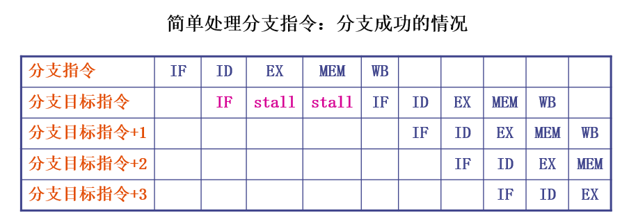
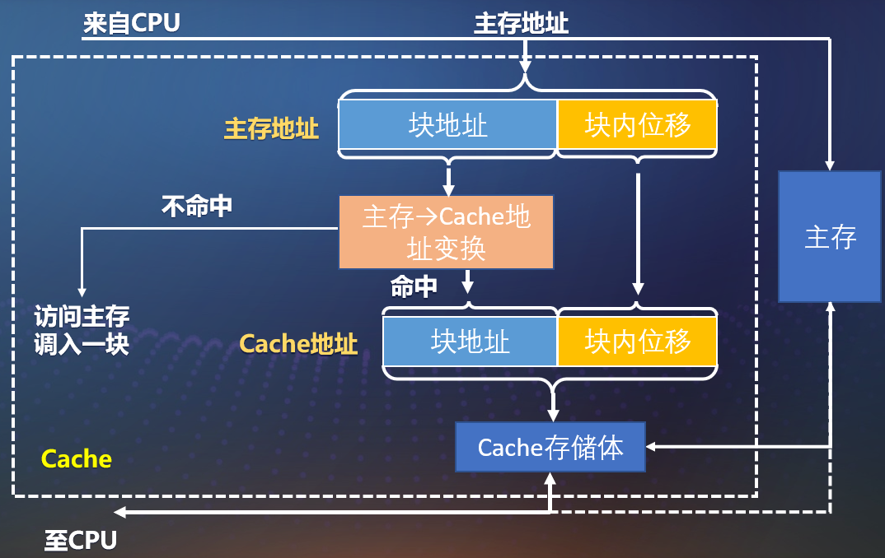
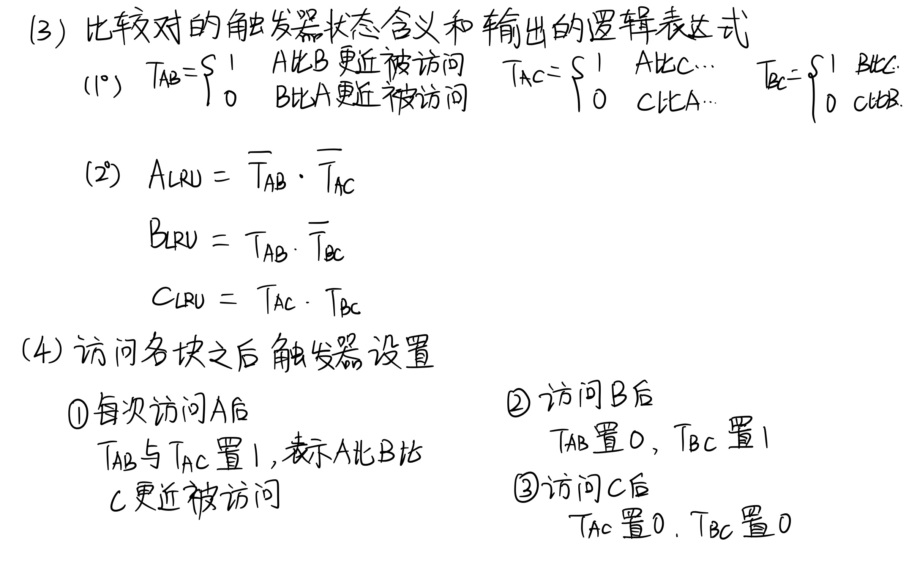
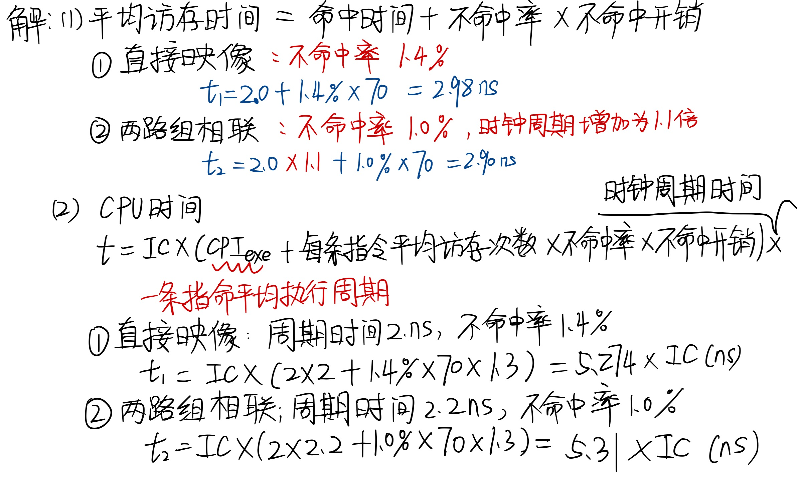

# 计算机体系
[TOC]

## 1. 计算机系统结构的基础知识

### 1.1 计算机系统的基本概念
#### 1.1.1 计算机系统发展方向
1. 计算机性能每年的增长从原来的50%降到了约20% 。
	- **高功耗问题**：计算机系统的核心部件CPU的频率越高，计算速度越快，所消耗的功率就越大。
	- 可以进一步有效地**开发的指令级并行性已经很少**
	- **存储器访问速度**的提高缓慢
2. 计算机系统的性能的提升，从单个处理器核心转向了多处理器核心的研究和开发，这就是所谓的多核。
	- 多核是在单个芯片上实现多个处理器核，来提高计算机系统的性能。
3. 计算机系统结构发展方向转变：从**单纯依靠指令级并行**转向**开发线程级并行和数据级并行**。

#### 1.1.2 层次结构
从**使用语言的角度**，把计算机系统按功能，分成多级层次结构：

#### 1.1.3  计算机系统结构的定义

1. **广义的系统结构定义**：指令系统的结构、计算机组成、计算机硬件；

2. **计算机系统结构的实质：确定计算机系统中软硬件之间的界面  **

	- 界面之上：由软件实现的功能；
- 界面之下：由硬件和固件所实现的功能
	
3. 计算机系统结构的经典定义：**传统机器程序员所看到的计算机属性**，即概念性结构与功能特性。
	- 传统机器级程序员: 机器语言和汇编语言编程，该机器指令系统的功能特性;
	- 高级语言虚拟机程序员： 该机器所配置的高级语言所具有的功能特性；
	- 不同级的程序员所看到的计算机具有不同的属性。
	
4. **透明性：**在计算机技术中，把这种本来存在的事物或属性，但从某种角度看又好像不存在的概念称为透明性。

   - 

   

#### 1.1.4 计算机组成和计算机实现
这里主要区分关于计算机系统结构、计算机组成、计算机实现的几个概念。按照我的理解：
1. 计算机系统结构：传统机器语言程序员看到的传统机器级的所有属性，也就是在二进制语言编程和汇编编程时看到的计算机结构属性；
2. 计算机组成：计算机里面各部件的设计和连接方式：
	- 计算机系统结构的**逻辑实现**： 数据流+控制流+逻辑设计；
	- 着眼于物理机器级内各事件的排序方式、控制方式、各部件的功能以及各部件之间的联系。
3. 计算机的实现：
	- 计算机组成的物理实现；
	- 包括：处理器、主存、器件集成度、器件速度、各个模块、插件底板的划分和连接；
	- 主要着眼于器件技术和微组装技术。
	- 

总结区别：

例如：
1. 具有相同系统结构的计算机可以采用不同的计算机组成；
2. 同一种计算机组成又可以采用多种不同的计算机去实现。
**系列机：**由同一厂家生产的具有相同系统结构、但具有不同组成和实现的一系列不同型号的机器。比如Intel公司的x86系列。

#### 1.1.4 计算机系统结构的分类

##### 1.1.4.1   Flynn分类法（考点）

定义：**按指令流和数据流的多倍性进行分类**

1. 指令流：计算机执行的指令序列；
2. 数据流：由指令流调用的数据序列；
3. 多倍性：在系统最受限的部件上，**同时处于同一执行阶段的指令或数据的最大数目**。

分类：
1. 单指令流单数据流SISD（Single Instruction stream Single Data stream）
	- 
2. 单指令流多数据流SIMD（Single Instruction stream Multiple Data stream）
	- 
3. 多指令流单数据流MISD（Multiple Instruction stream Single Data stream）
	- 
4. 多指令流多数据流MIMD（Multiple Instruction stream Multiple Data stream） 

   - 

##### 1..1.4.2 冯氏分类法

定义：用系统的最大并行度对计算机进行分类。计算机系统在单位时间内能够处理的最大二进制位数。

##### 1.1.4.3 Handler分类法

将计算机的硬件结构分成3个层次

### 1.2 计算机系统设计

#### 1.2.1 计算机系统设计的定量原理（考点）

四个定量原理：

1. 以经常性事件为重点：(最重要、最广泛采用的设计原则)
2. **AmdahI定律（考点）**
3. CPU性能公式
4. 程序的局部性原理

##### 1.2.1.1  以经常性事件为重点

- **对经常发生的情况采用优化方法的原则进行选择**，以得到更多的总体上的改进。
- 最重要、最广泛采用的设计原则；
- 分配更多的资源、达到更高的性能或者分配更多的电能等。
- 

##### 1..2.1.2 AmdahI定律（考点）

Amadahl定律是对第一条的使用。通过**加快某部件执行速度获得系统性能提高，其中性能的提高也受限于该部件执行时间占总执行时间的百分比。**

通过该定理我们可以计算—— **特定部件改进后计算机比改进之前到底快了多少。**

**变量说明**：

1. 加速比：说明改进后的计算机比改进之前快了多少。
   - 
2. **可改进比例Fe：**可改进部分的执行时间与总执行时间的比值，总是小于等于1的。
   - 
3. **部件加速比Se：** 可改进部分改进之后性能提升的倍数，等于改进前需要的执行时间与改进后所需要的执行时间的比值，总是大于等于1.
   - 
4. **改进之后程序总的执行时间Tn：** 没有改进部分的时间加上改进之后的执行时间。
   - 
5. **系统加速比Sn：** 改进之前总执行时间与改进之后的总执行时间的比值。
   - 

**拓展定律：**

**例题讲解：**

  

  

  

  

##### 1.2.1.3  CPU性能公式（TODO）

##### 1.2.1.4  程序的局部性原理 （TODO）

#### 1.2.2 计算机系统设计者的主要任务（TODO）

#### 1.2.3 计算机系统设计的主要方法 （TODO）

### 1.3  计算机系统的性能评测（TODO）

### 1.4  计算机系统结构的发展（TODO）

### 1.5 计算机系统结构中的并行性发展（TODO）

## 2.  指令系统的设计

### 2.1  指令系统结构的分类（TODO）

### 2.2 寻址方式和操作数

#### 2.2.1 寻址方式（考点）

定义：**寻址方式** 是指令系统中如何形成所要访问的数据的地址。寻址方式可以指明指令中的操作数是一个常数、一个寄存器操作数或者是一个存储器操作数。

一些操作数的寻址方式：

**各种寻址方式的使用情况统计结果**：   大约1/4的load指令和ALU指令采用了立即数寻址。

**寻址方式的两种表示方法：**

1. 将寻址方式编码于操作码中，由操作码描述相应操作的寻址方式。
   - 适 合：处理机采用load-store结构，寻址方式只有很少几种。
2. 在指令字中设置专门的寻址字段，以直接指出寻址方式。
   - 灵活，操作码短，但需要设置专门的寻址方式字段，而且操作码和寻址方式字段合起来所需要的总位数可能会比隐含方法的总位数多。
   - 适 合：处理机具有多种寻址方式，且指令有多个操作数。

**一个需要注意的问题：**如何在存储器中存放不同宽度的信息？ 

以IBM370为例子进行讨论：

1. 信息有字节、半字（双字节）、单字（4字节）和双字（8字节）等宽度。
2. 主存宽度为8个字节。采用按字节编址，各类信息都是用该信息的首字节地址来寻址。 

如果允许它们任意存储，**很可能会出现一个信息跨存储字边界而存储于两个存储单元中，例如：**

   “双字”就跨了存储字边界，被存储在两个存储单元中，这样它的读出就要花两个存储周期；    第2个“单字”，也是同样的情况。

**信息存储遵循的规则——整数边界的概念**

**信息宽度不超过主存宽度的信息必须存放在一个存储字内，不能跨边界。** 必须做到：**信息在主存中存放的起始地址必须是该信息宽度（字节数）的整数倍。**

#### 2.2.2 操作数的类型和大小（TODO）

### 2.3 指令系统的设计与优化

### 2.4 指令系统的发展和改进

### 2.5 MIPS指令系统结构

## 3. 流水线技术

### 3.1 流水线的基本概念  

#### 3.1.1  什么是流水线

1. 流水线技术：

   **把一个重复过程分解成若干个子过程**，每个子过程通过专门的功能部件来实现。把多个处理过程在时间上错开，一次通过各个功能段，这样每个子过程就可以和其他子过程**并行进行**。

2. 流水线的级或段（Stage）：

   流水线中的每个子过程及其功能部件称之为流水线的级或段（Stage）。

3. 流水线的深度：

   流水线的段数称之为流水线的深度。

4. 时空图：

   描述流水线的工作过程。横坐标表示时间，纵坐标表示空间（也就是流水线的段）。格子的数代表第几个任务。

5. 流水线的特点：

   - 各段时间应尽可能相等，否则堵塞/断流。
     - 若不等，时间最长的段将成为流水线的瓶颈。
   - 每段后面都有一个缓冲器(流水寄存器)。
   - 只有输入端不断提供任务，才能充分发挥效率。
   - 需要有通过时间和排空时间。
     - **通过时间**：第一个任务从进入流水线到流出结果所需时间。
     - **排空时间**：最后一个任务从进入流水线到流出结果所需时间。
     - 浮点数运算的时空图:
       - 

#### 3.1.2 流水线的分类（考点）

1. 按照流水技术用于**计算机系统的等级分类：**

   - **部件级流水线**（运算操作流水线）：把处理机中的部件分段，使各种类型的运算操作按流水方式进行。
   - **处理机级流水线**（指令流水线）：把指令的执行过程按照流水方式处理。
   - **系统级流水线**（宏流水线）：把多台处理机串行连接起来，对同一数据流进行处理，每个处理机完成整个任务中的一部分。

2. 按照流水线所完成的**功能分类：**

   - **单功能流水线**：只能完成一种固定功能；
   - **多功能流水线**：流水线的各段可以进行不同的连接，以实现不同的功能。
   - 

3. **多功能流水线进一步按同一时间内各段间的连接方式分类：**（**ask**）

   - **静态流水线**：同一时间内，各段只能按同一种功能的连接方式工作。

     - **只有当输入的是一串相同的运算任务时，流水的效率才能得到充分的发挥。**

   - **动态流水线**：同一时间内，各段可以按照不同的方式连接，同时执行多种功能。

     - **优点：灵活，能够提高流水线各段的使用率**

     - **缺点：控制复杂**

   - **静**、**动态流水线时空图的对比**：（ask）

     - 

4. 按照流水线中是否有**反馈回路**分类
   - **线性流水线**：流水线的各段串行连接，没有反馈回路。数据通过流水线中的各段时，每段最多只流过一次。
   - **非线性流水线**：流水线中除了有串行的连接外，还有反馈回路。
   - 非线性流水线的调度问题：
     - **确定什么时候向流水线引进新的任务，才能使该任务**
   - 举例：
     - 

5. 根据**任务流入流出的顺序**是否相同分类

   - 顺序流水线：输出端任务流出的顺序与输入端任务流入的顺序完全相同。

   - 乱序流水线：任务流出的顺序与输入端任务流入的顺序可以不同，允**许后进入流水线的任务先完成。**

     **——** **也称为无序流水线、错序流水线、异步流水线**

### 3.2  流水线的性能指标

指标包括包括但不限于吞吐率、加速比、效率。

#### 3.2.1  吞吐率 

吞吐率：在单位时间内流水线所完成的任务数量或输出结果的数量。  

1. **各段时间均相等的流水线**

   各段时间均相等的流水线时空图——**k段线性流水线**

   

   - 流水线完成n个连续任务所需要的总时间为：

     ​     **Tk＝kΔt＋(n－1)Δt＝(k＋n－1)Δt**   

   - 流水线的实际吞吐率：

     ​	

   - 最大吞吐率：

     ​	

   - 实际吞吐率和最大吞吐率的关系：只有当n>>k时，才有TP≈TPmax。 

     ​	

2. **各段时间不完全相等的流水线** 

     

    

3. 解决流水线瓶颈问题的常用方法

   - **细分瓶颈段**

     - 

   - **重复设置瓶颈段**

     - 改进后流水线的吞吐率和**各段时间均相等的流水线的相同。**
     - 缺点是控制逻辑比较复杂，所需硬件增加了。
       - 
     - 核心原理是：让中间由于最大的段的时间导致其他空出来的浪费的时间被利用起来了。
     - 时空图如下：
       - 

     

#### 3.2.2 流水线的加速比

**加速比**：完成同样一批任务，不使用流水线所用的时间与使用流水线所用的时间之比。

1. **流水线各段时间相等**（都是△t）

   - 一条k段流水线完成n个连续任务所需时间：**Tk  = ( k＋ n－1)Δt**

   - 顺序执行n个任务所需时间： **Ts = nkΔt**

   - 流水线的实际加速比为  ：

     

   - 最大加速比：

     

2. **流水线的各段时间不完全相等时**

   - 

   - 一条k段流水线完成n个连续任务实际加速比为：

   

#### 3.2.3  流水线的效率  

**流水线设备的利用率**：流水线中的设备**实际使用时间**与**整个运行时间的比值** 。——由于通过时间和排空时间使各段不是满负荷工作。

1. **各段时间相等时的效率**
   - 
   - **各段效率ei相同**——这里分析各段的效率是根据时空图横向分析每一段的总时间和使用时间。
     - 
   - **整条流水线的效率：**  
     - 
   - **最高效率**：
     - 
   - **当流水线各段时间相等时，流水线的效率与吞吐率成正比**
     - 
2. **流水线的效率是流水线的实际加速比S与它的最大加速比k的比值：(适用于各段时间相等的和2.流水线的各段时间不完全相等的流水线)**
   -  
   - **当E=1时，S=k，实际加速比达到最大。**

3. **从时空图上看，效率就是n个任务占用的时空面积和k个段总的时空面积之比**
   - 

#### 3.2.4 流水线的性能分析举例  （ask）
1. 例题一

解答：
静态多功能流水线有一下特点：
   1. **静态流水线在进行功能切换时，要等前一种运算全部流出流水线后才能进行后面的运算；** 所以才会在加法运算全部结束之后才开始乘法计算。
   2. 运算之间存在关联，后面有些运算要用到前面运算的结果； 
值得注意的是，这里涉及到乘法计算次数的时候，并不是顺着一个一个进行乘法计算，而是两个单独的一起计算，之后再合起来。
   

2. 例题二

解答：
   静态流水线在实现运算的功能转换时，必须在前面的运算结果全部流出才能开始新的功能。但是动态流水线不需要满足这个要求，它只需要在操作数出现就可以进行新的操作。

3. 例题三

### 3.3 非线性流水线的调度（TODO）

### 3.4 流水线的相关与冲突   
#### 3.4.1 一条经典的5段RISC流水线
1. 非流水情况下，一条指令的执行过程分为5个周期：
   - 取指令周期（IF）
      - 一程序计数器PC的内容作为地址，从存储器中取出指令并放入指令寄存器IR；
      - 同时PC+4，指向下一个指令。
   - 指令译码/读寄存器周期（ID）
      - 对指令进行译码，并用IR的寄存器地址去访问寄存器组，读出所需的操作数；
   - 执行/有效地址计算周期（EX）
      不同指令所进行的操作不同
      - load和store指令：ALU把指令中所指定的寄存器内容和偏移量相加，形成访存的有效地址；
      - 寄存器-寄存器ALU指令：ALU按照操作码指定操作对从通用寄存器组中读出的数据进行运算；
      - 寄存器-立即数ALU指令：ALU按照操作码指定的操作对从通用寄存器组中读出的操作数和指令中给出的立即数进行运算；
      - 分支指令：ALU把指令中的偏移量和PC值相加，形成转移目标地址。同时，对于前一个周期读出的操作数进行判断，确定分支是否成功。
   - 存储器访问/分支完成周期（MEM）
      该周期处理的指令只有load、store和分支指令，其他类型指令在此周期不做任何操作。
      - load/store指令
         - load：用上一个周期计算出的有效地址，从存储器中读出相应的数据；
         - store：把指定的数据写入这个有效地址所指出的存储器单元。
      - 分支指令
         - 若分支成功，就把转移目标送入PC中，分支指令完成。
   - 写回周期（WB）
      - ALU运算指令和load指令在这个周期把结果数据写入通用寄存器组

   在以上讨论中我们可以发现：
      - 分支指令需要四个周期（如果把分支指令的执行天道ID周期，则只需要两个周期）；
      - store指令只需要四个周期；
      - 其他指令需要5个周期才能完成。

2. 改为流水线实现
   - 经典的5段流水线：每一个周期作为一个流水段，在各段之间加上锁存寄存器（流水寄存器）。
   - 

3. 采用流水线方式实现时，需要解决一下问题：
   - 要保证不会在同一时钟周期要求同一个功能段做两件不同的工作。
      - 例如：不能要求ALU同时做有效地址计算和算术运算。
   - 避免IF段的访存（取指令）与MEM段的访存（读/写数据）发生冲突。
      - 可以采用分离的指令存储器和数据存储器；
      - 一般采用分离的指令Cache和数据Cache。
   - ID段和WB段都要访问通用寄存器组。
      - 写操作安排在时钟周期的前半拍，读操作安排在后半拍。
   - 对PC的更新
      - 流水线为了能够每个时钟周期启动一条新的指令，就必须在每个时钟周期进行PC值的加4操作，并保留新的PC值。这种操作必须在IF段完成，以便为取下一条指令做好准备。
      - 需设置一个专门的加法器。
      - 但分支指令也可能改变PC的值，而且是在MEM段进行，这会导致冲突——分支的处理后面讨论。

#### 3.4.2 相关和流水线冲突
##### 3.4.2.1 相关 （ask）
相关：两条指令之间存在某种依赖关系。
   如果两条指令相关，则它们就有可能不能在流水线中重叠执行或者只能部分重叠执行。

相关有3种类型
1. 数据相关 （真数据相关）
   - 对于两条指令i和j（i在前，j在后，下同），如果下述条件之一成立，则称指令j与指令i数据相关。 
      - 指令j使用指令i产生的结果；
      - 指令j与指令k数据相关，而指令k又与指令i数据相关。
   - 数据相关具有传递性。
   - 当数据的流动是经过寄存器时，相关的检测比较直观和容易。
   - 当数据的流动是经过存储器时，检测比较复杂。
   - 举例：
      - 
2. 名相关
   - 名：指令所访问的寄存器或存储器单元的名称。
   - 如果两条指令使用相同的名，但是它们之间并没有数据流动，则称这两条指令存在名相关。
   - 指令j与指令i之间的名相关有两种：
      - 反相关：指令j写的名＝指令i读的名
      - 输出相关：指令j写的名＝指令i写的名          
   - 名相关的两条指令之间并没有数据的传送。
   - 换名技术：通过改变指令中操作数的名来消除名相关。
   - 可以用编译器静态实现，也可以用硬件动态完成。
   - 
3. **控制相关** 
   - 控制相关是指由分支指令引起的相关。      
      - 典型的 “if-then”为了保证程序应有的执行顺序，必须严格按控制相关确定的顺序执行。
      - 控制相关带来了以下两个限制：
         - 
         - 与一条分支指令控制相关的指令不能被移到该分支之前。否则这些指令就不受该分支控制了。
            - 对于上述的例子，then 部分中的指令不能移到if语句之前。
         - 如果一条指令与某分支指令不存在控制相关，就不能把该指令移到该分支之后。
            - 对于上述的例子，不能把S移到if语句的then部分中。
         

##### 3.4.2.2 流水线冲突  （ask） 
**流水线冲突**是指由于相关的存在，使得指令流中的下一条指令不能在指定的时钟周期执行。

流水线冲突有3种类型：
1. **结构冲突**：因硬件资源满足不了指令重叠执行的要求而发生的冲突。
2. **数据冲突**：当指令在流水线中重叠执行时，因需要用到前面指令的执行结果而发生的冲突。
3. **控制冲突**：流水线遇到分支指令和其它会改变PC值的指令所引起的冲突。

后面的讨论中的约定：
   当一条指令被暂停时，在该暂停指令之后流出的所
有指令都要被暂停，而在该暂停指令之前流出的指令则
继续进行。

1. 结构冲突
   - 在流水线处理机中，为了能够使各种组合的指令都能顺利地重叠执行，需要对功能部件进行全流水处理或重复设置足够多的资源。
   - 如果某种指令组合因为资源冲突而不能正常执行，则称该处理机有结构冲突。
   - 常见的导致结构冲突的原因：
      - 功能部件不是完全流水
      - 资源份数不够
   - 为了降低成本，有时会允许结构冲突的存在
   - 结构冲突举例：访存冲突
      - 有些流水线处理机只有一个存储器，**将数据和指令放在一起（）**，访存指令会导致访存冲突。
      - 解决办法Ⅰ：插入暂停周期
      - 解决方法Ⅱ： **设置相互独立的指令存储器和数据存储器或设置相互独立的指令Cache和数据Cache**。**（不太懂）**
      - 
      - 
      - 
2. 数据冲突：
   - 当相关的指令靠得足够近时，它们在流水线中的重叠执行或者重新排序会改变指令读/写操作数的顺序，使之不同于它们串行执行时的顺序，则发生了数据冲突。
   - 数据冲突有3种类型:（约定：i指令在前，j指令在后）
      - 写后读冲突（RAW）——最常见的一种，对应于真数据相关；
         - 在 i 写入之前，j 先去读；j 读出的内容是错误的。
      - 写后写冲突（WAW）——对应于输出相关
         - 在 i 写入之前，j 先写; 最后写入的结果是 i 的。错误！
      - 读后写冲突（WAR）——由反相关引起
         - 在 i 读之前，j 先写; i 读出的内容是错误的！
   - 解决方式
      - 定向技术
      - 停顿
      - 依靠编译器解决数据冲突  
      

**举例：**
   - 定向技术（ask）：
      - 
      - 通过定向技术(旁路或短路)减少数据冲突引起的停顿：
      - 关键思想：在计算结果尚未出来之前，后面等待使用该结果的指令并不真正立即需要该计算结果，**如果能够将该计算结果从其产生的地方直接送到其它指令需要它的地方，那么就可以避免停顿。**
      - **EX段和MEM段之间的流水寄存器中保存的ALU运算结果总是回送到ALU的入**。
      - 当**定向硬件检测**到前一个ALU运算结果写入的寄存器就是当前ALU操作的源寄存器时，那么控制逻辑就选择定向的数据作为ALU的输入，而不采用从通用寄存器组读出数据。
      - 结果数据不仅可以从某一功能部件的输出定向到其自身的输入，而且还可以定向到其它功能部件的输入。
   - **需要停顿的数据冲突（ask）** 
      - 
      - 
      - 
   - 依靠编译器解决数据冲突  
      - 有时可以采用指令调度或流水线调度技术来消除数据冲突——让编译器重新组织指令顺序

3. 控制冲突 （好难懂）
   - 执行分支指令的结果有两种
      - 分支成功：
         PC值改变为分支转移的目标地址。在条件判定和转移地址计算都完成后，才改变PC值。
      - 分支失败：
         PC的值保持正常递增，指向顺序的下一条指令。
   - 处理分支指令最简单的方法：
      - “冻结”或者“排空”流水线 
      - 优点：简单
      - 前述5段流水线中，改变PC值是在MEM段进行的。给流水线带来了3个时钟周期的延迟
      - 
   - 可采取两种措施来减少分支延迟
      - 在流水线中尽早判断出分支转移是否成功；
      - 尽早计算出分支目标地址。
      - 下面的讨论中，我们假设：这两步工作被提前到ID段完成，即分支指令是在ID段的末尾执行完成，所带来的分支延迟为一个时钟周期。 
   - 通过软件（编译器）减少分支延迟的方法——3种：
      - 预测分支失败 
         - 
         - 
      - 预测分支成功 
         - 假设分支转移成功，并从目标地址处取指令执行。
         - 起作用的前提：先知道分支目标地址，后知道分支是否成功。
         - 前述5段流水线中，这种方法没有任何好处。
      - **延迟分支（ask）**
         - **主要思想**：从逻辑上“延长”分支指令的执行时间。把延迟分支看成是由原来的分支指令和若干个延迟槽构成，不管分支是否成功，都要按顺序执行延迟槽中的指令。
            - 
         - 分支延迟指令的调度：由编译器在延迟槽中放入有用的指令
            - 三种调度方法：从前调度、从目标处调度、从失败处调度
            - 
            - 
         - 进一步改进为：分支取消机制
            - 
         

### 3.5  流水线的实现  （TODO）

## 4. 向量处理机（TODO）

## 5. 指令并行及其开发——硬件方法（TODO）

## 6.  指令并行及其开发——软件方法（TODO）

## 7. 存储系统
### 7.1 存储系统的层次结构
#### 7.1.1 存储系统的多级层次结构（TODO）

#### 7.1.2 存储系统的性能参数
以M1和M2构成的两级存储层次为例：
   - 
   - 存储容量 S：M1和M2构成的这个存储系统的容量**就是M2的容量，即S = S2**
   - 平均每位价格 C：
      - 
   - 命中率 H：**CPU访存时，在M1中找到所需信息的概率，用H表示**
      - 假设：N1和N2分别是访问M1和M2的次数，则：
         
   - 不命中率 F：
      - F = 1 - H；

**平均访存时间（考点）：**
   - 命中时：访问时间为T1（命中时间）；
   - 不命中时：
      - 把M2中包含要访问的字的块（或者页面）调入M1中；
      - CPU在M1中访问这个字；
      - 举例：
         - 假设传送一个信息块的时间是Tb，则不命中时的访问时间是：**T2 + Tb + T1 = T1 + Tm，其中Tm = T2 + Tb，T2应该是在M2中命中的时间**
      - 不命中开销Tm：从向M2发出访问请求，到把整个数据块调入M1中所需的时间。
   - **存储系统的平均访存时间Ta**：
      - **Ta = HT1 + (1 - H)(T1 + Tm) = T1 + FTm**

#### 7.1.3 三级存储系统
1. 高速缓冲存储器Cache
2. 主存储器
3. 辅助存储器
可以看成“Cache—主存” 和“主存—辅存”两个层次

1. “Cache—主存”层次
   - 
2. “主存-辅存”层次
   - 
3. 两者区别
   - 

### 7.2 Cache的基本知识
#### 7.2.1 Cache的基本结构和原理
1. Cache和主存分块
   - 块地址（块号）——查找该块在Cache中的位置
   - 块内位移——确定所访问的数据在该块中的位置
   - 

2. Cache的基本工作原理示意图 
   - 基本工作原理：
      - 来自cpu的主存地址，首先在cache中查找，如果找到了则送入cpu；
      - 如果没找到，就到主存中去找，在主存中找到了，将这部分页或者块放到cache中；
      - 其中的地址变换：
         - 在cache中查找时，先将主存地址的块地址变换成cache的地址，然后根据块内位移来确定最终地址；
         - 在主存查找，就是直接是块地址加上块内偏移量；
   -

3. 地址印象规则：
   - 决定把一个块从主存中调入到cache中时，能够放到哪些位置；
   - 三个地址映像规则：
      - 全相联映像；
      - 直接映像；
      - 组相联映像。

4. 查找算法：cpu访存时，如何确定访问的信息在cache中，如果在cache中，如何确定cashe位置。

5. Cache的结构
   - cache块是：用于存放信息的存储体 
   - 每一个Cache块在目录表里都有一个对应的表项，用于指出当前该块中存放的信息来自于主存的哪个块。
   - 
   - 每个主存块能惟一地由它的标识来确定；
   - 不同的映像规则，标识部分和索引部分的分割是不同的。
   - Cache目录表结构：
      - 
      - 主存的一块调入到Cache时，只能放在Cache的某些特定位置上（候选位置）。
      - 查找目录表进行标识比较时：只需要查找候选位置的目录表项，如果标识相同，并且有效位为“1”，则命中；否则不命中。

#### 7.2.2 地址映像规则
1. 全相联映像(Fully Associative)
   - 主存里的任一块可以调入到Cache的任意一个位置上
   - 
   - 调入时：
      - 除了把9号块的内容调入到Cache的某一块的位置上，**还需要把块号9填入到目录表中（即标识存储器）该Cache块对应的位置，并把有效位置“1”**。
      - 全相联映像规则中，主存的块地址就是标识部分。
   - 访存时：
      - Cache里的所有块都是候选位置，所以，查找标识时需要查找整个目录表。
      - 优点：空间利用率最高，冲突概率最低
      - 缺点：实现最复杂

2. 直接映像(Direct Mapping)
   - 主存中的每一块，只能调入到Cache中惟一的一个指定位置上。（循环分配）
   - 假设Cache一共有M块，主存中块号为i的信息块只能调入到Cache中块号为j的位置上：
      - j 和i的关系要满足：j=i mod M（M为Cache的块数）
      - 设M=2^m，那么用二进制数表示时，j实际上就是i的低m位
         - 低m位称为索引；
         - **其他的高位部分就是标识。**
         - 
   - 
      - 低3位——索引: **确定该主存块能被调入到Cache的哪个位置上**
      - 最高位——标识: **也就是cache目录项中放的内容**
      - 
   - 调入时：
      - 主存9号块调入到Cache的1号块的同时，把主存块地址的最高位（即标识部分）填入到Cache目录表中1号块对应的位置上；
   - 访存时：
      - 直接映像的候选位置只有1个，所以判断是否命中，只需查找目录表中的一个表项即可。
   - 特点：
      - 缺点：空间利用率最低，冲突概率最高
      - 优点：实现最简单

3. 组相联映像
   Cache分为若干组，主存中的一块只能被放到Cache的指定一组内，在指定的组内可以放到任何一个位置；它是直接映像和全相联的折衷。
   - 假设Cache分为G组，每组有n个块，则称为n路组相联，n称为相联度。
   - 设主存的第i块可以映像到Cache的第k组：
      - 则k=i mod G（G为Cache的组数）
      - 设G=2g，那么用二进制数表示时，k实际上就是i的低g位；
         - 低g位称为索引；
         - 其他的高位部分就是标识。
         - 
   - 
      - 低2位——索引：确定该主存块能被调到Cache的哪一组
      - 高两位——标识
      - 
   - 调入时：
      - 9号主存块可以调入到Cache的1号组中的任意位置（即：1号组内的2块均可），将标识部分填入到Cache目录表的对应表项中。
   - 访存时：
      - 只需查找特定一组中的各个表项。
   - 

**总结：**
1. 要判断Cache是否命中，需要查找目录表，进行标识比较。
2. 为了快速判断是否命中，要求标识存储器能够具备并行查找的功能。
3. 注意：无论直接映像还是组相联映像，**查找的时候只需要比较标识部分，索引部分无需参加比较。**

#### 7.2.3 标识存储器的实现方式
采用相联存储器实现
   以n路组相联为例——Cache分为G=2g组，每组n块
   - 
   - 
   - 

#### 7.2.4 替换算法
如果要把主存的一个块调入到Cache中，而Cache中能存放该主存块的候选位置已全部被占用，那么新块应该把哪一块替换出去？

1. 直接映像Cache的替换
   候选位置只有一个，所以别无选择。
2. 全相联和组相联映像的Cache替换
   尽可能避免替换掉马上要用到的信息。

对于全相联和组相联映像的Cache替换，有以下常用算法：
1. 随机法
   - 随机选择被替换的块
   - 方法简单，易于实现，但是命中率比较低。适用于Cache容量很大的情况。
2. 先进先出法（FIFO）
   - 替换最早被调入的块
   - 容易实现，但是进入Cache的先后顺序，并不能正确反映程序的局部性。
3. 最近最少使用法（LRU）
   - 根据程序访问的局部性原理，最近刚访问过的块，很可能马上又要被访问，所以，选择替换那个最久没有被访问过的块。
   - 较好地反映了程序的局部性原理，命中率高，但是实现比较困难，硬件成本高。

**LRU算法的实现：**
1. 堆栈法
   - 以组相联映像规则为例：用一个堆栈来记录同一组里各块被访问的先后次序，堆栈中存放的是组内各块的块地址。
   - 
   - 
   - 
   - 堆栈法所需要的硬件：
      - 需要为每一组都设置一个项数与相联度相同的小堆栈，每一项的位数为log2n位，用于存放组内块地址
   - 硬件堆栈所需的功能：
      - 相联比较
      - 能全部下移、部分下移和从中间取出一项
   - 这种方法速度慢，成本高，适用于相联度较小的情况。

2. **比较对法**
   - 基本思路：让各块两两组合，构成比较对。
   - 每一个比较对用一个触发器的状态来表示它所相关的两个块最近一次被访问的远近次序，再经过门电路就可找到LRU块，也就是应该被替换的块。
例题1：
   
   
   

例题2：
   

模拟数据表明，对于容量很大的Cache，随机法和最近最少使用法的命中率差别不大。

#### 7.2.5 写策略 （ask）
CPU对Cache的访问主要是读操作，写在所有访存操作中占比较低。所有指令的访问都是“读”，对数据的访问也是以读为主。

“写”操作比“读”要花费更多的时间：             
1. 读操作时，读出标识并进行比较，和对Cache存储体的访问，可以同时进行；
2. 写操作，只有确认了是“命中”后，才能对Cache进行写入；
3. **写策略是区分不同Cache设计方案的一个重要标志。**

由于Cache里的内容是主存部分内容的副本，“写”访问可能会导致Cache和主存内容的不一致。

有以下写策略：
1. 写直达法（Write Through，也称存直达法Store Through ）
   - 执行写操作时，Cache和主存同时写入。
   - 优点：易于实现，Cache和主存的一致性好
   - 缺点：每次写操作都要访问主存，所以速度慢
   - 如果在“写”的过程中，CPU必须等待，一直到写操作结束，则称为CPU写停顿（Write Stall）。
   - **可采用写缓冲器来减少写停顿。**？
   
2. 写回法（Write Back，也称拷回法Copy Back）
   - 执行写操作时，只写入Cache，仅当该Cache块被替换的时候才写回到主存。
   - 需要为每个Cache块设置一个修改位，用于表明该块调入Cache后是否被修改过。当该块被替换时，如果它没有被修改过，就不用把它写回主存。
   - 优点：速度快，所使用的存储器带宽较低
   - 缺点：存在不一致性隐患
   

写不命中时的处理方法：
1. 按写分配法（Write Allocate，也称写时取（Fetch on Write）
   - 写不命中的时候，先把要写单元所在的块调入到Cache，然后再写。
   - 写回法一般采用这种方式。
2. 不按写分配法（No-write Allocate，也称绕写法（Write Around ）
   - 写不命中的时候，直接写入主存，而不调入到Cache中。
   - 写直达法一般采用这种方式。

#### 7.2.6 Cache性能分析
1. 不命中率
   - 硬件速度无关
   - 容易产生一些误导
2. 平均访存时间
   - 和不命中率相比，能更好地评价存储系统的性能
   - 是衡量性能的一个间接指标，有时候也不能准确地评价存储系统的性能。
   - **平均访存时间 ＝ 命中时间＋不命中率×不命中开销**
3. 程序执行时间
   - 评价存储系统的基准
   - CPU时间＝（CPU执行周期数+存储器停顿周期数）× 时钟周期时间
   - 假设所有的访存停顿都是由于Cache不命中引起的，于是有：
      - 存储器停顿时钟周期数 = 访存次数 ×  不命中率 × 不命中开销
   - 设指令总数为IC条；没有存储器停顿时的平均每条指令所需时钟周期数为CPIexecution 
      - CPU执行周期数= IC × CPIexecution
      - 访存次数=IC × 每条指令的平均访存次数
   - CPU时间=IC*(CPIexecution+每条指令的平均访存次数x不命中率x不命中开销)x时钟周期时间
   

例题1：

即使两台计算机的存储层次完全相同，**时钟频率高的CPU，它的不命中开销比较大。**

**Cache对于低CPI、高时钟频率的CPU来说更加重要。**

大多数情况下，减少平均访存时间和减少CPU的执行时间是一致的，所以实际中也经常用平均访存时间作为评价指标。

最终目标——减少CPU的执行时间

**例题二（考点）：**

### 7.3 Cache效率的优化方法
#### 7.3.1 降低Cache的不命中率（TODO）

#### 7.3.2 减少Cache不命中开销

1. 采用两级Cache
   - 第一级（L1）Cache小而快：使其速度和快速CPU的时钟周期相匹配
   - 第二级（L2）Cache足够大：使它能够捕获更多本来需要到主存去的访问，从而降低不命中开销
   - 在两级Cache结构中，**不命中率分为局部不命中率和全局不命中率：（考点）**
      - 局部不命中率=该级Cache的不命中次数/到达该级Cache的访问次数
      - 全局不命中率=该级Cache的不命中次数/CPU访存的总次数
      - **L1级Cache ：全局不命中率=局部不命中率**
      - **L2级Cache：全局不命中率=不命中率L1 ×局部不命中率L2**
   - 在两级Cache结构中，平均访存时间的公式就变为：
      - 平均访存时间 ＝ 命中时间L1＋不命中率L1×不命中开销L1
      - 不命中开销L1 ＝ 命中时间L2＋不命中率L2×不命中开销L2
      - 平均访存时间 ＝ 命中时间L1＋不命中率L1×（命中时间L2＋不命中率L2×不命中开销L2）
   - **每条指令的平均访存停顿时间=每条指令的平均不命中次数L1 ×命中时间L2+每条指令的平均不命中次数L2 ×不命中开销L2**（ask）

例题1：
   

例题2：
   
      

## 8. IO处理

